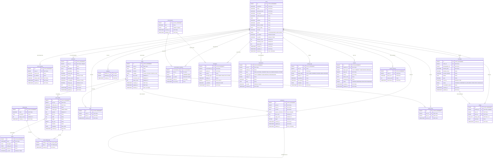

# 2.3. Xây dựng cơ sở dữ liệu

## 2.3.1. Biểu đồ Entity Relationship Diagram

```mermaid
erDiagram
    users {
        BIGINT id PK "AUTO_INCREMENT"
        VARCHAR username UK "NOT NULL"
        VARCHAR email UK "NOT NULL"
        VARCHAR password_hash "NOT NULL"
        VARCHAR full_name "NOT NULL"
        VARCHAR profile_picture_url "NULL"
        TEXT bio "NULL"
        VARCHAR website "NULL"
        VARCHAR gender "NULL"
        VARCHAR phone_number "NULL"
        DATE date_of_birth "NULL"
        VARCHAR location "NULL"
        ENUM role "PHOTOGRAPHER CLIENT ADMIN"
        BOOLEAN is_verified "DEFAULT FALSE"
        BOOLEAN is_active "DEFAULT TRUE"
        INT follower_count "DEFAULT 0"
        INT following_count "DEFAULT 0"
        INT post_count "DEFAULT 0"
        TIMESTAMP created_at "NOT NULL"
        TIMESTAMP updated_at "NOT NULL"
        TIMESTAMP deleted_at "NULL soft delete"
    }

    user_sessions {
        BIGINT id PK "AUTO_INCREMENT"
        BIGINT user_id FK "NOT NULL"
        VARCHAR device_info "NULL"
        VARCHAR ip_address "NULL"
        VARCHAR refresh_token UK "NOT NULL"
        TIMESTAMP created_at "NOT NULL"
        TIMESTAMP expired_at "NOT NULL"
    }

    portfolios {
        BIGINT id PK "AUTO_INCREMENT"
        BIGINT user_id FK "NOT NULL UNIQUE"
        VARCHAR title "NULL"
        TEXT description "NULL"
        JSON specialties "NULL"
        DECIMAL hourly_rate "NULL"
        VARCHAR currency "DEFAULT VND"
        VARCHAR service_area "NULL"
        BOOLEAN is_available "DEFAULT TRUE"
        DECIMAL rating_avg "DEFAULT 0.00"
        INT review_count "DEFAULT 0"
        TIMESTAMP created_at "NOT NULL"
        TIMESTAMP updated_at "NOT NULL"
    }

    posts {
        BIGINT id PK "AUTO_INCREMENT"
        BIGINT user_id FK "NOT NULL"
        TEXT caption "NULL"
        VARCHAR location "NULL"
        ENUM visibility "PUBLIC PRIVATE FRIENDS_ONLY"
        INT like_count "DEFAULT 0"
        INT comment_count "DEFAULT 0"
        INT share_count "DEFAULT 0"
        TIMESTAMP created_at "NOT NULL"
        TIMESTAMP updated_at "NOT NULL"
        TIMESTAMP deleted_at "NULL soft delete"
    }

    filters {
        BIGINT id PK "AUTO_INCREMENT"
        VARCHAR name UK "NOT NULL"
        TEXT description "NULL"
        JSON config_json "NULL"
        VARCHAR preview_url "NULL"
        BOOLEAN is_active "DEFAULT TRUE"
    }

    post_media {
        BIGINT id PK "AUTO_INCREMENT"
        BIGINT post_id FK "NOT NULL"
        VARCHAR media_file_url "NOT NULL"
        VARCHAR thumbnail_url "NULL"
        ENUM media_type "IMAGE VIDEO"
        INT position "DEFAULT 0"
        BIGINT filter_id FK "NULL"
        INT width "NULL"
        INT height "NULL"
        BIGINT file_size "NULL"
        INT duration "NULL"
        JSON metadata "NULL EXIF"
        TIMESTAMP created_at "NOT NULL"
    }

    media_tags {
        BIGINT id PK "AUTO_INCREMENT"
        VARCHAR name UK "NOT NULL"
        TEXT description "NULL"
        INT usage_count "DEFAULT 0"
        TIMESTAMP created_at "NOT NULL"
    }

    post_media_tags {
        BIGINT media_id PK "FK post_media"
        BIGINT tag_id PK "FK media_tags"
        TIMESTAMP created_at "NOT NULL"
    }

    followers {
        BIGINT follower_id PK "FK users"
        BIGINT following_id PK "FK users"
        TIMESTAMP created_at "NOT NULL"
    }

    likes {
        BIGINT id PK "AUTO_INCREMENT"
        BIGINT user_id FK "NOT NULL"
        BIGINT post_id FK "NOT NULL"
        TIMESTAMP created_at "NOT NULL"
    }

    comments {
        BIGINT id PK "AUTO_INCREMENT"
        BIGINT post_id FK "NOT NULL"
        BIGINT user_id FK "NOT NULL"
        TEXT content "NOT NULL"
        BIGINT parent_comment_id FK "NULL threaded"
        INT like_count "DEFAULT 0"
        INT reply_count "DEFAULT 0"
        TINYINT depth "DEFAULT 0 max 3"
        TIMESTAMP created_at "NOT NULL"
        TIMESTAMP updated_at "NOT NULL"
        TIMESTAMP deleted_at "NULL soft delete"
    }

    saved_posts {
        BIGINT id PK "AUTO_INCREMENT"
        BIGINT user_id FK "NOT NULL"
        BIGINT post_id FK "NOT NULL"
        TIMESTAMP saved_at "NOT NULL"
    }

    bookings {
        BIGINT id PK "AUTO_INCREMENT"
        BIGINT client_id FK "NOT NULL"
        BIGINT photographer_id FK "NOT NULL"
        DATETIME booking_date "NOT NULL"
        DECIMAL duration_hours "NULL"
        VARCHAR location_booking "NULL"
        TEXT details "NULL"
        DECIMAL price "NULL"
        VARCHAR currency "DEFAULT VND"
        ENUM status "PENDING CONFIRMED IN_PROGRESS COMPLETED CANCELLED"
        TEXT cancellation_reason "NULL"
        TIMESTAMP created_at "NOT NULL"
        TIMESTAMP updated_at "NOT NULL"
    }

    ratings {
        BIGINT id PK "AUTO_INCREMENT"
        BIGINT booking_id FK "NOT NULL UNIQUE"
        BIGINT rater_id FK "NOT NULL"
        BIGINT ratee_id FK "NOT NULL"
        SMALLINT rating_value "NOT NULL 1-5"
        TEXT comment "NULL"
        TIMESTAMP created_at "NOT NULL"
    }

    conversations {
        BIGINT id PK "AUTO_INCREMENT"
        VARCHAR title "NULL"
        ENUM type "DIRECT GROUP"
        TIMESTAMP created_at "NOT NULL"
        TIMESTAMP updated_at "NOT NULL"
    }

    conversation_members {
        BIGINT conversation_id PK "FK conversations"
        BIGINT user_id PK "FK users"
        ENUM role "MEMBER ADMIN"
        BOOLEAN is_muted "DEFAULT FALSE"
        TIMESTAMP joined_at "NOT NULL"
        TIMESTAMP last_read_at "NULL"
    }

    messages {
        BIGINT id PK "AUTO_INCREMENT"
        BIGINT conversation_id FK "NOT NULL"
        BIGINT sender_id FK "NOT NULL"
        TEXT content "NULL"
        ENUM message_type "TEXT IMAGE VIDEO FILE SYSTEM"
        VARCHAR media_url "NULL"
        BIGINT reply_to_id FK "NULL self-ref"
        BOOLEAN is_deleted "DEFAULT FALSE"
        TIMESTAMP created_at "NOT NULL"
    }

    notifications {
        BIGINT id PK "AUTO_INCREMENT"
        BIGINT user_id FK "NOT NULL"
        BIGINT sender_id FK "NULL"
        ENUM type "NEW_LIKE NEW_COMMENT NEW_FOLLOWER BOOKING SYSTEM"
        ENUM target_type "POST COMMENT USER BOOKING CONVERSATION"
        BIGINT target_id "NULL"
        VARCHAR title "NULL"
        TEXT body "NULL"
        BOOLEAN is_read "DEFAULT FALSE"
        TIMESTAMP created_at "NOT NULL"
    }

    activity_logs {
        BIGINT id PK "AUTO_INCREMENT"
        BIGINT user_id FK "NULL"
        VARCHAR action "NOT NULL"
        ENUM target_type "POST USER COMMENT BOOKING MEDIA SESSION"
        BIGINT target_id "NULL"
        VARCHAR ip_address "NULL"
        VARCHAR user_agent "NULL"
        JSON metadata "NULL"
        TIMESTAMP created_at "NOT NULL"
    }

    reports {
        BIGINT id PK "AUTO_INCREMENT"
        BIGINT reporter_id FK "NOT NULL"
        ENUM target_type "POST COMMENT USER BOOKING MESSAGE"
        BIGINT target_id "NOT NULL"
        TEXT reason "NOT NULL"
        TEXT admin_note "NULL"
        BIGINT reviewed_by FK "NULL"
        ENUM status "PENDING REVIEWING RESOLVED DISMISSED"
        TIMESTAMP created_at "NOT NULL"
        TIMESTAMP updated_at "NOT NULL"
    }

    search_histories {
        BIGINT id PK "AUTO_INCREMENT"
        BIGINT user_id FK "NOT NULL"
        VARCHAR query_text "NOT NULL"
        INT result_count "NULL"
        TIMESTAMP searched_at "NOT NULL"
    }

    %% ===== RELATIONSHIPS =====

    users ||--o{ user_sessions : "phien dang nhap"
    users ||--o| portfolios : "ho so photographer"
    users ||--o{ posts : "tao bai dang"
    users ||--o{ followers : "theo doi"
    users ||--o{ likes : "thich bai"
    users ||--o{ comments : "binh luan"
    users ||--o{ saved_posts : "luu bai"
    users ||--o{ bookings : "dat lich"
    users ||--o{ ratings : "danh gia"
    users ||--o{ conversation_members : "tham gia chat"
    users ||--o{ messages : "gui tin nhan"
    users ||--o{ notifications : "nhan thong bao"
    users ||--o{ activity_logs : "nhat ky"
    users ||--o{ reports : "bao cao"
    users ||--o{ search_histories : "lich su tim kiem"

    posts ||--o{ post_media : "chua media"
    posts ||--o{ likes : "nhan like"
    posts ||--o{ comments : "nhan comment"
    posts ||--o{ saved_posts : "duoc luu"

    post_media }o--o| filters : "ap dung filter"
    post_media ||--o{ post_media_tags : "gan tag"
    media_tags ||--o{ post_media_tags : "duoc gan"

    comments ||--o{ comments : "threaded cha-con"

    bookings ||--o| ratings : "danh gia booking"

    conversations ||--o{ messages : "chua tin nhan"
    conversations ||--o{ conversation_members : "thanh vien"
```
