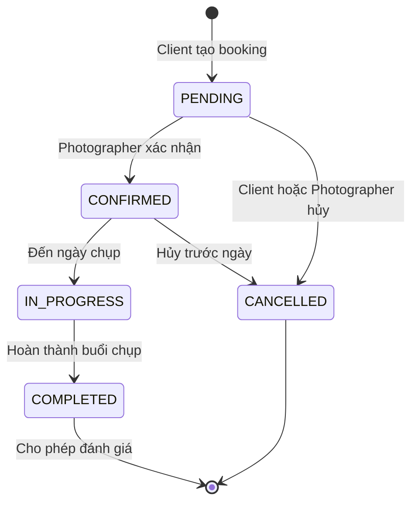

# CHƯƠNG 2: PHÂN TÍCH THIẾT KẾ

## 2.1. Xác định các yêu cầu chính của hệ thống

### 2.1.1. Phân tích các yêu cầu chức năng

Hệ thống InstaGallery được phân tích dựa trên 3 tác nhân chính: **Người dùng (Client)**, **Nhiếp ảnh gia (Photographer)** và **Quản trị viên (Admin)**. Các yêu cầu chức năng được chia thành các nhóm theo mức độ ưu tiên:

#### A. Nhóm chức năng Xác thực & Quản lý tài khoản

| ID | Chức năng | Mô tả chi tiết | Tác nhân | Ưu tiên |
|---|---|---|---|---|
| FR-01 | Đăng ký tài khoản | Cho phép người dùng tạo tài khoản mới. Hệ thống cần kiểm tra email/username không trùng, mật khẩu đủ mạnh, mã hóa mật khẩu trước khi lưu. Vì có 2 loại tài khoản Client và Photographer, khi đăng ký cần cho người dùng chọn vai trò hoặc mặc định là Client rồi nâng cấp sau. | Client, Photographer | 🔴 P0 |
| FR-02 | Đăng nhập | Đăng nhập bằng email/mật khẩu, hệ thống trả về JWT Access Token (15 phút) và Refresh Token (30 ngày). Backend kiểm tra email, so sánh mật khẩu đã mã hóa, sau đó cấp Access Token và Refresh Token. Chức năng này áp dụng cho tất cả, bao gồm Client, Photographer và Admin. | Tất cả | 🔴 P0 |
| FR-03 | Đăng nhập bằng Google (OAuth 2.0) | Khác FR-02 ở chỗ người dùng không nhập mật khẩu, mà xác thực qua Google OAuth. Backend cần kiểm tra Google token hợp lệ, sau đó tìm tài khoản theo email. Nếu chưa có thì tự tạo tài khoản mới. Nếu email đã tồn tại thì liên kết với tài khoản cũ. | Client, Photographer | 🟡 P1 |
| FR-04 | Đăng xuất | Khi người dùng đăng xuất, app xóa token ở thiết bị, backend vô hiệu hóa Refresh Token trong bảng session. Access Token có thể để tự hết hạn hoặc đưa vào blacklist nếu muốn bảo mật cao hơn. | Tất cả | 🔴 P0 |
| FR-05 | Quên mật khẩu | Dành cho người dùng không đăng nhập được. Hệ thống gửi link hoặc mã OTP đặt lại mật khẩu qua email. Cần tránh thông báo quá rõ kiểu “email không tồn tại” để hạn chế dò tài khoản. | Client, Photographer | 🟡 P1 |
| FR-06 | Đổi mật khẩu | Dành cho người dùng đã đăng nhập. Người dùng nhập mật khẩu cũ, mật khẩu mới, xác nhận mật khẩu mới. Sau khi đổi thành công nên xóa các phiên đăng nhập khác để tăng bảo mật. | Tất cả | 🟡 P1 |
| FR-07 | Xác thực hai yếu tố (2FA) | Bật/tắt xác thực 2 lớp qua OTP (email hoặc Google Authenticator). Yêu cầu nhập OTP khi đăng nhập từ thiết bị mới. Cung cấp mã khôi phục (Recovery Codes) phòng trường hợp mất thiết bị. | Client, Photographer | 🟡 P1 |
| FR-08 | Cập nhật hồ sơ cá nhân | Cho phép người dùng sửa thông tin cá nhân như tên, avatar, bio, website, giới tính, ngày sinh, vị trí. Đây là chức năng tài khoản nhưng không trực tiếp liên quan đến bảo mật. | Tất cả | 🔴 P0 |
| FR-09 | Tài khoản riêng tư (Private Account) | Chuyển đổi profile Public ↔ Private. Khi Private: chỉ followers đã được chấp nhận mới thấy bài đăng. Yêu cầu gửi Follow Request thay vì follow trực tiếp, chủ tài khoản duyệt/từ chối từng request. | Client, Photographer | 🟡 P1 |

#### B. Nhóm chức năng Quản lý bài đăng & Nội dung

| ID | Chức năng | Mô tả chi tiết | Tác nhân | Ưu tiên |
|---|---|---|---|---|
| FR-10 | Đăng bài ảnh (Upload ảnh) | Người dùng chọn tối đa 10 ảnh từ thư viện, viết caption, thêm vị trí, chọn bộ lọc và chọn chế độ hiển thị Public/Private. Hệ thống hỗ trợ các định dạng ảnh như JPEG, PNG, WebP, HEIC. Ảnh được nén phía client trước khi upload để tối ưu dung lượng. Trong quá trình upload, hệ thống hiển thị thanh tiến trình để người dùng theo dõi. | Client, Photographer | 🔴 P0 |
| FR-11 | Chỉnh sửa bài đăng | Sửa caption, chế độ hiển thị của bài đã đăng. Không cho phép thay đổi ảnh. | Chủ bài đăng | 🟡 P1 |
| FR-12 | Xóa bài đăng | Xóa mềm (soft delete) bài đăng. Chủ bài đăng hoặc Admin có quyền xóa. | Chủ bài, Admin | 🟡 P1 |
| FR-13 | Xem Feed | Hiển thị bài đăng từ những người mình follow, sắp xếp theo thời gian, hỗ trợ cursor pagination. Feed được cache trên server (Redis) và client (Room). Hỗ trợ pull-to-refresh và infinite scroll. | Tất cả | 🔴 P0 |
| FR-14 | Khám phá (Explore) | Hiển thị bài đăng trending, hỗ trợ lọc theo tag, grid ảnh 3 cột. | Tất cả | 🔴 P0 |
| FR-15 | Xem chi tiết bài đăng | Xem carousel ảnh, caption, danh sách comments (threaded), thông tin tác giả. | Tất cả | 🔴 P0 |
| FR-16 | Bộ lọc & Chỉnh sửa ảnh cơ bản | Cung cấp 10-15 bộ lọc màu (filter) có sẵn khi đăng bài. Hỗ trợ chỉnh sửa cơ bản: độ sáng (brightness), tương phản (contrast), độ bão hòa (saturation), crop, xoay ảnh. Preview filter trước khi áp dụng. | Client, Photographer | 🟡 P1 |
| FR-17 | Album / Bộ sưu tập (Collection) | Tạo, sửa, xóa album ảnh cá nhân. Thêm/xóa bài đăng vào album. Đặt tên, mô tả và ảnh bìa cho album. Album có thể Public hoặc Private. Photographer dùng album làm showcase trong Portfolio. | Client, Photographer | 🟡 P1 |
| FR-18 | Tạo ảnh đa kích thước (Multi-resolution) | Server tự động tạo 3 phiên bản ảnh khi upload: thumbnail (150x150), preview (640px) và ảnh gốc (original). Client tải thumbnail trong grid/feed, tải preview khi xem nhanh và tải ảnh gốc khi người dùng zoom/pinch. Cơ chế này giúp giảm băng thông truyền tải khoảng 60-80%. | Hệ thống (tự động) | 🔴 P0 |
| FR-19 | Gắn thẻ người dùng trong ảnh (Tag People) | Gắn thẻ (tag) người dùng khác vào vị trí cụ thể trên ảnh khi đăng hoặc sau khi đăng. Người được tag nhận thông báo và bài hiển thị trong tab "Tagged" của profile. Có thể gỡ tag của chính mình hoặc cài đặt duyệt tag trước khi hiển thị. | Client, Photographer | 🟢 P2 |

#### C. Nhóm chức năng Tương tác xã hội

| ID | Chức năng | Mô tả chi tiết | Tác nhân | Ưu tiên |
|---|---|---|---|---|
| FR-20 | Like / Unlike bài đăng | Thích hoặc bỏ thích bài đăng. Cập nhật counter like_count tự động qua trigger. Cần nhớ có ràng buộc mỗi user chỉ like 1 lần / 1 bài. | Client, Photographer | 🔴 P0 |
| FR-21 | Bình luận (Comment) | Viết bình luận trên bài đăng, hỗ trợ threaded comments (trả lời comment) tối đa 3 cấp. Chỉnh sửa comment đã đăng (trong 15 phút). Xóa comment (chủ comment hoặc chủ bài). Like comment. Pagination cursor-based cho danh sách comments. | Client, Photographer | 🔴 P0 |
| FR-22 | Lưu bài đăng | Lưu bài đăng vào danh sách cá nhân để xem lại sau. | Client, Photographer | 🟡 P1 |
| FR-23 | Follow / Unfollow | Theo dõi hoặc bỏ theo dõi người dùng khác. Cập nhật counter follower_count/following_count. | Client, Photographer | 🔴 P0 |
| FR-24 | Tìm kiếm | Tìm kiếm người dùng, bài đăng, hashtag. Hỗ trợ autocomplete và lưu lịch sử tìm kiếm. | Tất cả | 🟡 P1 |
| FR-25 | Quản lý Hashtag | Hệ thống hashtag (#tag) cho bài đăng: tự động phát hiện và index hashtag trong caption. Hiển thị trang riêng cho mỗi hashtag với grid ảnh, tổng số bài (usage_count), và trending hashtags. Tối đáng 30 hashtag/bài. | Tất cả | 🔴 P0 |
| FR-26 | Mention (@username) | Nhắc đến người dùng trong caption hoặc comment bằng @username. Hệ thống highlight tên, tạo link đến profile, và gửi thông báo cho người được mention. Autocomplete danh sách username khi gõ @. | Client, Photographer | 🟡 P1 |
| FR-27 | Chia sẻ bài đăng | Chia sẻ bài đăng qua link (deep link) hoặc gửi qua chat nội bộ. Cập nhật share_count. | Client, Photographer | 🟢 P2 |
| FR-28 | Nhật ký hoạt động (Activity Feed) | Hiển thị lịch sử tương tác: ai đã like, comment, follow, tag mình. Phân loại theo nhóm: "Hôm nay", "Tuần này", "Tháng này". Xóa từng hoạt động hoặc xóa tất cả. | Client, Photographer | 🟡 P1 |
| FR-29 | Gợi ý theo dõi (Suggestion) | Gợi ý người dùng nên follow dựa trên: mutual followers, cùng khu vực, cùng sở thích (tag tương tự), Photographer nổi bật. Hiển thị trên Feed và trang Explore. Có nút "Ẩn gợi ý" cho từng suggestion. | Tất cả | 🟢 P2 |
| FR-30 | Báo cáo vi phạm | Báo cáo bài đăng, bình luận hoặc người dùng vi phạm. Chọn lý do và gửi cho Admin xử lý. | Client, Photographer | 🟡 P1 |
| FR-31 | Chặn người dùng (Block) | Chặn người dùng khác. Người bị chặn không thể xem profile, bài đăng, nhắn tin, follow. | Client, Photographer | 🟡 P1 |
| FR-32 | Tắt tiếng người dùng (Mute) | Ẩn bài đăng của người dùng khỏi Feed mà không cần Unfollow. Người bị mute không biết. Có thể bật/tắt mute bài đăng của từng người dùng bất cứ lúc nào. | Client, Photographer | 🟢 P2 |
| FR-33 | Giới hạn bình luận (Restrict Comment) | Bật/tắt giới hạn ai được phép bình luận trên bài đăng: Tất cả, Chỉ Followers, Chỉ người mình Follow, Không ai. Lọc từ khóa nhạy cảm tự động (profanity filter) bằng danh sách từ cấm do Admin quản lý. | Client, Photographer | � P2 |
| FR-34 | Xóa tài khoản – tự xóa | Người dùng yêu cầu xóa tài khoản. Hệ thống vô hiệu hóa tài khoản ngay lập tức (soft delete) và xóa vĩnh viễn toàn bộ dữ liệu liên quan trong tối đa 30 ngày theo chính sách lưu trữ. Yêu cầu xác nhận mật khẩu. Tuân thủ GDPR/PDPA. | Client, Photographer | � P1 |

#### D. Nhóm chức năng Booking & Portfolio

| ID | Chức năng | Mô tả chi tiết | Tác nhân | Ưu tiên |
|---|---|---|---|---|
| FR-35 | Tạo/Sửa Portfolio | Nhiếp ảnh gia tạo hồ sơ năng lực gồm: ảnh nổi bật, chuyên môn, giá/giờ tham khảo, khu vực hoạt động, mô tả dịch vụ, trạng thái sẵn sàng. Vì app chỉ dùng ảnh, phần portfolio nên gắn với album/ảnh của Photographer. | Photographer | 🟡 P1 |
| FR-36 | Xem Portfolio | Xem hồ sơ năng lực, gallery ảnh, đánh giá, thông tin liên hệ của nhiếp ảnh gia như nút Nhắn tin và Đặt lịch. | Tất cả | 🟡 P1 |
| FR-37 | Đặt lịch chụp (Booking) | Client xem lịch khả dụng của Photographer, chọn ngày/khung giờ còn trống, nhập yêu cầu, xem giá dự kiến và gửi yêu cầu đặt lịch. | Client | 🟡 P1 |
| FR-38 | Quản lý Booking | Photographer xác nhận, bắt đầu, hoàn thành hoặc hủy booking theo state machine mở rộng: PENDING → CONFIRMED → IN_PROGRESS → COMPLETED → REVIEWED. Các nhánh phụ: PENDING → REJECTED, CONFIRMED → CANCELLED (bởi Client hoặc Photographer), COMPLETED → DISPUTED. Mỗi chuyển trạng thái ghi audit log và gửi thông báo cho cả 2 bên. | Photographer, Client | 🟡 P1 |
| FR-39 | Đánh giá thợ ảnh | Client đánh giá 1-5 sao và viết nhận xét sau khi booking hoàn thành (COMPLETED). Photographer có thể phản hồi (reply) nhận xét. Hệ thống tự động cập nhật rating_avg và review_count. Không cho phép chỉnh sửa sau 7 ngày. | Client | 🟡 P1 |
| FR-40 | Lịch khả dụng (Availability Calendar) | Photographer thiết lập lịch trống/bận theo ngày hoặc khung giờ. Client xem lịch khi đặt booking, chỉ chọn được slot còn trống. Tự động cập nhật khi booking được xác nhận. Hỗ trợ lặp lại (recurring): thứ 2-6 sáng, cuối tuần cả ngày, v.v. | Photographer (quản lý), Client (xem) | 🟡 P1 |

#### E. Nhóm chức năng Chat & Thông báo

| ID | Chức năng | Mô tả chi tiết | Tác nhân | Ưu tiên |
|---|---|---|---|---|
| FR-41 | Nhắn tin (Chat) | Nhắn tin trực tiếp 1-1 giữa Client và Photographer. Hệ thống hỗ trợ gửi tin nhắn văn bản và hình ảnh, hiển thị tin nhắn theo thời gian thực qua WebSocket. Người dùng có thể xem trạng thái đã gửi/đã đọc và nhận thông báo khi có tin nhắn mới. | Client, Photographer | 🟢 P2 |
| FR-42 | Thông báo | Nhận thông báo khi có like, comment, follow, booking mới, mention, tag. Hỗ trợ đánh dấu đã đọc, đánh dấu tất cả đã đọc. Push notification qua Firebase Cloud Messaging (FCM). Cài đặt thông báo: bật/tắt từng loại (like, comment, follow, booking, chat). Chế độ Không làm phiền (Do Not Disturb) theo khung giờ. | Tất cả | 🟡 P1 |

#### F. Nhóm chức năng Quản trị

| ID | Chức năng | Mô tả chi tiết | Tác nhân | Ưu tiên |
|---|---|---|---|---|
| FR-43 | Quản lý người dùng | Xem danh sách, tìm kiếm, lọc theo role/trạng thái. Khóa/mở khóa tài khoản (kèm lý do). Xóa tài khoản (soft delete). Thay đổi quyền (Client → Photographer, nâng/hạ role). Xem chi tiết hồ sơ, lịch sử hoạt động, danh sách bài đăng của user. | Admin | 🟢 P2 |
| FR-44 | Kiểm duyệt nội dung | Xem danh sách báo cáo vi phạm (queue), lọc theo loại (post/comment/user) và trạng thái (pending/reviewed/resolved). Duyệt/từ chối/xóa bài đăng và bình luận vi phạm. Gửi cảnh báo (warning) cho user vi phạm. Khóa tài khoản tự động sau 3 lần vi phạm. | Admin | 🟢 P2 |
| FR-45 | Thống kê hệ thống | Xem dashboard tổng quan: tổng users, posts, bookings, reports. Biểu đồ tăng trưởng theo thời gian (ngày/tuần/tháng). Top Photographer theo booking/rating. Top bài đăng theo like/comment. Tỷ lệ user active (DAU/MAU). Export báo cáo dạng CSV. | Admin | 🟢 P2 |
| FR-46 | Quản lý từ khóa cấm (Profanity Filter) | Thêm, sửa, xóa danh sách từ khóa nhạy cảm. Hệ thống tự động ẩn comment chứa từ cấm và gửi vào hàng chờ duyệt. Hỗ trợ regex pattern cho các biến thể từ. | Admin | 🟢 P2|

**Tóm tắt yêu cầu chức năng**

| Ưu tiên | Số lượng | Ý nghĩa |
|---|---|---|
| 🔴 P0 – Bắt buộc | 13 FR | Phải có trong MVP (Minimum Viable Product) |
| 🟡 P1 – Nên có | 23 FR | Cần hoàn thành trước khi demo / bảo vệ |
| 🟢 P2 – Tùy chọn | 10 FR | Nâng cao trải nghiệm, triển khai khi có thời gian |
| **Tổng cộng** | **46 FR** | **Phủ đầy đủ 6 nhóm chức năng** |

---

### 2.1.2. Các yêu cầu phi chức năng

#### Hiệu suất (Performance)

| ID | Loại | Yêu cầu | Chỉ tiêu cụ thể | Ưu tiên |
|---|---|---|---|---|
| NFR-01 | Thời gian phản hồi API | API trả kết quả nhanh | ≤ 2 giây (p95) | 🔴 |
| NFR-02 | Thời gian tải ảnh | Ảnh hiển thị mượt | ≤ 3 giây (ảnh gốc), ≤ 1 giây (thumbnail) | 🔴 |
| NFR-03 | Đồng thời | Hệ thống chịu tải nhiều user | ≥ 500 concurrent users | 🟡 |
| NFR-04 | Kích thước upload | Hỗ trợ file media lớn | Tối đa 10 ảnh/bài, mỗi ảnh ≤ 10MB | 🔴 |

#### Bảo mật (Security)

| ID | Loại | Yêu cầu | Chỉ tiêu cụ thể | Ưu tiên |
|---|---|---|---|---|
| NFR-05 | Mã hóa mật khẩu | Mật khẩu không lưu plaintext | bcrypt (cost ≥ 12) | 🔴 |
| NFR-06 | Xác thực | Bảo vệ truy cập API | JWT Access Token (15 phút) + Refresh Token (30 ngày) | 🔴 |
| NFR-07 | Rate limiting | Chống brute-force | Login: 5 req/15min, Register: 3 req/1h, API chung: 100 req/min | 🔴 |
| NFR-08 | Truyền dữ liệu | Mã hóa data khi truyền | HTTPS / TLS 1.3 | 🔴 |
| NFR-09 | Lưu trữ token | Bảo vệ token trên device | EncryptedSharedPreferences (Android Keystore) | 🟡 |
| NFR-10 | Input Validation | Chống injection & XSS | Validate tất cả input phía server. Sanitize HTML trong caption/comment. Parameterized queries cho DB. | 🔴 |
| NFR-11 | Bảo vệ ảnh | Chống sao chép ảnh trái phép | Signed URLs (hết hạn 15 phút), FLAG_SECURE chống screenshot, watermark tự động cho ảnh public. | 🟡 |

#### Khả dụng (Usability)

| ID | Loại | Yêu cầu | Chỉ tiêu cụ thể | Ưu tiên |
|---|---|---|---|---|
| NFR-12 | Giao diện | UI thân thiện, dễ sử dụng | Material 3 Design, tối đa 3 thao tác cho mọi chức năng | 🔴 |
| NFR-13 | Ngôn ngữ | Hỗ trợ đa ngôn ngữ | Tiếng Việt + Tiếng Anh | 🟡 |
| NFR-14 | Thông báo lỗi | User hiểu được lỗi | Thông báo tiếng Việt rõ ràng, có gợi ý cách sửa | 🔴 |
| NFR-15 | Accessibility | Hỗ trợ người khuyết tật | Tương thích TalkBack (screen reader). Content description cho tất cả ảnh. Contrast ratio ≥ 4.5:1 (WCAG 2.1 Level AA). Touch target tối thiểu 48dp. | 🟡 |
| NFR-16 | Onboarding | Hướng dẫn người dùng mới | Màn hình giới thiệu (walkthrough) khi lần đầu mở app. Tooltip hướng dẫn cho các tính năng chính. Skip được nếu user không muốn. | 🟢 |

#### Tin cậy (Reliability)

| ID | Loại | Yêu cầu | Chỉ tiêu cụ thể | Ưu tiên |
|---|---|---|---|---|
| NFR-17 | Uptime | Hệ thống luôn hoạt động | ≥ 99% uptime | 🟡 |
| NFR-18 | Xử lý lỗi | Không crash khi có lỗi | Hiện error screen, không force close app. Global exception handler. Retry mechanism cho network requests (3 lần, exponential backoff). | 🔴 |
| NFR-19 | Backup dữ liệu | Không mất dữ liệu | Backup MySQL mỗi ngày (automated), media trên cloud (redundant storage). Point-in-time recovery cho DB. | 🟡 |
| NFR-20 | Graceful Degradation | Xử lý khi service down | Feature flag cho từng module. Circuit breaker pattern khi service lỗi. Fallback UI thay vì màn hình trắng. | 🟡 |

#### Hiệu suất Mobile (Mobile Performance)

| ID | Loại | Yêu cầu | Chỉ tiêu cụ thể | Ưu tiên |
|---|---|---|---|---|
| NFR-21 | Thời gian khởi động app | App mở nhanh | Cold start ≤ 3 giây, Warm start ≤ 1.5 giây. Sử dụng Splash Screen API (Android 12+). | 🔴 |
| NFR-22 | Quản lý bộ nhớ (Memory) | App không bị OOM (Out of Memory) | Image caching thông minh (Coil memory/disk cache). Recycle bitmap khi scroll. Giới hạn memory cache ≤ 25% heap. Không memory leak (kiểm tra bằng LeakCanary). | 🔴 |
| NFR-23 | Kích thước ứng dụng (APK Size) | App nhẹ, dễ cài đặt | APK ≤ 30MB (ảnh hưởng tỷ lệ cài đặt trên Play Store). Sử dụng App Bundle (AAB) + Dynamic Delivery. Tối ưu bằng ProGuard/R8. | 🟡 |
| NFR-24 | Tiêu thụ pin (Battery) | App không drain pin | Background sync không tiêu thụ > 5% pin/giờ. Sử dụng WorkManager cho background tasks. Tôn trọng Doze Mode và App Standby. | 🟡 |
| NFR-25 | Tiêu thụ dữ liệu (Data Usage) | Tiết kiệm data | Chế độ tiết kiệm data: Chỉ tải thumbnail trong feed/grid, lazy loading ảnh, nén ảnh WebP trước khi upload (giảm 30-50% size). Lazy loading cho ảnh trong feed. | 🟡 |
| NFR-26 | Chế độ Offline | Hoạt động khi không có mạng | Cache feed, profile, ảnh đã xem bằng Room DB. Queue thao tác (like, comment) khi offline, tự đồng bộ khi có mạng (offline-first architecture). Hiển thị banner "Đang offline" rõ ràng. | 🟡 |

#### Khả năng mở rộng (Scalability)

| ID | Loại | Yêu cầu | Chỉ tiêu cụ thể | Ưu tiên |
|---|---|---|---|---|
| NFR-27 | Database | Hỗ trợ dữ liệu lớn | Partitioning cho messages, logs theo thời gian (monthly). Read Replicas cho query nặng. Connection pooling (HikariCP). | 🟢 |
| NFR-28 | Caching | Giảm tải database | Redis cache cho: user profile (TTL 30 phút), feed (TTL 5 phút), counters (real-time). Cache invalidation khi data thay đổi. | 🟡 |
| NFR-29 | Media storage | Lưu trữ ảnh không giới hạn | Firebase Storage (tách khỏi DB). CDN cho delivery ảnh (giảm latency). Auto-cleanup ảnh của tài khoản đã xóa sau 30 ngày. | 🔴 |

#### Tương thích (Compatibility)

| ID | Loại | Yêu cầu | Chỉ tiêu cụ thể | Ưu tiên |
|---|---|---|---|---|
| NFR-30 | Android version | Hỗ trợ nhiều thiết bị | Android 8.0 (API 26) trở lên, target SDK: Android 14 (API 34) | 🔴 |
| NFR-31 | Kích thước màn hình | Hiển thị đúng mọi thiết bị | Responsive cho 5" — 7" (phone). Hỗ trợ notch/punch-hole display. Edge-to-edge UI. | 🔴 |

#### Vận hành & DevOps (Operations)

| ID | Loại | Yêu cầu | Chỉ tiêu cụ thể | Ưu tiên |
|---|---|---|---|---|
| NFR-32 | Logging & Monitoring | Giám sát hệ thống | Server: Centralized logging (ELK Stack), APM metrics (Prometheus + Grafana). App: Crash reporting (Firebase Crashlytics), analytics (Firebase Analytics). Alert khi error rate > 1% hoặc response time > 5s. | 🟡 |
| NFR-33 | CI/CD Pipeline | Tự động hóa phát triển | GitHub Actions: auto build, lint, unit test khi push/PR. Auto deploy backend lên staging khi merge develop. Auto build APK và gửi qua Firebase App Distribution khi merge release. | 🟢 |
| NFR-34 | Nén ảnh server-side | Tối ưu lưu trữ và bandwidth | Server tự động tạo 3 phiên bản: thumbnail (150x150), preview (640px width), original. Format WebP. Progressive JPEG cho ảnh lớn. | 🔴 |

#### Tuân thủ pháp lý (Compliance)

| ID | Loại | Yêu cầu | Chỉ tiêu cụ thể | Ưu tiên |
|---|---|---|---|---|
| NFR-35 | GDPR / PDPA | Tuân thủ luật bảo vệ dữ liệu | Quyền xóa dữ liệu (Right to Erasure): xóa toàn bộ data trong 30 ngày. Quyền xuất dữ liệu (Data Portability): export data dạng JSON/ZIP. Chính sách quyền riêng tư (Privacy Policy) hiển thị rõ trong app. Consent Management: xin phép trước khi thu thập location, contacts. | 🟡 |
| NFR-36 | Điều khoản sử dụng | Ràng buộc pháp lý | Hiển thị Terms of Service khi đăng ký. Community Guidelines cho nội dung. DMCA/Copyright policy cho ảnh. | 🟡 |

**Tóm tắt yêu cầu phi chức năng**

| Ưu tiên | Số lượng | Ý nghĩa |
|---|---|---|
| 🔴 Bắt buộc | 16 NFR | Phải có trong MVP, ảnh hưởng trực tiếp đến chất lượng app |
| 🟡 Nên có | 16 NFR | Cần hoàn thành trước khi demo / bảo vệ đồ án |
| 🟢 Tùy chọn | 4 NFR | Dành cho production hoặc khi có thời gian |
| **Tổng cộng** | **36 NFR** | **Phủ 9 nhóm: Hiệu suất, Bảo mật, Khả dụng, Tin cậy, Mobile, Mở rộng, Tương thích, DevOps, Pháp lý** |

---

## 2.2. Xây dựng biểu đồ Use Case

### 2.2.1. Các tác nhân (Actors)

Hệ thống InstaGallery có 3 tác nhân chính:

| Tác nhân | Vai trò | Mô tả |
|---|---|---|
| **👤 Khách hàng (Client)** | Người dùng phổ thông | Là người dùng phổ thông. Họ dùng app để khám phá, xem ảnh, tương tác (like, comment, save), tìm kiếm nhiếp ảnh gia, đặt lịch chụp (booking), đánh giá sau khi hoàn thành và nhắn tin cho thợ ảnh. Đây là nhóm người “sử dụng dịch vụ chụp ảnh”. |
| **📸 Nhiếp ảnh gia (Photographer)** | Người dùng chuyên nghiệp | Là người dùng chuyên nghiệp. Họ có tất cả quyền mạng xã hội của Client (Duyệt feed, post bài, feedback...). Ngoài ra, họ có thêm tính năng nghề nghiệp: tạo portfolio, showcase tác phẩm, tự thiết lập lịch khả dụng và tiếp nhận, xử lý lịch chụp (booking). |
| **🔧 Quản trị viên (Admin)** | Quản lý hệ thống | Là người kiểm trị và vận hành toàn hệ thống. Admin không trực tiếp tham gia đăng bài hay book lịch, mà chịu trách nhiệm quản lý tài khoản người dùng, kiểm duyệt nội dung báo cáo vi phạm, quản lý bộ lọc từ cấm và theo dõi biểu đồ thống kê dashboard. |

> **Ghi chú:** Photographer kế thừa toàn bộ quyền của Client (trừ 2 hành động: *Đặt lịch chụp* và *Đánh giá thợ ảnh* vì đây là hành động của Client dành cho Photographer), và có thêm các ca sử dụng nghề nghiệp riêng.

### 2.2.2. Các use case của hệ thống

Hệ thống được chia thành 6 nhóm chức năng với tổng cộng **45 use case** (do yêu cầu chức năng FR-18 "Tạo ảnh đa kích thước" là tiến trình tự động của hệ thống, không phải ca sử dụng trực tiếp do người dùng kích hoạt):

#### 👤 Khách hàng (Client) — 38 use case

| STT | Ca sử dụng (Use Case) | Nhóm chức năng | Yêu cầu chức năng (FR) tương ứng |
|---|---|---|---|
| 1 | Đăng lý tài khoản | A. Xác thực & Tài khoản | FR-01 |
| 2 | Đăng nhập | A. Xác thực & Tài khoản | FR-02 |
| 3 | Đăng nhập bằng Google (OAuth 2.0) | A. Xác thực & Tài khoản | FR-03 |
| 4 | Đăng xuất | A. Xác thực & Tài khoản | FR-04 |
| 5 | Quên mật khẩu | A. Xác thực & Tài khoản | FR-05 |
| 6 | Đổi mật khẩu | A. Xác thực & Tài khoản | FR-06 |
| 7 | Bật/Tắt xác thực 2 yếu tố (2FA) | A. Xác thực & Tài khoản | FR-07 |
| 8 | Cập nhật hồ sơ cá nhân | A. Xác thực & Tài khoản | FR-08 |
| 9 | Chuyển đổi tài khoản Public / Private | A. Xác thực & Tài khoản | FR-09 |
| 10 | Upload ảnh / Đăng bài | B. Bài đăng & Nội dung | FR-10 |
| 11 | Chỉnh sửa bài đăng | B. Bài đăng & Nội dung | FR-11 |
| 12 | Xóa bài đăng | B. Bài đăng & Nội dung | FR-12 |
| 13 | Duyệt Feed ảnh | B. Bài đăng & Nội dung | FR-13 |
| 14 | Khám phá (Explore) | B. Bài đăng & Nội dung | FR-14 |
| 15 | Xem chi tiết bài đăng | B. Bài đăng & Nội dung | FR-15 |
| 16 | Áp dụng bộ lọc & chỉnh sửa ảnh | B. Bài đăng & Nội dung | FR-16 |
| 17 | Quản lý Album / Bộ sưu tập | B. Bài đăng & Nội dung | FR-17 |
| 18 | Gắn thẻ người dùng trong ảnh | B. Bài đăng & Nội dung | FR-19 |
| 19 | Like / Unlike bài đăng | C. Tương tác xã hội | FR-20 |
| 20 | Bình luận (Comment) | C. Tương tác xã hội | FR-21 |
| 21 | Lưu bài đăng | C. Tương tác xã hội | FR-22 |
| 22 | Follow / Unfollow | C. Tương tác xã hội | FR-23 |
| 23 | Tìm kiếm ảnh / Thợ ảnh / Hashtag | C. Tương tác xã hội | FR-24 |
| 24 | Duyệt Hashtag | C. Tương tác xã hội | FR-25 |
| 25 | Mention (@username) | C. Tương tác xã hội | FR-26 |
| 26 | Chia sẻ bài đăng | C. Tương tác xã hội | FR-27 |
| 27 | Xem nhật ký hoạt động | C. Tương tác xã hội | FR-28 |
| 28 | Xem gợi ý theo dõi (Suggestion) | C. Tương tác xã hội | FR-29 |
| 29 | Báo cáo vi phạm | C. Tương tác xã hội | FR-30 |
| 30 | Chặn người dùng | C. Tương tác xã hội | FR-31 |
| 31 | Tắt tiếng người dùng (Mute) | C. Tương tác xã hội | FR-32 |
| 32 | Giới hạn bình luận | C. Tương tác xã hội | FR-33 |
| 33 | Xóa tài khoản | C. Tương tác xã hội | FR-34 |
| 34 | Xem Portfolio nhiếp ảnh gia | D. Booking & Portfolio | FR-36 |
| 35 | Đặt lịch chụp (Booking) | D. Booking & Portfolio | FR-37 |
| 36 | Đánh giá thợ ảnh | D. Booking & Portfolio | FR-39 |
| 37 | Nhắn tin (Chat) | E. Chat & Thông báo | FR-41 |
| 38 | Xem thông báo | E. Chat & Thông báo | FR-42 |

---

#### 📸 Nhiếp ảnh gia (Photographer) — 39 use case

- **Phần chung:** Kế thừa toàn bộ **36 ca sử dụng** của Khách hàng (loại trừ 2 use case đặt lịch chụp và đánh giá).
- **Phần riêng:** Có thêm **3 ca sử dụng** độc quyền sau:

| STT | Ca sử dụng (Use Case) | Nhóm chức năng | Yêu cầu chức năng (FR) tương ứng |
|---|---|---|---|
| 39 | Tạo / Chỉnh sửa Portfolio | D. Booking & Portfolio | FR-35 |
| 40 | Quản lý Booking | D. Booking & Portfolio | FR-38 |
| 41 | Thiết lập lịch khả dụng | D. Booking & Portfolio | FR-40 |

*Tổng cộng Photographer:* 36 (chung) + 3 (riêng) = **39 use case**.

---

#### 🔧 Quản trị viên (Admin) — 8 use case

Admin sở hữu 4 ca tương tác chung của người dùng (Đăng nhập, Đăng xuất, Đổi mật khẩu, Cập nhật hồ sơ) và **4 ca sử dụng nghiệp vụ quản trị riêng** sau:

| STT | Ca sử dụng (Use Case) | Nhóm chức năng | Yêu cầu chức năng (FR) tương ứng |
|---|---|---|---|
| 42 | Quản lý người dùng | F. Quản trị | FR-43 |
| 43 | Kiểm duyệt nội dung | F. Quản trị | FR-44 |
| 44 | Thống kê hệ thống | F. Quản trị | FR-45 |
| 45 | Quản lý từ khóa cấm | F. Quản trị | FR-46 |

*Tổng cộng Admin:* 4 (chung) + 4 (riêng) = **8 usecase**.

---

#### **Kết luận về Tổng số ca sử dụng trong hệ thống:**

Nhằm tránh việc tính trùng lặp các ca sử dụng chung, tổng số use case thực tế của toàn hệ thống là **45 unique use cases**, được phân bổ gồm có:

- **36 use case** sử dụng chung giữa Client và Photographer.
- **2 use case** chỉ dành riêng cho Client (Đặt lịch chụp, Đánh giá thợ ảnh).
- **3 use case** dành riêng cho Photographer (Tạo/Sửa Portfolio, Quản lý Booking, Thiết lập lịch khả dụng).
- **4 use case** dành riêng cho Admin (Quản lý người dùng, Kiểm duyệt nội dung, Thống kê hệ thống, Quản lý từ khóa cấm).

---

### Bảng phân quyền Use Case

| STT | Ca sử dụng (Use Case) | Client (Khách hàng) | Photographer (Thợ ảnh) | Admin (Quản trị) |
|---|---|:---:|:---:|:---:|
| 1 | Đăng lý tài khoản | ✅ | ✅ | ❌ |
| 2 | Đăng nhập | ✅ | ✅ | ✅ |
| 3 | Đăng nhập bằng Google | ✅ | ✅ | ❌ |
| 4 | Đăng xuất | ✅ | ✅ | ✅ |
| 5 | Quên mật khẩu | ✅ | ✅ | ❌ |
| 6 | Đổi mật khẩu | ✅ | ✅ | ✅ |
| 7 | Bật/Tắt xác thực 2 yếu tố (2FA) | ✅ | ✅ | ❌ |
| 8 | Cập nhật hồ sơ cá nhân | ✅ | ✅ | ✅ |
| 9 | Chuyển đổi tài khoản Public / Private | ✅ | ✅ | ❌ |
| 10 | Upload ảnh / Đăng bài | ✅ | ✅ | ❌ |
| 11 | Chỉnh sửa bài đăng | ✅ | ✅ | ❌ |
| 12 | Xóa bài đăng | ✅ | ✅ | ✅ |
| 13 | Duyệt Feed ảnh | ✅ | ✅ | ❌ |
| 14 | Khám phá (Explore) | ✅ | ✅ | ❌ |
| 15 | Xem chi tiết bài đăng | ✅ | ✅ | ❌ |
| 16 | Áp dụng bộ lọc & chỉnh sửa ảnh | ✅ | ✅ | ❌ |
| 17 | Quản lý Album / Bộ sưu tập | ✅ | ✅ | ❌ |
| 18 | Gắn thẻ người dùng trong ảnh | ✅ | ✅ | ❌ |
| 19 | Like / Unlike bài đăng | ✅ | ✅ | ❌ |
| 20 | Bình luận (Comment) | ✅ | ✅ | ❌ |
| 21 | Lưu bài đăng | ✅ | ✅ | ❌ |
| 22 | Follow / Unfollow | ✅ | ✅ | ❌ |
| 23 | Tìm kiếm ảnh / Thợ ảnh / Hashtag | ✅ | ✅ | ❌ |
| 24 | Duyệt Hashtag | ✅ | ✅ | ❌ |
| 25 | Mention (@username) | ✅ | ✅ | ❌ |
| 26 | Chia sẻ bài đăng | ✅ | ✅ | ❌ |
| 27 | Xem nhật ký hoạt động | ✅ | ✅ | ❌ |
| 28 | Xem gợi ý theo dõi (Suggestion) | ✅ | ✅ | ❌ |
| 29 | Báo cáo vi phạm | ✅ | ✅ | ❌ |
| 30 | Chặn người dùng | ✅ | ✅ | ❌ |
| 31 | Tắt tiếng người dùng (Mute) | ✅ | ✅ | ❌ |
| 32 | Giới hạn bình luận | ✅ | ✅ | ❌ |
| 33 | Xóa tài khoản | ✅ | ✅ | ❌ |
| 34 | Xem Portfolio nhiếp ảnh gia | ✅ | ✅ | ❌ |
| 35 | Đặt lịch chụp (Booking) | ✅ | ❌ | ❌ |
| 36 | Đánh giá thợ ảnh | ✅ | ❌ | ❌ |
| 37 | Nhắn tin (Chat) | ✅ | ✅ | ❌ |
| 38 | Xem thông báo | ✅ | ✅ | ❌ |
| 39 | Tạo / Chỉnh sửa Portfolio | ❌ | ✅ | ❌ |
| 40 | Quản lý Booking | ❌ | ✅ | ❌ |
| 41 | Thiết lập lịch khả dụng | ❌ | ✅ | ❌ |
| 42 | Quản lý người dùng | ❌ | ❌ | ✅ |
| 43 | Kiểm duyệt nội dung | ❌ | ❌ | ✅ |
| 44 | Thống kê hệ thống | ❌ | ❌ | ✅ |
| 45 | Quản lý từ khóa cấm | ❌ | ❌ | ✅ |

---

### 2.2.3. Biểu đồ use case tổng quát

```mermaid
graph LR
    subgraph "Actors"
        P["📸 Nhiếp ảnh gia<br/>(PHOTOGRAPHER)"]
        C["👤 Khách hàng<br/>(CLIENT)"]
        A["🔧 Quản trị viên<br/>(ADMIN)"]
    end

    subgraph "UC1: Xác thực & Quản lý TK"
        UC1_1["Đăng ký tài khoản"]
        UC1_2["Đăng nhập"]
        UC1_3["Đăng nhập bằng Google"]
        UC1_4["Đăng xuất"]
        UC1_5["Quên mật khẩu"]
        UC1_6["Đổi mật khẩu"]
        UC1_7["Bật/Tắt 2FA"]
        UC1_8["Cập nhật hồ sơ"]
        UC1_9["Xóa tài khoản"]
    end

    subgraph "UC2: Quản lý bài đăng"
        UC2_1["Upload bài / Đăng ảnh"]
        UC2_2["Chỉnh sửa bài đăng"]
        UC2_3["Xóa bài đăng"]
        UC2_4["Duyệt Feed ảnh"]
        UC2_5["Khám phá - Explore"]
        UC2_6["Xem chi tiết bài đăng"]
        UC2_7["Bộ lọc & Sửa ảnh"]
        UC2_8["Quản lý Album - Bộ sưu tập"]
        UC2_9["Gắn thẻ - Tag"]
    end

    subgraph "UC3: Tương tác xã hội"
        UC3_1["Like / Unlike"]
        UC3_2["Bình luận - Comment"]
        UC3_3["Lưu bài đăng"]
        UC3_4["Follow / Unfollow"]
        UC3_5["Mention - @username"]
        UC3_6["Chia sẻ bài đăng"]
        UC3_7["Xem nhật ký hoạt động"]
        UC3_8["Xem gợi ý gợi follow"]
        UC3_9["Báo cáo vi phạm"]
    end

    subgraph "UC4: Tìm kiếm & Hashtag"
        UC4_1["Tìm kiếm"]
        UC4_2["Duyệt Hashtag"]
    end

    subgraph "UC5: Portfolio & Booking"
        UC5_1["Tạo / Sửa Portfolio"]
        UC5_2["Xem Portfolio thợ ảnh"]
        UC5_3["Đặt lịch chụp - Booking"]
        UC5_4["Quản lý Booking"]
        UC5_5["Đánh giá thợ ảnh"]
        UC5_6["Thiết lập lịch khả dụng"]
    end

    subgraph "UC6: Chat"
        UC6_1["Nhắn tin - Chat"]
    end

    subgraph "UC7: Quản trị"
        UC7_1["Quản lý người dùng"]
        UC7_2["Kiểm duyệt nội dung"]
        UC7_3["Thống kê hệ thống"]
        UC7_4["Quản lý từ khóa cấm"]
    end

    subgraph "UC8: Thông báo"
        UC8_1["Xem thông báo"]
    end

    subgraph "UC9: Quyền riêng tư & Bảo mật"
        UC9_1["Chuyển đổi Public/Private"]
        UC9_2["Chặn người dùng"]
        UC9_3["Tắt tiếng - Mute"]
        UC9_4["Giới hạn bình luận"]
    end

    %% Client associations
    C --> UC1_1 & UC1_2 & UC1_3 & UC1_4 & UC1_5 & UC1_6 & UC1_7 & UC1_8 & UC1_9
    C --> UC2_1 & UC2_2 & UC2_3 & UC2_4 & UC2_5 & UC2_6 & UC2_7 & UC2_8 & UC2_9
    C --> UC3_1 & UC3_2 & UC3_3 & UC3_4 & UC3_5 & UC3_6 & UC3_7 & UC3_8 & UC3_9
    C --> UC4_1 & UC4_2
    C --> UC5_2 & UC5_3 & UC5_5
    C --> UC6_1
    C --> UC8_1
    C --> UC9_1 & UC9_2 & UC9_3 & UC9_4

    %% Photographer associations (all client except booking/review, plus unique)
    P --> UC1_1 & UC1_2 & UC1_3 & UC1_4 & UC1_5 & UC1_6 & UC1_7 & UC1_8 & UC1_9
    P --> UC2_1 & UC2_2 & UC2_3 & UC2_4 & UC2_5 & UC2_6 & UC2_7 & UC2_8 & UC2_9
    P --> UC3_1 & UC3_2 & UC3_3 & UC3_4 & UC3_5 & UC3_6 & UC3_7 & UC3_8 & UC3_9
    P --> UC4_1 & UC4_2
    P --> UC5_1 & UC5_2 & UC5_4 & UC5_6
    P --> UC6_1
    P --> UC8_1
    P --> UC9_1 & UC9_2 & UC9_3 & UC9_4

    %% Admin associations
    A --> UC1_2 & UC1_4 & UC1_6 & UC1_8
    A --> UC2_3
    A --> UC7_1 & UC7_2 & UC7_3 & UC7_4
```

---

### 2.2.4. Mô tả chi tiết các use case

---

#### **--- Nhóm: Xác thực ---**

#### 2.2.4.1. Use case Đăng ký tài khoản

| Thuộc tính | Mô tả |
|---|---|
| **Tên UC** | Đăng ký tài khoản |
| **Tác nhân** | Client, Photographer |
| **Mô tả** | Người dùng tạo tài khoản mới để sử dụng hệ thống |
| **Tiền điều kiện** | Người dùng chưa có tài khoản, đang ở màn hình đăng ký |
| **Hậu điều kiện** | Tài khoản được tạo thành công, người dùng được chuyển đến màn hình Location |
| **API** | `POST /auth/register` |

**Luồng chính (Main Flow):**

1. Người dùng mở ứng dụng và chọn "Đăng ký".
2. Hệ thống hiển thị form đăng ký: username, email, mật khẩu, xác nhận mật khẩu, loại tài khoản (Client/Photographer).
3. Người dùng nhập thông tin và bấm "Đăng ký".
4. Hệ thống validate dữ liệu đầu vào (email hợp lệ, mật khẩu ≥ 8 ký tự, username chưa tồn tại).
5. Hệ thống hash mật khẩu bằng bcrypt và lưu vào database.
6. Hệ thống tạo JWT Access Token và Refresh Token.
7. Hệ thống trả về thông tin user và tokens, chuyển đến màn hình bật vị trí.

**Luồng thay thế (Alternative Flow):**

- **4a.** Email đã tồn tại → Hiển thị lỗi "Email đã được sử dụng".
- **4b.** Username đã tồn tại → Hiển thị lỗi "Username đã được sử dụng".
- **4c.** Mật khẩu không đủ mạnh → Hiển thị lỗi validation.
- **4d.** Mật khẩu xác nhận không khớp → Hiển thị lỗi.

---

#### 2.2.4.2. Use case Đăng nhập

| Thuộc tính | Mô tả |
|---|---|
| **Tên UC** | Đăng nhập |
| **Tác nhân** | Client, Photographer, Admin |
| **Mô tả** | Người dùng xác thực để truy cập hệ thống |
| **Tiền điều kiện** | Người dùng có tài khoản hợp lệ |
| **Hậu điều kiện** | Người dùng đăng nhập thành công, được chuyển đến Feed |
| **API** | `POST /auth/login` |

**Luồng chính:**

1. Người dùng mở ứng dụng.
2. Hệ thống kiểm tra token trong bộ nhớ cục bộ.
3. Nếu không có token → hiển thị màn hình Login.
4. Người dùng nhập email và mật khẩu, bấm "Đăng nhập".
5. Hệ thống validate input, gửi request đến API.
6. API kiểm tra rate limit (≤ 5 lần/15 phút).
7. API xác thực email, so sánh mật khẩu với hash bằng bcrypt.
8. Tạo Access Token (15 phút) + Refresh Token (30 ngày), lưu session.
9. Trả về tokens + thông tin user, chuyển đến Feed.

**Luồng thay thế:**

- **2a.** Có token hợp lệ → tự động vào Feed.
- **2b.** Token hết hạn → gọi `POST /auth/refresh`, nếu thành công → vào Feed.
- **6a.** Vượt rate limit → Hiển thị "Vui lòng thử lại sau 15 phút".
- **7a.** Sai mật khẩu → Hiển thị "Email hoặc mật khẩu không đúng".
- **7b.** Tài khoản bị khóa → Hiển thị "Tài khoản đã bị vô hiệu hóa".

---

#### 2.2.4.5. Use case Quên mật khẩu

| Thuộc tính | Mô tả |
|---|---|
| **Tên UC** | Quên mật khẩu |
| **Tác nhân** | Client, Photographer |
| **Mô tả** | Người dùng khôi phục mật khẩu qua email khi quên |
| **Tiền điều kiện** | Người dùng có tài khoản với email hợp lệ |
| **Hậu điều kiện** | Mật khẩu được đặt lại thành công |
| **API** | `POST /auth/forgot-password`, `POST /auth/reset-password` |

**Luồng chính:**

1. Người dùng bấm "Quên mật khẩu?" trên màn hình Login.
2. Hệ thống hiển thị form nhập email.
3. Người dùng nhập email và bấm "Gửi link".
4. Hệ thống kiểm tra email tồn tại trong database.
5. Hệ thống gửi email chứa link đặt lại mật khẩu (có token, hết hạn sau 1 giờ).
6. Người dùng mở email, bấm link.
7. Hệ thống hiển thị form nhập mật khẩu mới + xác nhận mật khẩu.
8. Người dùng nhập mật khẩu mới và bấm "Đặt lại".
9. Hệ thống hash mật khẩu mới, cập nhật database, xóa phiên đăng nhập cũ.
10. Hiển thị thông báo thành công, chuyển về màn hình Login.

**Luồng thay thế:**

- **4a.** Email không tồn tại → Vẫn hiển thị "Đã gửi email" (bảo mật, không tiết lộ email có tồn tại).
- **8a.** Token hết hạn → Hiển thị "Link đã hết hạn, vui lòng gửi lại".

---

#### 2.2.4.8. Use case Cập nhật hồ sơ cá nhân

| Thuộc tính | Mô tả |
|---|---|
| **Tên UC** | Cập nhật thông tin cá nhân |
| **Tác nhân** | Client, Photographer, Admin |
| **Mô tả** | Chỉnh sửa thông tin hồ sơ cá nhân |
| **Tiền điều kiện** | Đã đăng nhập |
| **Hậu điều kiện** | Thông tin cá nhân được cập nhật thành công |
| **API** | `PUT /users/me`, `PUT /users/me/avatar` |

**Luồng chính:**

1. Người dùng vào Profile → bấm "Chỉnh sửa hồ sơ".
2. Hệ thống hiển thị form với thông tin hiện tại: avatar, tên, username, bio, email, website.
3. Người dùng chỉnh sửa thông tin cần thay đổi.
4. (Tùy chọn) Bấm avatar để chọn ảnh mới từ gallery → upload qua `PUT /users/me/avatar`.
5. Bấm "Lưu".
6. Hệ thống validate dữ liệu, cập nhật database.
7. Hiển thị thông báo thành công, cập nhật UI.

**Luồng thay thế:**

- **6a.** Username mới trùng → Hiển thị "Username đã tồn tại".

---

#### **--- Nhóm: Ảnh & Tương tác ---**

#### 2.2.4.13. Use case Duyệt Feed ảnh

| Thuộc tính | Mô tả |
|---|---|
| **Tên UC** | Duyệt Feed ảnh |
| **Tác nhân** | Client, Photographer |
| **Mô tả** | Xem danh sách bài đăng từ những người mình follow |
| **Tiền điều kiện** | Đã đăng nhập |
| **Hậu điều kiện** | Hiển thị feed bài đăng mới nhất |
| **API** | `GET /api/v1/posts/feed` (pagination) |

**Luồng chính:**

1. Người dùng mở app hoặc bấm tab Home trên Bottom Navigation.
2. Hệ thống gọi API lấy bài đăng từ những người user đang follow, sắp xếp theo thời gian mới nhất.
3. Hiển thị danh sách bài đăng: avatar tác giả, username, ảnh, caption, nút like/comment/share/save, số lượt like, thời gian đăng.
4. Người dùng cuộn xuống → hệ thống tải thêm bài bằng cách tăng `page` và giữ `limit`.
5. Người dùng kéo xuống từ đầu trang → pull-to-refresh, tải lại feed mới nhất.

**Luồng thay thế:**

- **2a.** Chưa follow ai → Hiển thị Feed trống (Empty State) với gợi ý "Khám phá" → chuyển sang Explore.

---

#### 2.2.4.14. Use case Khám phá (Explore)

| Thuộc tính | Mô tả |
|---|---|
| **Tên UC** | Khám phá (Explore) |
| **Tác nhân** | Client, Photographer |
| **Mô tả** | Duyệt ảnh trending và khám phá nội dung mới từ toàn hệ thống |
| **Tiền điều kiện** | Đã đăng nhập |
| **Hậu điều kiện** | Hiển thị grid ảnh trending, hỗ trợ lọc theo tag |
| **API** | `GET /explore`, `GET /search/trending` |

**Luồng chính:**

1. Người dùng bấm tab 🔍 Explore trên Bottom Navigation.
2. Hệ thống gọi `GET /explore` lấy bài đăng trending (thuật toán: like_count × recency_weight).
3. Gọi `GET /search/trending` lấy danh sách trending tags.
4. Hiển thị: thanh Search ở trên, trending tags (horizontal chips), grid ảnh 3 cột (staggered layout).
5. Người dùng bấm chip tag → lọc bài theo tag.
6. Cuộn xuống → tải thêm bài bằng pagination `page`/`limit`.
7. Bấm vào ảnh → chuyển đến PostDetailScreen.

**Luồng thay thế:**

- **2a.** Không có bài đăng → Hiển thị "Chưa có nội dung" với gợi ý follow users.
- **1a.** Bấm vào thanh Search → chuyển sang SearchScreen (UC Tìm kiếm).

---

#### 2.2.4.15. Use case Xem chi tiết bài đăng

| Thuộc tính | Mô tả |
|---|---|
| **Tên UC** | Xem chi tiết ảnh |
| **Tác nhân** | Client, Photographer |
| **Mô tả** | Xem đầy đủ thông tin một bài đăng |
| **Tiền điều kiện** | Đã đăng nhập |
| **Hậu điều kiện** | Hiển thị chi tiết bài đăng kèm comments |
| **API** | `GET /posts/{postId}`, `GET /posts/{postId}/comments` |

**Luồng chính:**

1. Người dùng bấm vào một bài đăng từ Feed, Explore, hoặc Profile.
2. Hệ thống gọi API lấy chi tiết bài đăng (bao gồm is_liked, is_saved status).
3. Hiển thị: carousel ảnh (swipe), avatar + username (bấm → profile), caption, thời gian.
4. Hệ thống gọi API lấy danh sách comments (threaded, 2 cấp hiển thị mặc định).
5. Hiển thị comments với avatar, username, nội dung, thời gian, nút reply, nút like comment.
6. Người dùng có thể: like bài, comment, save bài, bấm avatar → xem profile tác giả.

---

#### 2.2.4.10. Use case Upload ảnh / Đăng bài

| Thuộc tính | Mô tả |
|---|---|
| **Tên UC** | Upload ảnh (Đăng bài) |
| **Tác nhân** | Client, Photographer |
| **Mô tả** | Tạo bài đăng mới với ảnh/video |
| **Tiền điều kiện** | Đã đăng nhập |
| **Hậu điều kiện** | Bài đăng mới xuất hiện trên Feed |
| **API** | `POST /upload/presigned-url`, `POST /posts` |

**Luồng chính:**

1. Người dùng bấm nút "+" trên Bottom Navigation.
2. Hệ thống mở Gallery cho phép chọn ảnh/video (multi-select, tối đa 10).
3. Hiển thị preview ảnh đã chọn, cho phép sắp xếp lại thứ tự.
4. (Tùy chọn) Chọn filter để áp dụng cho ảnh.
5. Người dùng viết caption, (tùy chọn) thêm vị trí, chọn visibility (Public/Private/Friends Only).
6. Bấm "Đăng bài".
7. Hệ thống gọi `POST /upload/presigned-url` lấy URL upload cho từng ảnh.
8. Upload ảnh lên object storage thông qua presigned URL do backend cấp.
9. Gọi `POST /posts` tạo bài đăng với URLs ảnh đã upload.
10. Database: INSERT vào bảng `posts` + `post_media`, UPDATE `users.post_count`.
11. Gửi notification cho followers.
12. Chuyển về Feed, hiển thị bài đăng mới.

**Luồng thay thế:**

- **2a.** Chọn quá 10 ảnh → Hiển thị "Tối đa 10 ảnh".
- **8a.** Lỗi mạng khi upload → Hiển thị "Lỗi upload, vui lòng thử lại".

---

#### 2.2.4.11. Use case Chỉnh sửa bài đăng

| Thuộc tính | Mô tả |
|---|---|
| **Tên UC** | Chỉnh sửa bài đăng |
| **Tác nhân** | Chủ bài đăng |
| **Mô tả** | Sửa caption và visibility của bài đã đăng |
| **Tiền điều kiện** | Đã đăng nhập, là chủ bài đăng |
| **Hậu điều kiện** | Bài đăng được cập nhật thành công |
| **API** | `PUT /posts/{postId}` |

**Luồng chính:**

1. Người dùng vào chi tiết bài đăng của mình → bấm menu "⋮" → chọn "Sửa".
2. Hệ thống hiển thị form chỉnh sửa với dữ liệu pre-fill: caption, location, visibility.
3. Người dùng chỉnh sửa thông tin.
4. Bấm "Lưu".
5. Hệ thống validate và cập nhật database.
6. Hiển thị thông báo "Đã cập nhật bài đăng".

**Ghi chú:** Không cho phép thay đổi ảnh/video đã upload.

---

#### 2.2.4.19. Use case Like / Unlike bài đăng

| Thuộc tính | Mô tả |
|---|---|
| **Tên UC** | Like / Unlike |
| **Tác nhân** | Client, Photographer |
| **Mô tả** | Tương tác thích hoặc bỏ thích một bài đăng |
| **Tiền điều kiện** | Đã đăng nhập |
| **Hậu điều kiện** | Trạng thái thích được cập nhật và thông báo cho chủ bài |
| **API** | `POST /posts/{postId}/like`, `DELETE /posts/{postId}/like` |

**Luồng chính — Like:**

1. Người dùng bấm nút ❤️ trên bài đăng.
2. Hệ thống gọi `POST /posts/{postId}/like`.
3. Database: INSERT vào `likes`, trigger tự động tăng `posts.like_count`.
4. Gửi notification cho chủ bài đăng.
5. UI cập nhật: icon đỏ, số like tăng lên.

**Luồng chính — Unlike:**

1. Bấm ❤️ lần nữa → gọi `DELETE /posts/{postId}/like`.
2. Trigger tự động giảm `posts.like_count`.

---

#### 2.2.4.20. Use case Bình luận (Comment)

| Thuộc tính | Mô tả |
|---|---|
| **Tên UC** | Bình luận (Comment) |
| **Tác nhân** | Client, Photographer |
| **Mô tả** | Người dùng viết bình luận và trả lời bình luận trên các bài đăng |
| **Tiền điều kiện** | Đã đăng nhập |
| **Hậu điều kiện** | Bình luận được lưu và thông báo cho chủ bài |
| **API** | `POST /posts/{postId}/comments` |

**Luồng chính — Comment:**

1. Người dùng bấm icon 💬 hoặc cuộn xuống phần comments.
2. Nhập nội dung bình luận, bấm "Gửi".
3. Hệ thống gọi `POST /posts/{postId}/comments`.
4. Database: INSERT vào `comments`, cập nhật `posts.comment_count`.
5. Gửi notification cho chủ bài đăng (và @mentioned users nếu có).

**Luồng chính — Reply comment:**

1. Bấm "Trả lời" trên một comment.
2. Nhập nội dung, gửi → hệ thống lưu với `parent_comment_id`, `depth` tăng 1 (tối đa 3 cấp).

---

#### 2.2.4.23. Use case Tìm kiếm ảnh / Thợ ảnh / Hashtag

| Thuộc tính | Mô tả |
|---|---|
| **Tên UC** | Tìm kiếm ảnh / Thợ ảnh |
| **Tác nhân** | Client, Photographer |
| **Mô tả** | Tìm kiếm người dùng, bài đăng theo hashtag/keyword |
| **Tiền điều kiện** | Đã đăng nhập |
| **Hậu điều kiện** | Hiển thị kết quả phù hợp |
| **API** | `GET /search`, `GET /search/autocomplete`, `GET /search/history` |

**Luồng chính:**

1. Người dùng bấm tab Explore trên Bottom Navigation → bấm vào thanh Search.
2. Hệ thống hiển thị lịch sử tìm kiếm gần đây (có nút xóa).
3. Người dùng bắt đầu gõ từ khóa → autocomplete gợi ý users và tags.
4. Bấm tìm hoặc chọn gợi ý.
5. Hệ thống gọi `GET /search` với keyword, trả kết quả chia tab: Users / Posts / Tags.
6. Lưu lịch sử tìm kiếm vào `search_histories`.
7. Người dùng bấm kết quả → chuyển đến Profile hoặc PostDetail.

---

#### 2.2.4.22. Use case Follow / Unfollow

| Thuộc tính | Mô tả |
|---|---|
| **Tên UC** | Follow / Unfollow |
| **Tác nhân** | Client, Photographer |
| **Mô tả** | Theo dõi hoặc bỏ theo dõi người dùng khác |
| **Tiền điều kiện** | Đã đăng nhập |
| **Hậu điều kiện** | Quan hệ follow được tạo/xóa, counters cập nhật |
| **API** | `POST/DELETE /users/{userId}/follow` |

**Luồng chính — Follow:**

1. Người dùng xem profile người khác → bấm "Follow".
2. Hệ thống gọi `POST /users/{userId}/follow`.
3. Database: INSERT vào `followers`. Trigger tăng `following_count` (người follow) và `follower_count` (người được follow).
4. Gửi notification "X đã bắt đầu follow bạn".
5. UI cập nhật: nút chuyển thành "Following".

**Luồng chính — Unfollow:**

1. Bấm "Following" → gọi `DELETE /users/{userId}/follow`.
2. Trigger giảm counters.
3. UI cập nhật: nút chuyển về "Follow".

---

#### **--- Nhóm: Portfolio & Booking ---**

#### 2.2.4.34. Use case Xem Portfolio nhiếp ảnh gia

| Thuộc tính | Mô tả |
|---|---|
| **Tên UC** | Xem Portfolio nhiếp ảnh gia |
| **Tác nhân** | Client, Photographer |
| **Mô tả** | Xem hồ sơ năng lực, tác phẩm và đánh giá của thợ ảnh |
| **Tiền điều kiện** | Đã đăng nhập |
| **Hậu điều kiện** | Hiển thị đầy đủ thông tin Portfolio |
| **API** | `GET /users/{userId}/portfolio`, `GET /users/{userId}/ratings` |

**Luồng chính:**

1. Người dùng truy cập profile của Photographer → bấm "Xem Portfolio".
2. Hệ thống gọi API lấy portfolio và danh sách đánh giá.
3. Hiển thị: ảnh bìa, chuyên môn (tags), khu vực hoạt động, giá/giờ, trạng thái sẵn sàng.
4. Gallery ảnh đẹp nhất của Photographer.
5. Danh sách đánh giá: sao trung bình, từng nhận xét (sao + text + tên client).
6. Nút "Đặt lịch chụp" và "Nhắn tin".

---

#### 2.2.4.35. Use case Đặt lịch chụp (Booking)

| Thuộc tính | Mô tả |
|---|---|
| **Tên UC** | Đặt lịch chụp |
| **Tác nhân** | Client |
| **Mô tả** | Client đặt lịch chụp ảnh với Photographer |
| **Tiền điều kiện** | Đã đăng nhập, Photographer có portfolio và đang sẵn sàng |
| **Hậu điều kiện** | Booking được tạo với trạng thái PENDING |
| **API** | `GET /photographers/{id}/availability`, `POST /bookings` |

**Luồng chính:**

1. Client vào Portfolio/Profile của Photographer → bấm "Đặt lịch chụp".
2. Hệ thống gọi API kiểm tra lịch còn trống của Photographer.
3. Hiển thị Calendar cho Client chọn ngày.
4. Client chọn ngày → hệ thống kiểm tra ngày trống.
5. Nhập: yêu cầu chi tiết, thời lượng, xem giá dự kiến.
6. Bấm "Đặt lịch" → gọi `POST /bookings` (status = PENDING).
7. Gửi notification cho Photographer: "Có yêu cầu đặt lịch mới".
8. Hiển thị "Đặt lịch thành công! Đang chờ xác nhận".

**Luồng thay thế:**

- **4a.** Ngày đã có lịch → Hiển thị "Ngày này đã được đặt, vui lòng chọn ngày khác".

---

#### 2.2.4.40. Use case Quản lý Booking

| Thuộc tính | Mô tả |
|---|---|
| **Tên UC** | Quản lý Booking |
| **Tác nhân** | Photographer |
| **Mô tả** | Photographer xem, xác nhận, hoàn thành hoặc hủy booking |
| **Tiền điều kiện** | Đã đăng nhập với vai trò Photographer |
| **Hậu điều kiện** | Trạng thái booking được cập nhật |
| **API** | `GET /bookings`, `PUT /bookings/{bookingId}`, `POST /bookings/{bookingId}/cancel` |

**Luồng chính:**

1. Photographer mở danh sách booking → lọc theo trạng thái.
2. Bấm vào booking PENDING → xem chi tiết.
3. Bấm "Xác nhận" → status chuyển CONFIRMED, gửi notification cho Client.
4. Đến ngày chụp → bấm "Bắt đầu" → status IN_PROGRESS.
5. Chụp xong → bấm "Hoàn thành" → status COMPLETED.

**Booking State Machine:**

| Chuyển trạng thái | Client | Photographer | Admin |
|---|---|---|---|
| PENDING → CONFIRMED | ❌ | ✅ | ✅ |
| PENDING → CANCELLED | ✅ | ✅ | ✅ |
| CONFIRMED → IN_PROGRESS | ❌ | ✅ | ✅ |
| CONFIRMED → CANCELLED | ✅ | ✅ | ✅ |
| IN_PROGRESS → COMPLETED | ❌ | ✅ | ✅ |

---

#### 2.2.4.36. Use case Đánh giá thợ ảnh

| Thuộc tính | Mô tả |
|---|---|
| **Tên UC** | Đánh giá thợ ảnh |
| **Tác nhân** | Client |
| **Mô tả** | Client đánh giá Photographer sau khi buổi chụp hoàn thành |
| **Tiền điều kiện** | Booking có status = COMPLETED, chưa đánh giá |
| **Hậu điều kiện** | Đánh giá được lưu, rating_avg của Portfolio cập nhật |
| **API** | `POST /ratings` |

**Luồng chính:**

1. Hệ thống hiển thị nút "Đánh giá" trên booking đã hoàn thành.
2. Client bấm → hiển thị form: 5 sao (tap chọn) + ô nhập nhận xét.
3. Client chọn sao (1-5), viết nhận xét, bấm "Gửi đánh giá".
4. Hệ thống validate: `rating_value` BETWEEN 1 AND 5, `rater_id ≠ ratee_id`.
5. INSERT vào `ratings`, cập nhật `portfolios.rating_avg` và `portfolios.review_count`.
6. Hiển thị "Đánh giá đã được gửi. Cảm ơn bạn!".

---

#### **--- Nhóm: Chat ---**

#### 2.2.4.37. Use case Nhắn tin (Chat)

| Thuộc tính | Mô tả |
|---|---|
| **Tên UC** | Nhắn tin (Chat) |
| **Tác nhân** | Client, Photographer |
| **Mô tả** | Nhắn tin trực tiếp real-time giữa 2 người dùng |
| **Tiền điều kiện** | Đã đăng nhập |
| **Hậu điều kiện** | Tin nhắn được gửi và hiển thị real-time |
| **API** | `GET /conversations`, `POST /conversations`, `POST /conversations/{convId}/messages` (WebSocket) |

**Luồng chính:**

1. Người dùng bấm icon 💬 trên profile người khác hoặc vào tab Messages.
2. Hệ thống kiểm tra conversation có sẵn giữa 2 user.
3. Nếu chưa có → tạo conversation mới (type = DIRECT).
4. Hiển thị lịch sử tin nhắn (cursor pagination, tin mới nhất ở dưới).
5. Người dùng nhập tin nhắn, bấm gửi.
6. Tin nhắn gửi qua WebSocket cho real-time + lưu vào database.
7. Cập nhật `conversations.updated_at`, đánh dấu `last_read_at`.
8. Đối phương nhận tin nhắn real-time, hiện unread badge.

---

#### **--- Nhóm: Quản trị ---**

#### 2.2.4.42. Use case Quản lý người dùng

| Thuộc tính | Mô tả |
|---|---|
| **Tên UC** | Quản lý người dùng |
| **Tác nhân** | Admin |
| **Mô tả** | Xem, tìm kiếm, khóa/mở khóa, xóa tài khoản người dùng |
| **Tiền điều kiện** | Đăng nhập với quyền Admin |
| **Hậu điều kiện** | Thao tác quản trị được thực hiện |
| **API** | `GET /admin/users`, `PUT /admin/users/{userId}`, `POST /admin/users/{userId}/ban`, `POST /admin/users/{userId}/verify` |

**Luồng chính:**

1. Admin truy cập trang quản lý → "Quản lý người dùng".
2. Hiển thị danh sách users: avatar, tên, email, role, trạng thái, ngày tạo. Hỗ trợ filter, phân trang.
3. Admin tìm kiếm user cụ thể.
4. Bấm vào user → xem chi tiết: thông tin, stats, activity logs.
5. Các hành động: Khóa (ban), Mở khóa (unban), Xác minh (verify), Xóa (soft delete), Đổi role.

---

#### 2.2.4.43. Use case Kiểm duyệt nội dung

| Thuộc tính | Mô tả |
|---|---|
| **Tên UC** | Kiểm duyệt nội dung |
| **Tác nhân** | Admin |
| **Mô tả** | Xem và xử lý báo cáo vi phạm nội dung |
| **Tiền điều kiện** | Đăng nhập với quyền Admin |
| **Hậu điều kiện** | Báo cáo được xử lý (giải quyết/từ chối) |
| **API** | `GET /admin/reports`, `PUT /admin/reports/{reportId}`, `POST /admin/reports/{id}/resolve`, `DELETE /admin/posts/{postId}`, `DELETE /admin/comments/{commentId}` |

**Luồng chính:**

1. Admin mở trang "Kiểm duyệt" → hiển thị danh sách reports (PENDING ưu tiên lên trước).
2. Bấm vào report → xem chi tiết: nội dung bị báo cáo, lý do, người báo cáo.
3. Admin quyết định:
   - **Giải quyết (Resolve):** Xóa nội dung vi phạm, cập nhật status = RESOLVED.
   - **Từ chối (Dismiss):** Không vi phạm, cập nhật status = DISMISSED.
4. (Tùy chọn) Ghi admin_note, gửi cảnh báo cho người vi phạm.

---

#### 2.2.4.44. Use case Thống kê hệ thống

| Thuộc tính | Mô tả |
|---|---|
| **Tên UC** | Thống kê hệ thống |
| **Tác nhân** | Admin |
| **Mô tả** | Xem dashboard thống kê tổng quan hệ thống |
| **Tiền điều kiện** | Đăng nhập với quyền Admin |
| **Hậu điều kiện** | Hiển thị dữ liệu thống kê |
| **API** | `GET /admin/dashboard/stats`, `GET /admin/dashboard/growth` |

**Luồng chính:**

1. Admin truy cập Dashboard.
2. Hiển thị số liệu tổng: tổng users, tổng posts, tổng bookings, reports đang chờ.
3. Biểu đồ tăng trưởng: users mới / posts mới theo ngày/tuần/tháng.
4. Thống kê chi tiết: phân bố role, trạng thái bookings, top users hoạt động.

---

> **📌 Ghi chú:** Các Use Case bổ sung khác được mô tả chi tiết tại các phần của tài liệu `Mô tả Use case/`, bao gồm:
>
> - **Xác thực & Tài khoản:**
>   - UC 2.2.4.3: Đăng nhập bằng Google (OAuth 2.0) (MoTaUseCase_Part5.md)
>   - UC 2.2.4.4: Đăng xuất (MoTaUseCase_Part4.md)
>   - UC 2.2.4.6: Đổi mật khẩu (MoTaUseCase_Part4.md)
>   - UC 2.2.4.7: Bật/Tắt xác thực 2 yếu tố (2FA) (MoTaUseCase_Part5.md)
>   - UC 2.2.4.9: Chuyển đổi tài khoản Public / Private (MoTaUseCase_Part5.md)
> - **Bài đăng & Nội dung:**
>   - UC 2.2.4.12: Xóa bài đăng (MoTaUseCase_Part4.md)
>   - UC 2.2.4.16: Áp dụng bộ lọc & chỉnh sửa ảnh (MoTaUseCase_Part5.md)
>   - UC 2.2.4.17: Quản lý Album / Bộ sưu tập (MoTaUseCase_Part5.md)
>   - UC 2.2.4.18: Gắn thẻ người dùng trong ảnh (MoTaUseCase_Part5.md)
> - **Tương tác xã hội:**
>   - UC 2.2.4.21: Lưu bài đăng (MoTaUseCase_Part4.md)
>   - UC 2.2.4.24: Duyệt Hashtag (MoTaUseCase_Part5.md)
>   - UC 2.2.4.25: Mention (@username) (MoTaUseCase_Part5.md)
>   - UC 2.2.4.26: Chia sẻ bài đăng (MoTaUseCase_Part4.md)
>   - UC 2.2.4.27: Xem nhật ký hoạt động (MoTaUseCase_Part5.md)
>   - UC 2.2.4.28: Xem gợi ý theo dõi (Suggestion) (MoTaUseCase_Part5.md)
>   - UC 2.2.4.29: Báo cáo vi phạm (MoTaUseCase_Part4.md)
>   - UC 2.2.4.33: Xóa tài khoản (MoTaUseCase_Part4.md)
> - **Quyền riêng tư & Bảo mật:**
>   - UC 2.2.4.30: Chặn người dùng (MoTaUseCase_Part4.md)
>   - UC 2.2.4.31: Tắt tiếng người dùng (Mute) (MoTaUseCase_Part5.md)
>   - UC 2.2.4.32: Giới hạn bình luận (MoTaUseCase_Part5.md)
> - **Booking & Portfolio:**
>   - UC 2.2.4.39: Tạo / Chỉnh sửa Portfolio (MoTaUseCase_Part4.md)
>   - UC 2.2.4.41: Thiết lập lịch khả dụng (MoTaUseCase_Part5.md)
> - **Chat & Thông báo:**
>   - UC 2.2.4.38: Xem thông báo (MoTaUseCase_Part4.md)
> - **Quản trị hệ thống:**
>   - UC 2.2.4.45: Quản lý từ khóa cấm (MoTaUseCase_Part5.md)
