### 2.2.5. Phân tích các use case (Sequence Diagram)

---

#### 2.2.5.1. Sequence Diagram — Đăng ký

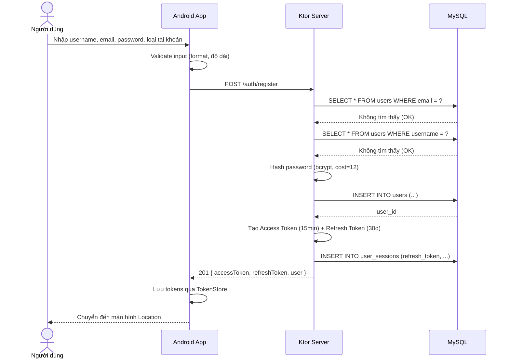
```mermaid
sequenceDiagram
    actor U as Người dùng
    participant App as Android App
    participant API as Ktor Server
    participant DB as MySQL

    U->>App: Nhập username, email, password, loại tài khoản
    App->>App: Validate input (format, độ dài)
    App->>API: POST /auth/register
    API->>DB: SELECT * FROM users WHERE email = ?
    DB-->>API: Không tìm thấy (OK)
    API->>DB: SELECT * FROM users WHERE username = ?
    DB-->>API: Không tìm thấy (OK)
    API->>API: Hash password (bcrypt, cost=12)
    API->>DB: INSERT INTO users (...)
    DB-->>API: user_id
    API->>API: Tạo Access Token (15min) + Refresh Token (30d)
    API->>DB: INSERT INTO user_sessions (refresh_token, ...)
    API-->>App: 201 { accessToken, refreshToken, user }
    App->>App: Lưu tokens qua TokenStore
    App-->>U: Chuyển đến màn hình Location
```

---

#### 2.2.5.2. Sequence Diagram — Đăng nhập

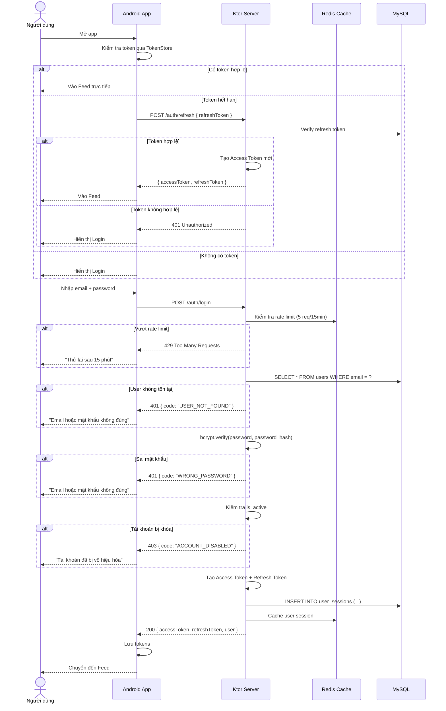
```mermaid
sequenceDiagram
    actor U as Người dùng
    participant App as Android App
    participant API as Ktor Server
    participant Redis as Redis Cache
    participant DB as MySQL

    U->>App: Mở app
    App->>App: Kiểm tra token qua TokenStore
    alt Có token hợp lệ
        App-->>U: Vào Feed trực tiếp
    else Token hết hạn
        App->>API: POST /auth/refresh { refreshToken }
        API->>DB: Verify refresh token
        alt Token hợp lệ
            API->>API: Tạo Access Token mới
            API-->>App: { accessToken, refreshToken }
            App-->>U: Vào Feed
        else Token không hợp lệ
            API-->>App: 401 Unauthorized
            App-->>U: Hiển thị Login
        end
    else Không có token
        App-->>U: Hiển thị Login
    end

    U->>App: Nhập email + password
    App->>API: POST /auth/login
    API->>Redis: Kiểm tra rate limit (5 req/15min)
    alt Vượt rate limit
        API-->>App: 429 Too Many Requests
        App-->>U: "Thử lại sau 15 phút"
    end
    API->>DB: SELECT * FROM users WHERE email = ?
    alt User không tồn tại
        API-->>App: 401 { code: "USER_NOT_FOUND" }
        App-->>U: "Email hoặc mật khẩu không đúng"
    end
    API->>API: bcrypt.verify(password, password_hash)
    alt Sai mật khẩu
        API-->>App: 401 { code: "WRONG_PASSWORD" }
        App-->>U: "Email hoặc mật khẩu không đúng"
    end
    API->>API: Kiểm tra is_active
    alt Tài khoản bị khóa
        API-->>App: 403 { code: "ACCOUNT_DISABLED" }
        App-->>U: "Tài khoản đã bị vô hiệu hóa"
    end
    API->>API: Tạo Access Token + Refresh Token
    API->>DB: INSERT INTO user_sessions (...)
    API->>Redis: Cache user session
    API-->>App: 200 { accessToken, refreshToken, user }
    App->>App: Lưu tokens
    App-->>U: Chuyển đến Feed
```

---

#### 2.2.5.5. Sequence Diagram — Quên mật khẩu

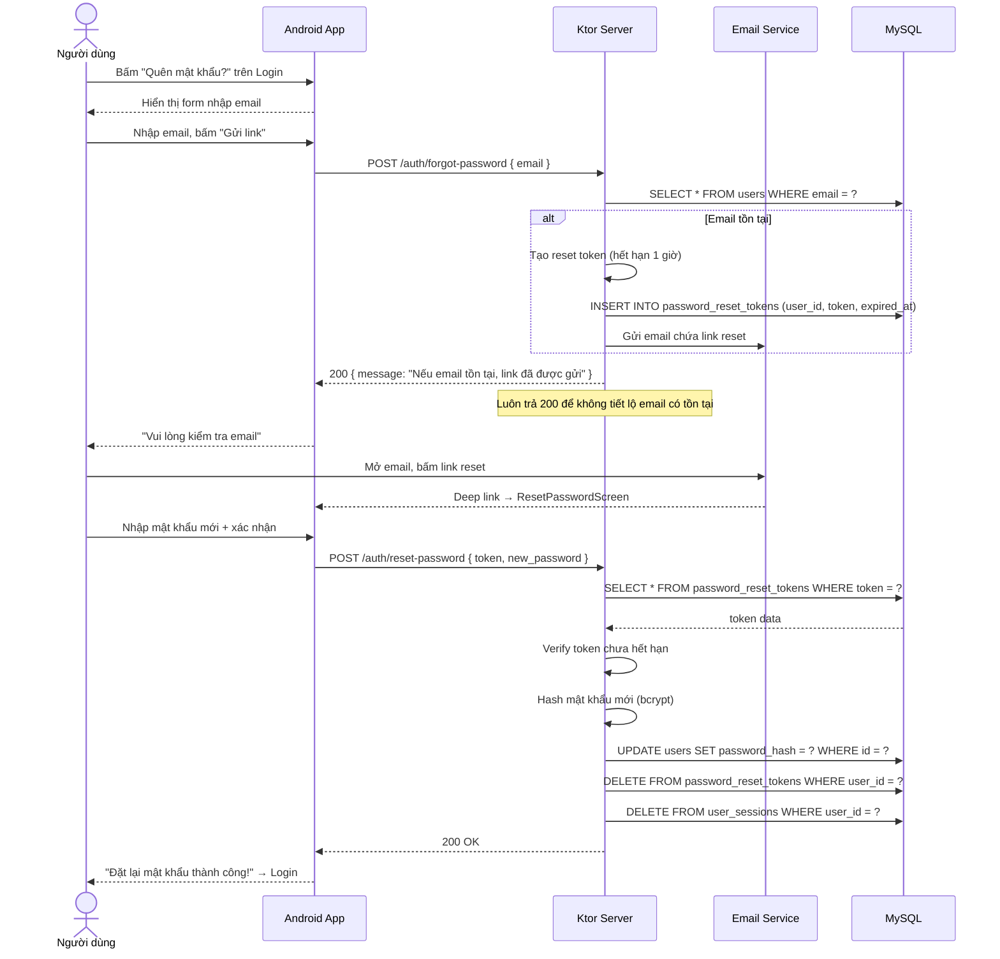
```mermaid
sequenceDiagram
    actor U as Người dùng
    participant App as Android App
    participant API as Ktor Server
    participant Email as Email Service
    participant DB as MySQL

    U->>App: Bấm "Quên mật khẩu?" trên Login
    App-->>U: Hiển thị form nhập email

    U->>App: Nhập email, bấm "Gửi link"
    App->>API: POST /auth/forgot-password { email }
    API->>DB: SELECT * FROM users WHERE email = ?
    alt Email tồn tại
        API->>API: Tạo reset token (hết hạn 1 giờ)
        API->>DB: INSERT INTO password_reset_tokens (user_id, token, expired_at)
        API->>Email: Gửi email chứa link reset
    end
    API-->>App: 200 { message: "Nếu email tồn tại, link đã được gửi" }
    Note over API: Luôn trả 200 để không tiết lộ email có tồn tại
    App-->>U: "Vui lòng kiểm tra email"

    U->>Email: Mở email, bấm link reset
    Email-->>App: Deep link → ResetPasswordScreen

    U->>App: Nhập mật khẩu mới + xác nhận
    App->>API: POST /auth/reset-password { token, new_password }
    API->>DB: SELECT * FROM password_reset_tokens WHERE token = ?
    DB-->>API: token data
    API->>API: Verify token chưa hết hạn
    API->>API: Hash mật khẩu mới (bcrypt)
    API->>DB: UPDATE users SET password_hash = ? WHERE id = ?
    API->>DB: DELETE FROM password_reset_tokens WHERE user_id = ?
    API->>DB: DELETE FROM user_sessions WHERE user_id = ?
    API-->>App: 200 OK
    App-->>U: "Đặt lại mật khẩu thành công!" → Login
```

---

#### 2.2.5.8. Sequence Diagram — Cập nhật hồ sơ cá nhân

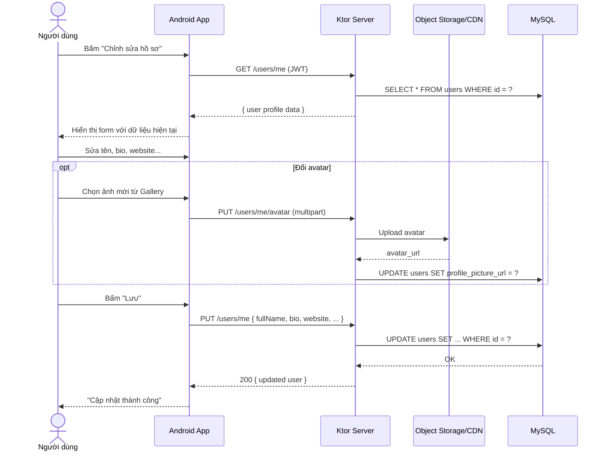
```mermaid
sequenceDiagram
    actor U as Người dùng
    participant App as Android App
    participant API as Ktor Server
    participant S3 as Object Storage/CDN
    participant DB as MySQL

    U->>App: Bấm "Chỉnh sửa hồ sơ"
    App->>API: GET /users/me (JWT)
    API->>DB: SELECT * FROM users WHERE id = ?
    API-->>App: { user profile data }
    App-->>U: Hiển thị form với dữ liệu hiện tại

    U->>App: Sửa tên, bio, website...
    opt Đổi avatar
        U->>App: Chọn ảnh mới từ Gallery
        App->>API: PUT /users/me/avatar (multipart)
        API->>S3: Upload avatar
        S3-->>API: avatar_url
        API->>DB: UPDATE users SET profile_picture_url = ?
    end

    U->>App: Bấm "Lưu"
    App->>API: PUT /users/me { fullName, bio, website, ... }
    API->>DB: UPDATE users SET ... WHERE id = ?
    DB-->>API: OK
    API-->>App: 200 { updated user }
    App-->>U: "Cập nhật thành công"
```

---

#### 2.2.5.10. Sequence Diagram — Upload ảnh / Đăng bài

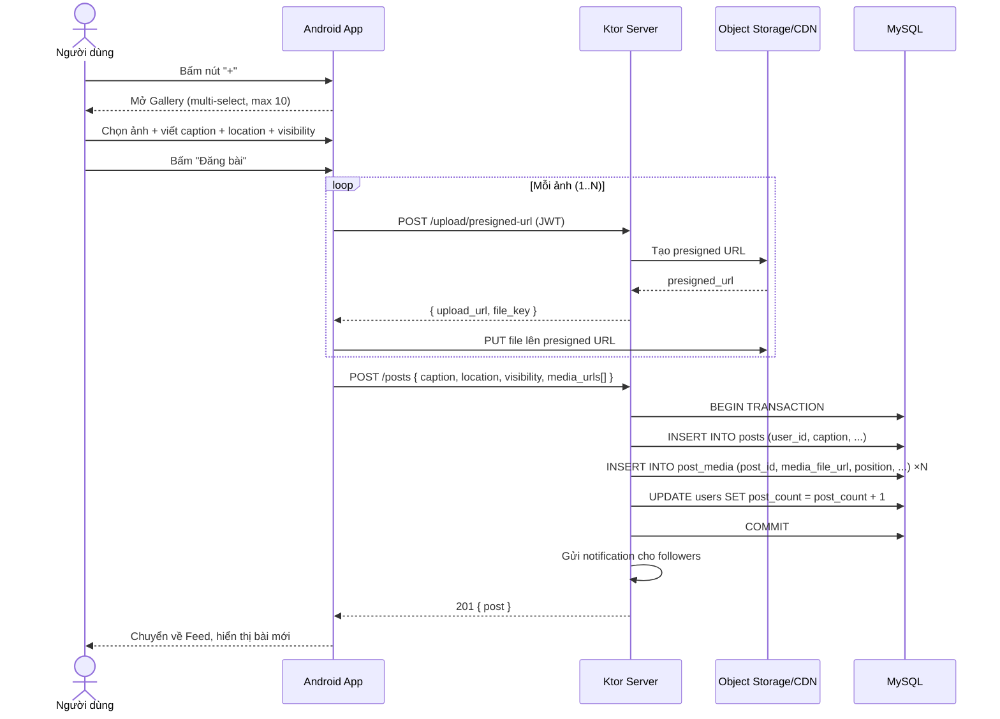
```mermaid
sequenceDiagram
    actor U as Người dùng
    participant App as Android App
    participant API as Ktor Server
    participant S3 as Object Storage/CDN
    participant DB as MySQL

    U->>App: Bấm nút "+"
    App-->>U: Mở Gallery (multi-select, max 10)
    U->>App: Chọn ảnh + viết caption + location + visibility

    U->>App: Bấm "Đăng bài"
    loop Mỗi ảnh (1..N)
        App->>API: POST /upload/presigned-url (JWT)
        API->>S3: Tạo presigned URL
        S3-->>API: presigned_url
        API-->>App: { upload_url, file_key }
        App->>S3: PUT file lên presigned URL
    end
    App->>API: POST /posts { caption, location, visibility, media_urls[] }
    API->>DB: BEGIN TRANSACTION
    API->>DB: INSERT INTO posts (user_id, caption, ...)
    API->>DB: INSERT INTO post_media (post_id, media_file_url, position, ...) ×N
    API->>DB: UPDATE users SET post_count = post_count + 1
    API->>DB: COMMIT
    API->>API: Gửi notification cho followers
    API-->>App: 201 { post }
    App-->>U: Chuyển về Feed, hiển thị bài mới
```

---

#### 2.2.5.11. Sequence Diagram — Chỉnh sửa bài đăng

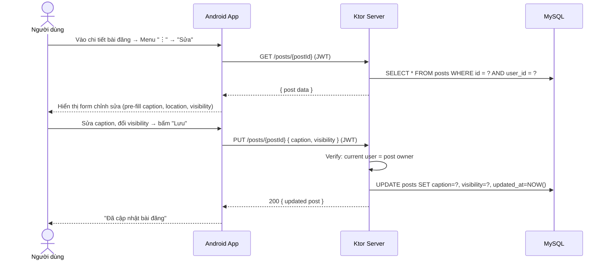
```mermaid
sequenceDiagram
    actor U as Người dùng
    participant App as Android App
    participant API as Ktor Server
    participant DB as MySQL

    U->>App: Vào chi tiết bài đăng → Menu "⋮" → "Sửa"
    App->>API: GET /posts/{postId} (JWT)
    API->>DB: SELECT * FROM posts WHERE id = ? AND user_id = ?
    API-->>App: { post data }
    App-->>U: Hiển thị form chỉnh sửa (pre-fill caption, location, visibility)

    U->>App: Sửa caption, đổi visibility → bấm "Lưu"
    App->>API: PUT /posts/{postId} { caption, visibility } (JWT)
    API->>API: Verify: current user = post owner
    API->>DB: UPDATE posts SET caption=?, visibility=?, updated_at=NOW()
    API-->>App: 200 { updated post }
    App-->>U: "Đã cập nhật bài đăng"
```

---

#### 2.2.5.13. Sequence Diagram — Duyệt Feed ảnh

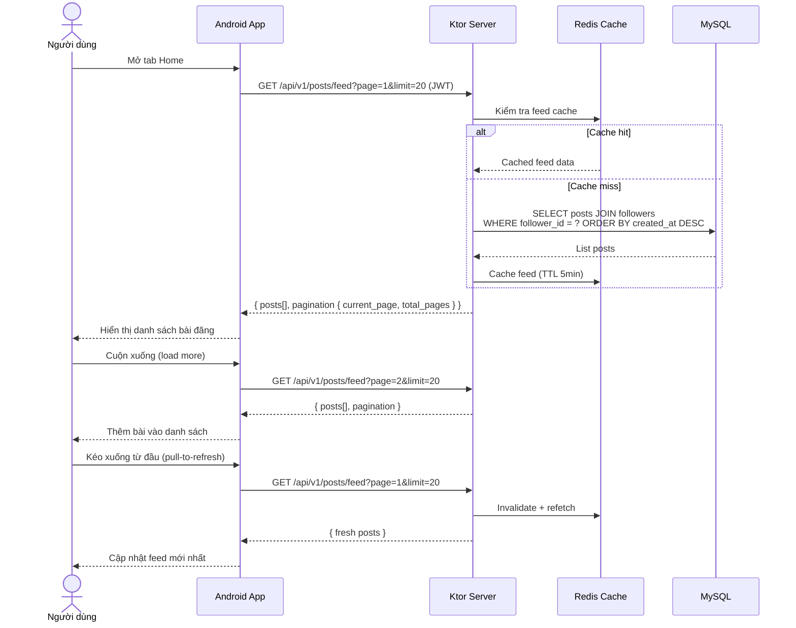
```mermaid
sequenceDiagram
    actor U as Người dùng
    participant App as Android App
    participant API as Ktor Server
    participant Redis as Redis Cache
    participant DB as MySQL

    U->>App: Mở tab Home
    App->>API: GET /api/v1/posts/feed?page=1&limit=20 (JWT)
    API->>Redis: Kiểm tra feed cache
    alt Cache hit
        Redis-->>API: Cached feed data
    else Cache miss
        API->>DB: SELECT posts JOIN followers<br/>WHERE follower_id = ? ORDER BY created_at DESC
        DB-->>API: List posts
        API->>Redis: Cache feed (TTL 5min)
    end
    API-->>App: { posts[], pagination { current_page, total_pages } }
    App-->>U: Hiển thị danh sách bài đăng

    U->>App: Cuộn xuống (load more)
    App->>API: GET /api/v1/posts/feed?page=2&limit=20
    API-->>App: { posts[], pagination }
    App-->>U: Thêm bài vào danh sách

    U->>App: Kéo xuống từ đầu (pull-to-refresh)
    App->>API: GET /api/v1/posts/feed?page=1&limit=20
    API->>Redis: Invalidate + refetch
    API-->>App: { fresh posts }
    App-->>U: Cập nhật feed mới nhất
```

---

#### 2.2.5.14. Sequence Diagram — Khám phá (Explore)

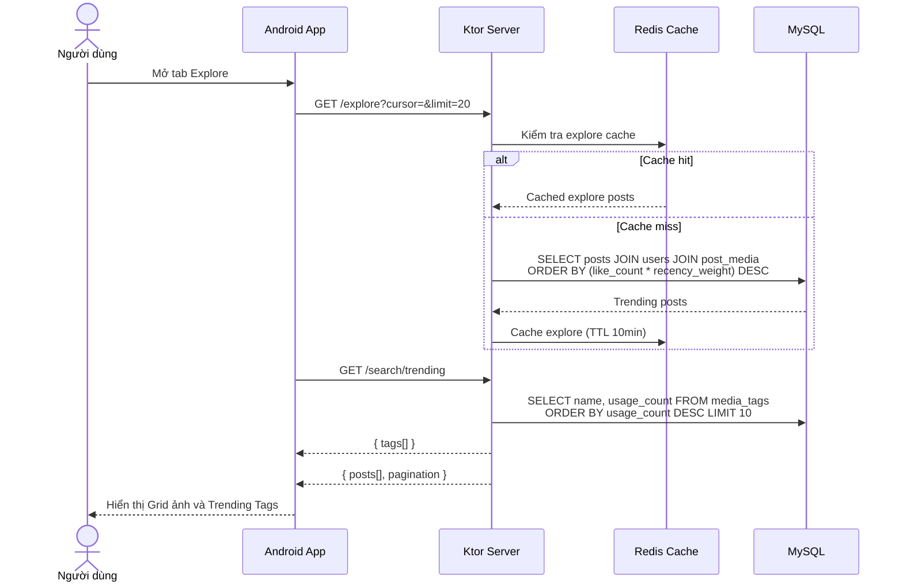
```mermaid
sequenceDiagram
    actor U as Người dùng
    participant App as Android App
    participant API as Ktor Server
    participant Redis as Redis Cache
    participant DB as MySQL

    U->>App: Mở tab Explore
    App->>API: GET /explore?cursor=&limit=20
    API->>Redis: Kiểm tra explore cache
    alt Cache hit
        Redis-->>API: Cached explore posts
    else Cache miss
        API->>DB: SELECT posts JOIN users JOIN post_media<br/>ORDER BY (like_count * recency_weight) DESC
        DB-->>API: Trending posts
        API->>Redis: Cache explore (TTL 10min)
    end
    
    App->>API: GET /search/trending
    API->>DB: SELECT name, usage_count FROM media_tags<br/>ORDER BY usage_count DESC LIMIT 10
    API-->>App: { tags[] }
    
    API-->>App: { posts[], pagination }
    App-->>U: Hiển thị Grid ảnh và Trending Tags
```

---

#### 2.2.5.15. Sequence Diagram — Xem chi tiết bài đăng

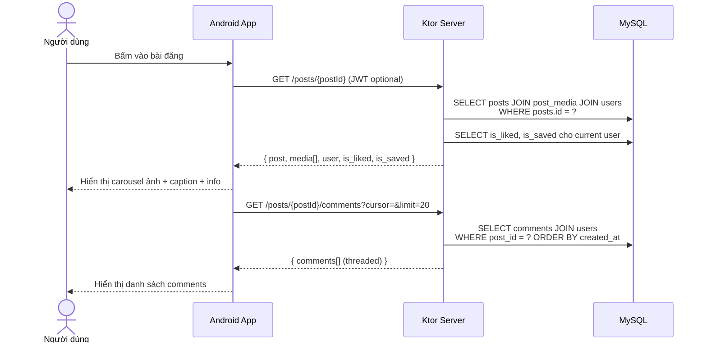
```mermaid
sequenceDiagram
    actor U as Người dùng
    participant App as Android App
    participant API as Ktor Server
    participant DB as MySQL

    U->>App: Bấm vào bài đăng
    App->>API: GET /posts/{postId} (JWT optional)
    API->>DB: SELECT posts JOIN post_media JOIN users<br/>WHERE posts.id = ?
    API->>DB: SELECT is_liked, is_saved cho current user
    API-->>App: { post, media[], user, is_liked, is_saved }
    App-->>U: Hiển thị carousel ảnh + caption + info

    App->>API: GET /posts/{postId}/comments?cursor=&limit=20
    API->>DB: SELECT comments JOIN users<br/>WHERE post_id = ? ORDER BY created_at
    API-->>App: { comments[] (threaded) }
    App-->>U: Hiển thị danh sách comments
```

---

#### 2.2.5.19. Sequence Diagram — Like / Unlike bài đăng

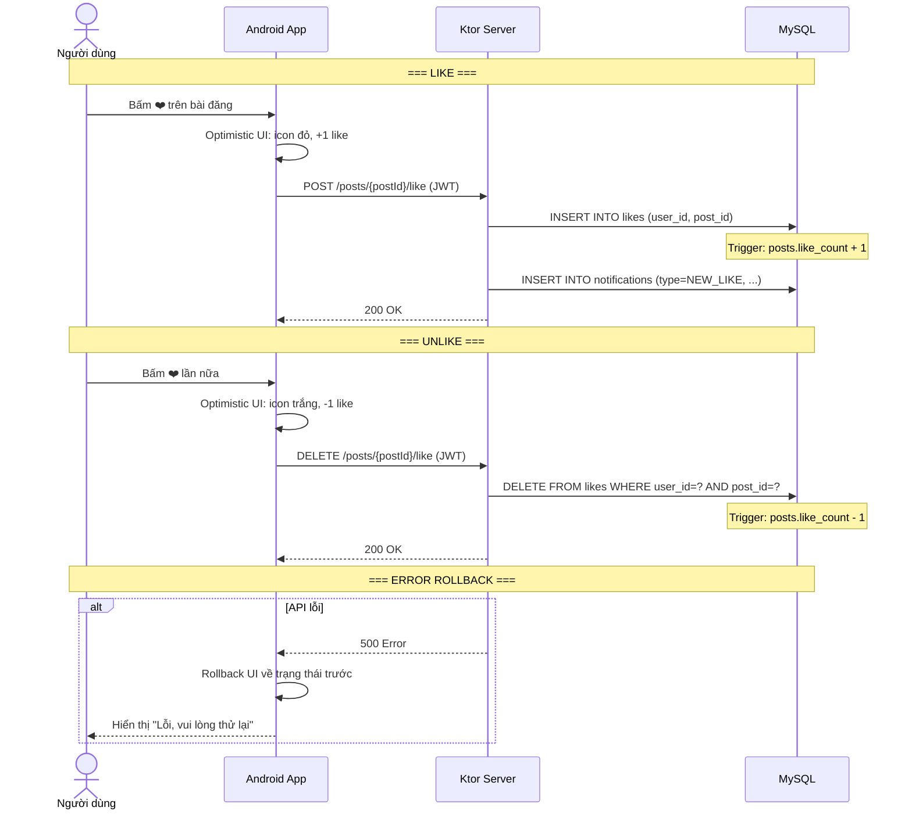
```mermaid
sequenceDiagram
    actor U as Người dùng
    participant App as Android App
    participant API as Ktor Server
    participant DB as MySQL

    Note over U,DB: === LIKE ===
    U->>App: Bấm ❤️ trên bài đăng
    App->>App: Optimistic UI: icon đỏ, +1 like
    App->>API: POST /posts/{postId}/like (JWT)
    API->>DB: INSERT INTO likes (user_id, post_id)
    Note over DB: Trigger: posts.like_count + 1
    API->>DB: INSERT INTO notifications (type=NEW_LIKE, ...)
    API-->>App: 200 OK
    
    Note over U,DB: === UNLIKE ===
    U->>App: Bấm ❤️ lần nữa
    App->>App: Optimistic UI: icon trắng, -1 like
    App->>API: DELETE /posts/{postId}/like (JWT)
    API->>DB: DELETE FROM likes WHERE user_id=? AND post_id=?
    Note over DB: Trigger: posts.like_count - 1
    API-->>App: 200 OK

    Note over U,DB: === ERROR ROLLBACK ===
    alt API lỗi
        API-->>App: 500 Error
        App->>App: Rollback UI về trạng thái trước
        App-->>U: Hiển thị "Lỗi, vui lòng thử lại"
    end
```

---

#### 2.2.5.20. Sequence Diagram — Bình luận (Comment)

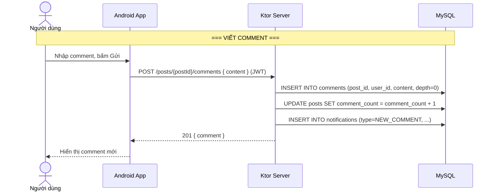
```mermaid
sequenceDiagram
    actor U as Người dùng
    participant App as Android App
    participant API as Ktor Server
    participant DB as MySQL

    Note over U,DB: === VIẾT COMMENT ===
    U->>App: Nhập comment, bấm Gửi
    App->>API: POST /posts/{postId}/comments { content } (JWT)
    API->>DB: INSERT INTO comments (post_id, user_id, content, depth=0)
    API->>DB: UPDATE posts SET comment_count = comment_count + 1
    API->>DB: INSERT INTO notifications (type=NEW_COMMENT, ...)
    API-->>App: 201 { comment }
    App-->>U: Hiển thị comment mới
```

---

#### 2.2.5.22. Sequence Diagram — Follow / Unfollow

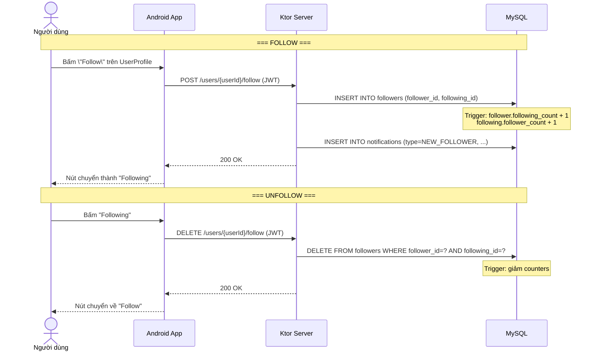
```mermaid
sequenceDiagram
    actor U as Người dùng
    participant App as Android App
    participant API as Ktor Server
    participant DB as MySQL

    Note over U,DB: === FOLLOW ===
    U->>App: Bấm \"Follow\" trên UserProfile
    App->>API: POST /users/{userId}/follow (JWT)
    API->>DB: INSERT INTO followers (follower_id, following_id)
    Note over DB: Trigger: follower.following_count + 1<br/>following.follower_count + 1
    API->>DB: INSERT INTO notifications (type=NEW_FOLLOWER, ...)
    API-->>App: 200 OK
    App-->>U: Nút chuyển thành "Following"

    Note over U,DB: === UNFOLLOW ===
    U->>App: Bấm "Following"
    App->>API: DELETE /users/{userId}/follow (JWT)
    API->>DB: DELETE FROM followers WHERE follower_id=? AND following_id=?
    Note over DB: Trigger: giảm counters
    API-->>App: 200 OK
    App-->>U: Nút chuyển về "Follow"
```

---

#### 2.2.5.23. Sequence Diagram — Tìm kiếm ảnh / Thợ ảnh / Hashtag

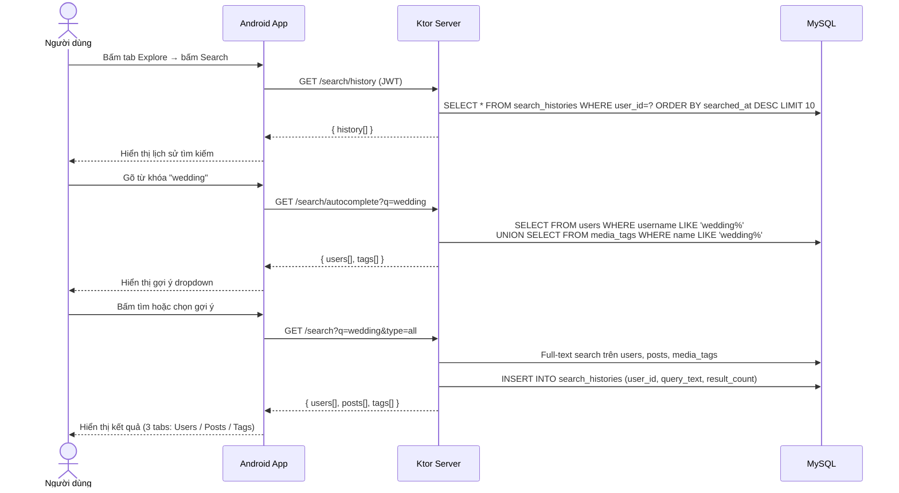
```mermaid
sequenceDiagram
    actor U as Người dùng
    participant App as Android App
    participant API as Ktor Server
    participant DB as MySQL

    U->>App: Bấm tab Explore → bấm Search
    App->>API: GET /search/history (JWT)
    API->>DB: SELECT * FROM search_histories WHERE user_id=? ORDER BY searched_at DESC LIMIT 10
    API-->>App: { history[] }
    App-->>U: Hiển thị lịch sử tìm kiếm

    U->>App: Gõ từ khóa "wedding"
    App->>API: GET /search/autocomplete?q=wedding
    API->>DB: SELECT FROM users WHERE username LIKE 'wedding%'<br/>UNION SELECT FROM media_tags WHERE name LIKE 'wedding%'
    API-->>App: { users[], tags[] }
    App-->>U: Hiển thị gợi ý dropdown

    U->>App: Bấm tìm hoặc chọn gợi ý
    App->>API: GET /search?q=wedding&type=all
    API->>DB: Full-text search trên users, posts, media_tags
    API->>DB: INSERT INTO search_histories (user_id, query_text, result_count)
    API-->>App: { users[], posts[], tags[] }
    App-->>U: Hiển thị kết quả (3 tabs: Users / Posts / Tags)
```

---

#### 2.2.5.34. Sequence Diagram — Xem Portfolio nhiếp ảnh gia

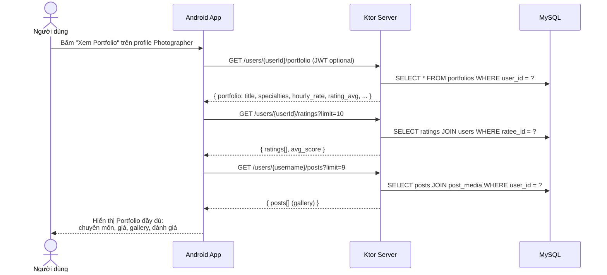
```mermaid
sequenceDiagram
    actor U as Người dùng
    participant App as Android App
    participant API as Ktor Server
    participant DB as MySQL

    U->>App: Bấm "Xem Portfolio" trên profile Photographer
    App->>API: GET /users/{userId}/portfolio (JWT optional)
    API->>DB: SELECT * FROM portfolios WHERE user_id = ?
    API-->>App: { portfolio: title, specialties, hourly_rate, rating_avg, ... }

    App->>API: GET /users/{userId}/ratings?limit=10
    API->>DB: SELECT ratings JOIN users WHERE ratee_id = ?
    API-->>App: { ratings[], avg_score }

    App->>API: GET /users/{username}/posts?limit=9
    API->>DB: SELECT posts JOIN post_media WHERE user_id = ?
    API-->>App: { posts[] (gallery) }

    App-->>U: Hiển thị Portfolio đầy đủ:<br/>chuyên môn, giá, gallery, đánh giá
```

---

#### 2.2.5.35. Sequence Diagram — Đặt lịch chụp

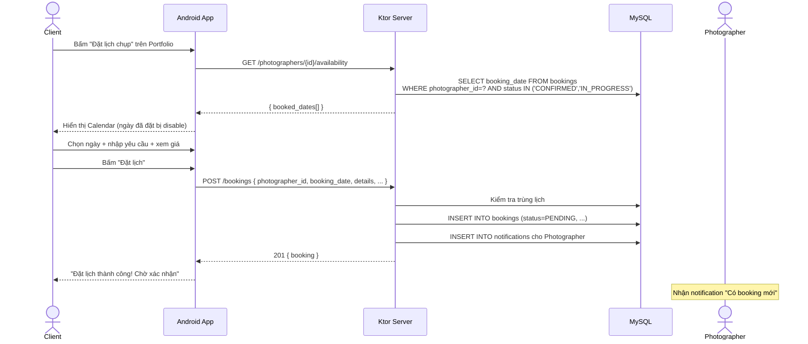
```mermaid
sequenceDiagram
    actor C as Client
    participant App as Android App
    participant API as Ktor Server
    participant DB as MySQL
    actor P as Photographer

    C->>App: Bấm "Đặt lịch chụp" trên Portfolio
    App->>API: GET /photographers/{id}/availability
    API->>DB: SELECT booking_date FROM bookings<br/>WHERE photographer_id=? AND status IN ('CONFIRMED','IN_PROGRESS')
    API-->>App: { booked_dates[] }
    App-->>C: Hiển thị Calendar (ngày đã đặt bị disable)

    C->>App: Chọn ngày + nhập yêu cầu + xem giá
    C->>App: Bấm "Đặt lịch"
    App->>API: POST /bookings { photographer_id, booking_date, details, ... }
    API->>DB: Kiểm tra trùng lịch
    API->>DB: INSERT INTO bookings (status=PENDING, ...)
    API->>DB: INSERT INTO notifications cho Photographer
    API-->>App: 201 { booking }
    App-->>C: "Đặt lịch thành công! Chờ xác nhận"
    Note over P: Nhận notification "Có booking mới"
```

---

#### 2.2.5.36. Sequence Diagram — Đánh giá thợ ảnh

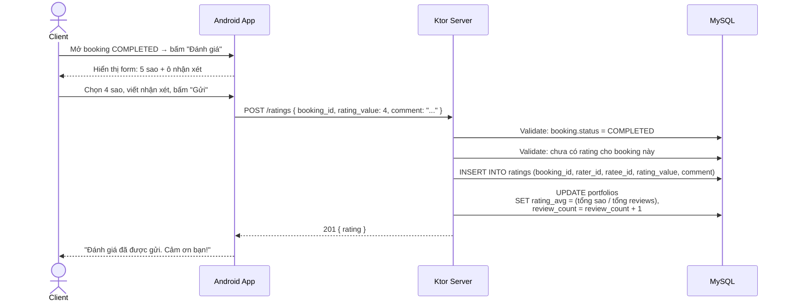
```mermaid
sequenceDiagram
    actor C as Client
    participant App as Android App
    participant API as Ktor Server
    participant DB as MySQL

    C->>App: Mở booking COMPLETED → bấm "Đánh giá"
    App-->>C: Hiển thị form: 5 sao + ô nhận xét

    C->>App: Chọn 4 sao, viết nhận xét, bấm "Gửi"
    App->>API: POST /ratings { booking_id, rating_value: 4, comment: "..." }
    API->>DB: Validate: booking.status = COMPLETED
    API->>DB: Validate: chưa có rating cho booking này
    API->>DB: INSERT INTO ratings (booking_id, rater_id, ratee_id, rating_value, comment)
    API->>DB: UPDATE portfolios<br/>SET rating_avg = (tổng sao / tổng reviews),<br/>review_count = review_count + 1
    API-->>App: 201 { rating }
    App-->>C: "Đánh giá đã được gửi. Cảm ơn bạn!"
```

---

#### 2.2.5.37. Sequence Diagram — Nhắn tin (Chat)

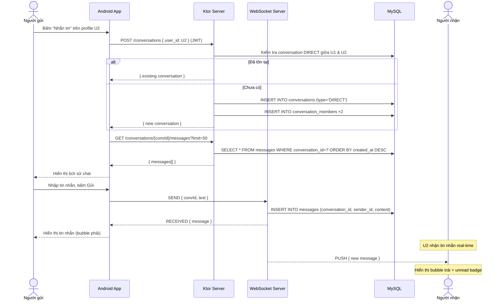
```mermaid
sequenceDiagram
    actor U1 as Người gửi
    participant App as Android App
    participant API as Ktor Server
    participant WS as WebSocket Server
    participant DB as MySQL
    actor U2 as Người nhận

    U1->>App: Bấm "Nhắn tin" trên profile U2
    App->>API: POST /conversations { user_id: U2 } (JWT)
    API->>DB: Kiểm tra conversation DIRECT giữa U1 & U2
    alt Đã tồn tại
        API-->>App: { existing conversation }
    else Chưa có
        API->>DB: INSERT INTO conversations (type='DIRECT')
        API->>DB: INSERT INTO conversation_members ×2
        API-->>App: { new conversation }
    end

    App->>API: GET /conversations/{convId}/messages?limit=50
    API->>DB: SELECT * FROM messages WHERE conversation_id=? ORDER BY created_at DESC
    API-->>App: { messages[] }
    App-->>U1: Hiển thị lịch sử chat

    U1->>App: Nhập tin nhắn, bấm Gửi
    App->>WS: SEND { convId, text }
    WS->>DB: INSERT INTO messages (conversation_id, sender_id, content)
    WS-->>App: RECEIVED { message }
    App-->>U1: Hiển thị tin nhắn (bubble phải)

    Note over U2: U2 nhận tin nhắn real-time
    WS-->>U2: PUSH { new message }
    Note over U2: Hiển thị bubble trái + unread badge
```

---

#### 2.2.5.40. Sequence Diagram — Quản lý Booking

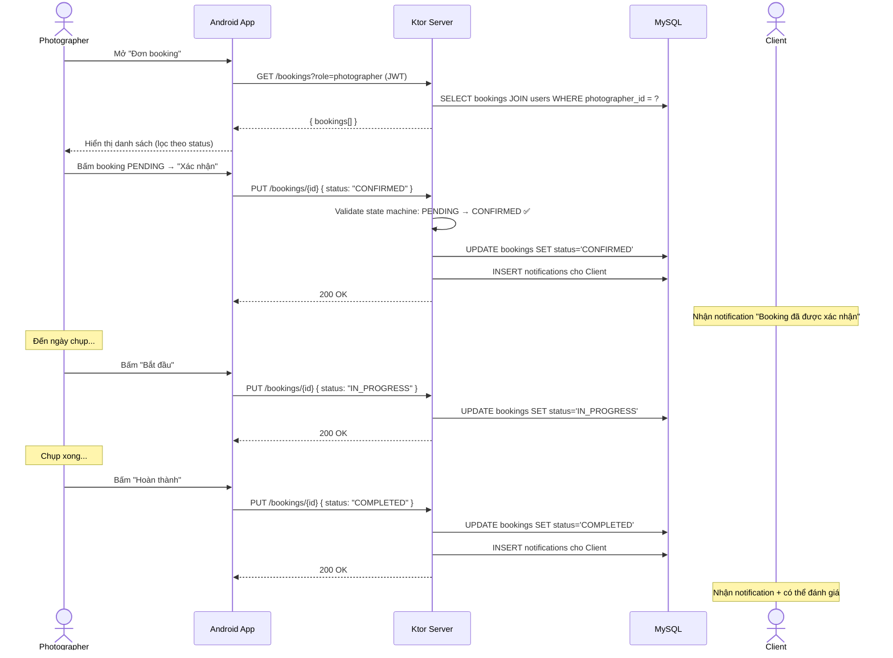
```mermaid
sequenceDiagram
    actor P as Photographer
    participant App as Android App
    participant API as Ktor Server
    participant DB as MySQL
    actor C as Client

    P->>App: Mở "Đơn booking"
    App->>API: GET /bookings?role=photographer (JWT)
    API->>DB: SELECT bookings JOIN users WHERE photographer_id = ?
    API-->>App: { bookings[] }
    App-->>P: Hiển thị danh sách (lọc theo status)

    P->>App: Bấm booking PENDING → "Xác nhận"
    App->>API: PUT /bookings/{id} { status: "CONFIRMED" }
    API->>API: Validate state machine: PENDING → CONFIRMED ✅
    API->>DB: UPDATE bookings SET status='CONFIRMED'
    API->>DB: INSERT notifications cho Client
    API-->>App: 200 OK
    Note over C: Nhận notification "Booking đã được xác nhận"

    Note over P: Đến ngày chụp...
    P->>App: Bấm "Bắt đầu"
    App->>API: PUT /bookings/{id} { status: "IN_PROGRESS" }
    API->>DB: UPDATE bookings SET status='IN_PROGRESS'
    API-->>App: 200 OK

    Note over P: Chụp xong...
    P->>App: Bấm "Hoàn thành"
    App->>API: PUT /bookings/{id} { status: "COMPLETED" }
    API->>DB: UPDATE bookings SET status='COMPLETED'
    API->>DB: INSERT notifications cho Client
    API-->>App: 200 OK
    Note over C: Nhận notification + có thể đánh giá
```

---

#### 2.2.5.42. Sequence Diagram — Quản lý người dùng

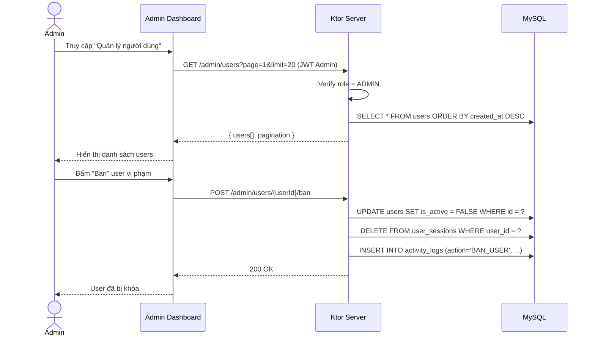
```mermaid
sequenceDiagram
    actor A as Admin
    participant Web as Admin Dashboard
    participant API as Ktor Server
    participant DB as MySQL

    A->>Web: Truy cập "Quản lý người dùng"
    Web->>API: GET /admin/users?page=1&limit=20 (JWT Admin)
    API->>API: Verify role = ADMIN
    API->>DB: SELECT * FROM users ORDER BY created_at DESC
    API-->>Web: { users[], pagination }
    Web-->>A: Hiển thị danh sách users

    A->>Web: Bấm "Ban" user vi phạm
    Web->>API: POST /admin/users/{userId}/ban
    API->>DB: UPDATE users SET is_active = FALSE WHERE id = ?
    API->>DB: DELETE FROM user_sessions WHERE user_id = ?
    API->>DB: INSERT INTO activity_logs (action='BAN_USER', ...)
    API-->>Web: 200 OK
    Web-->>A: User đã bị khóa
```

---

#### 2.2.5.43. Sequence Diagram — Kiểm duyệt nội dung

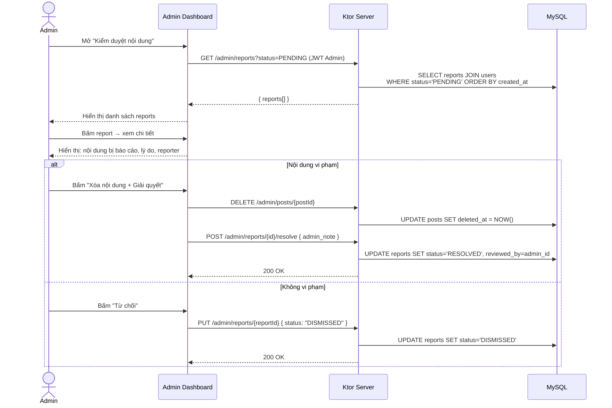
```mermaid
sequenceDiagram
    actor A as Admin
    participant Web as Admin Dashboard
    participant API as Ktor Server
    participant DB as MySQL

    A->>Web: Mở "Kiểm duyệt nội dung"
    Web->>API: GET /admin/reports?status=PENDING (JWT Admin)
    API->>DB: SELECT reports JOIN users<br/>WHERE status='PENDING' ORDER BY created_at
    API-->>Web: { reports[] }
    Web-->>A: Hiển thị danh sách reports

    A->>Web: Bấm report → xem chi tiết
    Web-->>A: Hiển thị: nội dung bị báo cáo, lý do, reporter

    alt Nội dung vi phạm
        A->>Web: Bấm "Xóa nội dung + Giải quyết"
        Web->>API: DELETE /admin/posts/{postId}
        API->>DB: UPDATE posts SET deleted_at = NOW()
        Web->>API: POST /admin/reports/{id}/resolve { admin_note }
        API->>DB: UPDATE reports SET status='RESOLVED', reviewed_by=admin_id
        API-->>Web: 200 OK
    else Không vi phạm
        A->>Web: Bấm "Từ chối"
        Web->>API: PUT /admin/reports/{reportId} { status: "DISMISSED" }
        API->>DB: UPDATE reports SET status='DISMISSED'
        API-->>Web: 200 OK
    end
```

---

#### 2.2.5.44. Sequence Diagram — Thống kê hệ thống

```mermaid
sequenceDiagram
    actor A as Admin
    participant Web as Admin Dashboard
    participant API as Ktor Server
    participant DB as MySQL

    A->>Web: Truy cập Dashboard
    Web->>API: GET /admin/dashboard/stats (JWT Admin)
    API->>DB: SELECT COUNT(*) FROM users WHERE deleted_at IS NULL
    API->>DB: SELECT COUNT(*) FROM posts WHERE deleted_at IS NULL
    API->>DB: SELECT COUNT(*) FROM bookings
    API->>DB: SELECT COUNT(*) FROM reports WHERE status='PENDING'
    API-->>Web: { total_users, total_posts, total_bookings, pending_reports }

    Web->>API: GET /admin/dashboard/growth?period=30days
    API->>DB: SELECT DATE(created_at), COUNT(*)<br/>FROM users GROUP BY DATE(created_at)
    API->>DB: SELECT DATE(created_at), COUNT(*)<br/>FROM posts GROUP BY DATE(created_at)
    API-->>Web: { users_growth[], posts_growth[] }
    Web-->>A: Hiển thị Dashboard với biểu đồ tăng trưởng
```

---

> **📌 Ghi chú:** Các Sequence Diagram cho các use case còn lại được mô tả chi tiết tại file `PhanTichUseCase_Part5.md`, bao gồm:
>
> - SD 2.2.5.4: Đăng xuất
> - SD 2.2.5.6: Đổi mật khẩu
> - SD 2.2.5.12: Xóa bài đăng
> - SD 2.2.5.21: Lưu bài đăng (Save/Unsave)
> - SD 2.2.5.26: Chia sẻ bài đăng
> - SD 2.2.5.29: Báo cáo vi phạm
> - SD 2.2.5.30: Chặn người dùng (Block/Unblock)
> - SD 2.2.5.33: Xóa tài khoản
> - SD 2.2.5.38: Xem thông báo
> - SD 2.2.5.39: Tạo / Chỉnh sửa Portfolio
>
> *Lưu ý:* Các use case còn lại không có Sequence Diagram riêng do thuộc nhóm chức năng cấu hình hoặc quản trị đơn giản.
