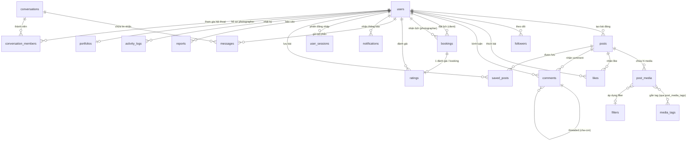
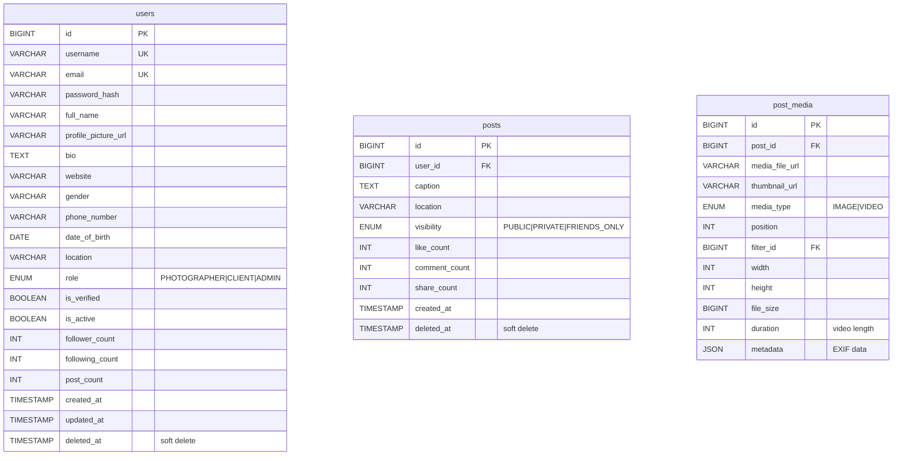

## 2.3. Xây dựng cơ sở dữ liệu

### 2.3.1. Biểu đồ Entity Relationship Diagram (ERD)

Hệ thống InstaGallery sử dụng MySQL 8.x với charset utf8mb4 (hỗ trợ emoji), engine InnoDB. Theo bộ backend mới nhất, tổng cộng có **33 bảng** được phân thành 10 nhóm. ERD dưới đây minh họa các quan hệ lõi; danh sách schema đầy đủ xem `docs_backend/database_schema.md`.

#### ERD Tổng thể



#### ERD Chi tiết — Users & Posts



#### ERD Chi tiết — Business & Messaging

```mermaid
erDiagram
    bookings {
        BIGINT id PK
        BIGINT client_id FK
        BIGINT photographer_id FK
        DATETIME booking_date
        DECIMAL duration_hours
        VARCHAR location_booking
        TEXT details
        DECIMAL price
        VARCHAR currency
        ENUM status "PENDING|CONFIRMED|IN_PROGRESS|COMPLETED|CANCELLED"
        TEXT cancellation_reason
    }
    conversations {
        BIGINT id PK
        VARCHAR title
        ENUM type "DIRECT|GROUP"
        TIMESTAMP updated_at
    }
    conversation_members {
        BIGINT conversation_id PK_FK
        BIGINT user_id PK_FK
        ENUM role "MEMBER|ADMIN"
        BOOLEAN is_muted
        TIMESTAMP joined_at
        TIMESTAMP last_read_at "unread tracking"
    }
    messages {
        BIGINT id PK
        BIGINT conversation_id FK
        BIGINT sender_id FK
        TEXT content
        ENUM message_type "TEXT|IMAGE|VIDEO|FILE|SYSTEM"
        VARCHAR media_url
        BIGINT reply_to_id FK
        BOOLEAN is_deleted "soft delete"
        TIMESTAMP created_at
    }
    ratings {
        BIGINT id PK
        BIGINT booking_id FK_UK
        BIGINT rater_id FK
        BIGINT ratee_id FK
        SMALLINT rating_value "1-5"
        TEXT comment
        TIMESTAMP created_at
    }
```

---

### 2.3.2. Các bảng trong cơ sở dữ liệu

Hệ thống hiện gồm 33 bảng được phân thành 10 nhóm chức năng. Phần mô tả chi tiết mới nhất được chuẩn hóa tại [database_schema.md](../database/database_schema.md) và các file mô tả bảng trong [Các bảng trong cơ sở dữ liệu/](Các%20bảng%20trong%20cơ%20sở%20dữ%20liệu/).

#### Nhóm 1: Auth & Identity (3 bảng)

**Bảng 1: `users`** — Lưu giữ thông tin định danh người dùng hệ thống.
*(Xem chi tiết tại [MoTaBang_Part1.md](Các%20bảng%20trong%20cơ%20sở%20dữ%20liệu/MoTaBang_Part1.md))*

| Cột | Kiểu dữ liệu | Ràng buộc | Mô tả |
|---|---|---|---|
| id | BIGINT | PK, AUTO_INCREMENT | ID người dùng |
| username | VARCHAR(50) | NOT NULL, UNIQUE INDEX | Tên đăng nhập |
| email | VARCHAR(100) | NOT NULL, UNIQUE INDEX | Email |
| password_hash | VARCHAR(255) | NOT NULL | Mật khẩu đã hash |
| full_name | VARCHAR(100) | NOT NULL | Họ và tên |
| profile_picture_url | VARCHAR(255) | NULL | URL ảnh đại diện |
| bio | TEXT | NULL | Tiểu sử |
| website | VARCHAR(255) | NULL | Website cá nhân |
| gender | VARCHAR(20) | NULL | Giới tính |
| phone_number | VARCHAR(20) | NULL | Số điện thoại |
| date_of_birth | DATE | NULL | Ngày sinh |
| location | VARCHAR(255) | NULL | Địa chỉ |
| user_type | ENUM('CLIENT','PHOTOGRAPHER') | NOT NULL, DEFAULT 'CLIENT' | Loại người dùng |
| role | ENUM('USER','ADMIN') | NOT NULL, DEFAULT 'USER' | Vai trò phân quyền |
| provider | ENUM('LOCAL','GOOGLE','FACEBOOK') | NOT NULL, DEFAULT 'LOCAL' | OAuth provider |
| provider_id | VARCHAR(255) | NULL, UNIQUE | ID từ OAuth provider |
| is_two_factor_enabled | BOOLEAN | NOT NULL, DEFAULT FALSE | Bật xác thực 2 lớp (2FA) |
| two_factor_secret | VARCHAR(255) | NULL | Secret key TOTP |
| is_private | BOOLEAN | NOT NULL, DEFAULT FALSE | Tài khoản ở chế độ riêng tư |
| is_verified | BOOLEAN | NOT NULL, DEFAULT FALSE | Tài khoản đã được admin verify |
| is_active | BOOLEAN | NOT NULL, DEFAULT TRUE | Tài khoản đang hoạt động |
| follower_count | INT | NOT NULL, DEFAULT 0 | Cache số người theo dõi |
| following_count | INT | NOT NULL, DEFAULT 0 | Cache số người đang theo dõi |
| post_count | INT | NOT NULL, DEFAULT 0 | Cache số bài viết đã đăng |
| created_at | TIMESTAMP | NOT NULL, DEFAULT NOW | Ngày tạo |
| updated_at | TIMESTAMP | NOT NULL, DEFAULT NOW | Ngày cập nhật |
| deleted_at | TIMESTAMP | NULL | Soft delete |

**Bảng 2: `user_sessions`** — Quản lý token phiên hoạt động theo thiết bị.
*(Xem chi tiết tại [MoTaBang_Part1.md](Các%20bảng%20trong%20cơ%20sở%20dữ%20liệu/MoTaBang_Part1.md))*

| Cột | Kiểu dữ liệu | Ràng buộc | Mô tả |
|---|---|---|---|
| id | BIGINT | PK | ID phiên đăng nhập |
| user_id | BIGINT | FK → users(id), INDEX | ID người dùng sở hữu phiên |
| device_info | VARCHAR(255) | NULL | Thông tin thiết bị đăng nhập |
| ip_address | VARCHAR(45) | NULL | Địa chỉ IP đăng nhập |
| refresh_token | VARCHAR(255) | NOT NULL, UNIQUE INDEX | Refresh token của JWT |
| created_at | TIMESTAMP | NOT NULL, DEFAULT NOW | Thời gian tạo |
| expired_at | TIMESTAMP | NOT NULL, INDEX | Thời gian hết hạn |

**Bảng 3: `password_reset_tokens`** — Token một lần gửi qua email khi quên mật khẩu.
*(Xem chi tiết tại [MoTaBang_Part1.md](Các%20bảng%20trong%20cơ%20sở%20dữ%20liệu/MoTaBang_Part1.md))*

| Cột | Kiểu dữ liệu | Ràng buộc | Mô tả |
|---|---|---|---|
| id | BIGINT | PK | ID token |
| user_id | BIGINT | FK → users(id), NOT NULL | Người sở hữu |
| token | VARCHAR(255) | NOT NULL, UNIQUE INDEX | Token đặt lại mật khẩu |
| expired_at | DATETIME | NOT NULL | Thời gian hết hạn |
| created_at | TIMESTAMP | NOT NULL, DEFAULT NOW | Thời gian tạo |

#### Nhóm 2: Nội dung & Media (5 bảng)

**Bảng 4: `posts`** — Lưu thông tin bài đăng của người dùng.
*(Xem chi tiết tại [MoTaBang_Part1.md](Các%20bảng%20trong%20cơ%20sở%20dữ%20liệu/MoTaBang_Part1.md))*

| Cột | Kiểu dữ liệu | Ràng buộc | Mô tả |
|---|---|---|---|
| id | BIGINT | PK | ID bài đăng |
| user_id | BIGINT | FK → users(id) ON DELETE CASCADE, INDEX | ID người đăng |
| caption | TEXT | NULL | Chú thích nội dung |
| location | VARCHAR(255) | NULL | Địa điểm |
| visibility | ENUM('PUBLIC','FOLLOWERS','PRIVATE') | NOT NULL, DEFAULT 'PUBLIC', INDEX | Chế độ hiển thị bài đăng |
| comment_visibility | ENUM('ALLOW_ALL','FOLLOWERS','DISABLED') | NOT NULL, DEFAULT 'ALLOW_ALL' | Quyền bình luận |
| like_count | INT | NOT NULL, DEFAULT 0 | Trực quan hóa số lượt thích |
| comment_count | INT | NOT NULL, DEFAULT 0 | Trực quan hóa số bình luận |
| share_count | INT | NOT NULL, DEFAULT 0 | Trực quan hóa số lượt chia sẻ |
| created_at | TIMESTAMP | NOT NULL, DEFAULT NOW, INDEX | Thời điểm đăng |
| updated_at | TIMESTAMP | NOT NULL, DEFAULT NOW | Thời điểm sửa |
| deleted_at | TIMESTAMP | NULL, INDEX | Soft delete |

**Bảng 5: `post_media`** — File ảnh/video đính kèm bài viết (hỗ trợ carousel).
*(Xem chi tiết tại [MoTaBang_Part1.md](Các%20bảng%20trong%20cơ%20sở%20dữ%20liệu/MoTaBang_Part1.md))*

| Cột | Kiểu dữ liệu | Ràng buộc | Mô tả |
|---|---|---|---|
| id | BIGINT | PK | ID file đính kèm |
| post_id | BIGINT | FK → posts(id) ON DELETE CASCADE, INDEX | ID bài viết |
| media_file_url | VARCHAR(500) | NOT NULL | URL file gốc |
| thumbnail_url | VARCHAR(500) | NULL | URL file ảnh thu nhỏ |
| media_type | ENUM('IMAGE','VIDEO') | NOT NULL, DEFAULT 'IMAGE' | Loại file |
| position | INT | NOT NULL, DEFAULT 0 | Thứ tự trong carousel |
| filter_id | BIGINT | FK → filters(id) SET NULL, NULL | Bộ lọc áp dụng |
| width | INT | NULL | Chiều rộng file (px) |
| height | INT | NULL | Chiều cao file (px) |
| file_size | BIGINT | NULL | Dung lượng file (bytes) |
| duration | INT | NULL | Thời lượng video (giây) |
| metadata | TEXT | NULL | EXIF metadata |
| created_at | TIMESTAMP | NOT NULL, DEFAULT NOW | Thời điểm tạo |

**Bảng 6: `filters`** — Bộ lọc màu có thể kết cấu áp dụng lên ảnh.
*(Xem chi tiết tại [MoTaBang_Part1.md](Các%20bảng%20trong%20cơ%20sở%20dữ%20liệu/MoTaBang_Part1.md))*

| Cột | Kiểu dữ liệu | Ràng buộc | Mô tả |
|---|---|---|---|
| id | BIGINT | PK | ID filter |
| name | VARCHAR(50) | NOT NULL, UNIQUE INDEX | Tên bộ lọc |
| description | TEXT | NULL | Mô tả bộ lọc |
| config_json | TEXT | NULL | Cấu hình tham số của filter |
| preview_url | VARCHAR(255) | NULL | URL ảnh preview khi áp dụng filter |
| is_active | BOOLEAN | NOT NULL, DEFAULT TRUE | Trạng thái hoạt động |

**Bảng 7: `media_tags`** — Danh mục từ khóa / hashtag gắn tag.
*(Xem chi tiết tại [MoTaBang_Part1.md](Các%20bảng%20trong%20cơ%20sở%20dữ%20liệu/MoTaBang_Part1.md))*

| Cột | Kiểu dữ liệu | Ràng buộc | Mô tả |
|---|---|---|---|
| id | BIGINT | PK | ID hashtag |
| name | VARCHAR(50) | NOT NULL, UNIQUE INDEX | Tên hashtag |
| description | TEXT | NULL | Mô tả |
| usage_count | INT | NOT NULL, DEFAULT 0, INDEX | Số lần từ khóa được dùng |
| created_at | TIMESTAMP | NOT NULL, DEFAULT NOW | Ngày tạo |

**Bảng 8: `post_media_tags`** — Bảng trung gian mapping Tag cho từng Media.
*(Xem chi tiết tại [MoTaBang_Part1.md](Các%20bảng%20trong%20cơ%20sở%20dữ%20liệu/MoTaBang_Part1.md))*

| Cột | Kiểu dữ liệu | Ràng buộc | Mô tả |
|---|---|---|---|
| media_id | BIGINT | PK, FK → post_media(id) ON DELETE CASCADE | ID file media |
| tag_id | BIGINT | PK, FK → media_tags(id) ON DELETE CASCADE, INDEX | ID hashtag |
| created_at | TIMESTAMP | NOT NULL, DEFAULT NOW | Ngày gắn hashtag |

#### Nhóm 3: Tương tác xã hội (5 bảng)

**Bảng 9: `likes`** — Thích bài viết.
*(Xem chi tiết tại [MoTaBang_Part2.md](Các%20bảng%20trong%20cơ%20sở%20dữ%20liệu/MoTaBang_Part2.md))*

| Cột | Kiểu dữ liệu | Ràng buộc | Mô tả |
|---|---|---|---|
| id | BIGINT | PK | ID lượt thích |
| user_id | BIGINT | FK → users(id) ON DELETE CASCADE | ID người thích |
| post_id | BIGINT | FK → posts(id) ON DELETE CASCADE, INDEX | ID bài viết |
| created_at | TIMESTAMP | NOT NULL, DEFAULT NOW, INDEX | Thời điểm thích |

**Bảng 10: `comment_likes`** — Thích một bình luận cụ thể.
*(Xem chi tiết tại [MoTaBang_Part2.md](Các%20bảng%20trong%20cơ%20sở%20dữ%20liệu/MoTaBang_Part2.md))*

| Cột | Kiểu dữ liệu | Ràng buộc | Mô tả |
|---|---|---|---|
| id | BIGINT | PK | ID lượt thích |
| user_id | BIGINT | FK → users(id) ON DELETE CASCADE | ID người thích |
| comment_id | BIGINT | FK → comments(id) ON DELETE CASCADE, INDEX | ID bình luận |
| created_at | TIMESTAMP | NOT NULL, DEFAULT NOW, INDEX | Thời điểm thích |

**Bảng 11: `comment_dislikes`** — Không thích một bình luận.
*(Xem chi tiết tại [MoTaBang_Part2.md](Các%20bảng%20trong%20cơ%20sở%20dữ%20liệu/MoTaBang_Part2.md))*

| Cột | Kiểu dữ liệu | Ràng buộc | Mô tả |
|---|---|---|---|
| id | BIGINT | PK | ID lượt không thích |
| user_id | BIGINT | FK → users(id) ON DELETE CASCADE | ID người không thích |
| comment_id | BIGINT | FK → comments(id) ON DELETE CASCADE, INDEX | ID bình luận |
| created_at | TIMESTAMP | NOT NULL, DEFAULT NOW, INDEX | Thời điểm không thích |

**Bảng 12: `comments`** — Bình luận bài đăng (hỗ trợ nested tối đa 3 cấp).
*(Xem chi tiết tại [MoTaBang_Part2.md](Các%20bảng%20trong%20cơ%20sở%20dữ%20liệu/MoTaBang_Part2.md))*

| Cột | Kiểu dữ liệu | Ràng buộc | Mô tả |
|---|---|---|---|
| id | BIGINT | PK | ID bình luận |
| post_id | BIGINT | FK → posts(id) ON DELETE CASCADE, INDEX | ID bài viết |
| user_id | BIGINT | FK → users(id) ON DELETE CASCADE, INDEX | ID người bình luận |
| content | TEXT | NOT NULL | Nội dung bình luận |
| parent_comment_id | BIGINT | FK → comments(id) ON DELETE CASCADE, NULL, INDEX | Reply cho bình luận nào |
| like_count | INT | NOT NULL, DEFAULT 0 | Trực quan hóa số lượt thích |
| reply_count | INT | NOT NULL, DEFAULT 0 | Trực quan hóa số phản hồi |
| depth | TINYINT | NOT NULL, DEFAULT 0 | Độ sâu của cây bình luận (Check <= 3) |
| created_at | TIMESTAMP | NOT NULL, DEFAULT NOW | Thời điểm tạo |
| updated_at | TIMESTAMP | NOT NULL, DEFAULT NOW | Thời điểm sửa |
| deleted_at | TIMESTAMP | NULL | Soft delete |

**Bảng 13: `saved_posts`** — Người dùng lưu bài đăng để xem lại.
*(Xem chi tiết tại [MoTaBang_Part2.md](Các%20bảng%20trong%20cơ%20sở%20dữ%20liệu/MoTaBang_Part2.md))*

| Cột | Kiểu dữ liệu | Ràng buộc | Mô tả |
|---|---|---|---|
| id | BIGINT | PK | ID lưu bài viết |
| user_id | BIGINT | FK → users(id) ON DELETE CASCADE | ID người lưu |
| post_id | BIGINT | FK → posts(id) ON DELETE CASCADE, INDEX | ID bài viết |
| saved_at | TIMESTAMP | NOT NULL, DEFAULT NOW | Thời điểm lưu |

#### Nhóm 4: Quan hệ người dùng (4 bảng)

**Bảng 14: `followers`** — Theo dõi người dùng trực tiếp.
*(Xem chi tiết tại [MoTaBang_Part2.md](Các%20bảng%20trong%20cơ%20sở%20dữ%20liệu/MoTaBang_Part2.md))*

| Cột | Kiểu dữ liệu | Ràng buộc | Mô tả |
|---|---|---|---|
| follower_id | BIGINT | PK, FK → users(id) ON DELETE CASCADE | ID người follow |
| following_id | BIGINT | PK, FK → users(id) ON DELETE CASCADE, INDEX | ID người được follow |
| created_at | TIMESTAMP | NOT NULL, DEFAULT NOW, INDEX | Thời điểm follow |

**Bảng 15: `follow_requests`** — Gửi yêu cầu follow đối với tài khoản Private.
*(Xem chi tiết tại [MoTaBang_Part2.md](Các%20bảng%20trong%20cơ%20sở%20dữ%20liệu/MoTaBang_Part2.md))*

| Cột | Kiểu dữ liệu | Ràng buộc | Mô tả |
|---|---|---|---|
| id | BIGINT | PK | ID yêu cầu |
| follower_id | BIGINT | FK → users(id) ON DELETE CASCADE, INDEX | ID người gửi yêu cầu |
| following_id | BIGINT | FK → users(id) ON DELETE CASCADE, INDEX | ID người nhận |
| status | ENUM('PENDING','ACCEPTED','REJECTED') | NOT NULL, DEFAULT 'PENDING', INDEX | Trạng thái yêu cầu |
| created_at | TIMESTAMP | NOT NULL, DEFAULT NOW | Ngày gửi |
| updated_at | TIMESTAMP | NOT NULL, DEFAULT NOW | Ngày phản hồi |

**Bảng 16: `blocked_users`** — Chặn người dùng khác.
*(Xem chi tiết tại [MoTaBang_Part2.md](Các%20bảng%20trong%20cơ%20sở%20dữ%20liệu/MoTaBang_Part2.md))*

| Cột | Kiểu dữ liệu | Ràng buộc | Mô tả |
|---|---|---|---|
| id | BIGINT | PK | ID chặn |
| blocker_id | BIGINT | FK → users(id) ON DELETE CASCADE, INDEX | ID người chặn |
| blocked_id | BIGINT | FK → users(id) ON DELETE CASCADE, INDEX | ID bị chặn |
| reason | VARCHAR(255) | NULL | Lý do chặn |
| created_at | TIMESTAMP | NOT NULL, DEFAULT NOW | Ngày chặn |

**Bảng 17: `muted_users`** — Tắt tiếng người dùng khác.
*(Xem chi tiết tại [MoTaBang_Part2.md](Các%20bảng%20trong%20cơ%20sở%20dữ%20liệu/MoTaBang_Part2.md))*

| Cột | Kiểu dữ liệu | Ràng buộc | Mô tả |
|---|---|---|---|
| id | BIGINT | PK | ID tắt tiếng |
| muter_id | BIGINT | FK → users(id) ON DELETE CASCADE, INDEX | ID người tắt tiếng |
| muted_id | BIGINT | FK → users(id) ON DELETE CASCADE, INDEX | ID bị tắt tiếng |
| created_at | TIMESTAMP | NOT NULL, DEFAULT NOW | Ngày tắt tiếng |

#### Nhóm 5: Nhắn tin (3 bảng)

**Bảng 18: `conversations`** — Phòng hội thoại chat 1-1 hoặc nhóm.
*(Xem chi tiết tại [MoTaBang_Part3.md](Các%20bảng%20trong%20cơ%20sở%20dữ%20liệu/MoTaBang_Part3.md))*

| Cột | Kiểu dữ liệu | Ràng buộc | Mô tả |
|---|---|---|---|
| id | BIGINT | PK | ID hội thoại |
| title | VARCHAR(255) | NULL | Tiêu đề nhóm chat (chỉ cho nhóm) |
| type | ENUM('DIRECT','GROUP') | NOT NULL, DEFAULT 'DIRECT' | Phân loại chat 1-1 hay chat nhóm |
| created_at | TIMESTAMP | NOT NULL, DEFAULT NOW | Ngày tạo phòng |
| updated_at | TIMESTAMP | NOT NULL, DEFAULT NOW, INDEX | Thời điểm cập nhật cuối / tin nhắn mới nhất |

**Bảng 19: `conversation_members`** — Trạng thái và phân quyền thành viên trong phòng chat.
*(Xem chi tiết tại [MoTaBang_Part3.md](Các%20bảng%20trong%20cơ%20sở%20dữ%20liệu/MoTaBang_Part3.md))*

| Cột | Kiểu dữ liệu | Ràng buộc | Mô tả |
|---|---|---|---|
| conversation_id | BIGINT | PK, FK → conversations(id) ON DELETE CASCADE | ID phòng chat |
| user_id | BIGINT | PK, FK → users(id) ON DELETE CASCADE, INDEX | ID thành viên tham gia |
| role | ENUM('MEMBER','ADMIN') | NOT NULL, DEFAULT 'MEMBER' | Quyền quản trị nhóm |
| nickname | VARCHAR(50) | NULL | Biệt danh trong cuộc hội thoại |
| is_muted | BOOLEAN | NOT NULL, DEFAULT FALSE | Tắt thông báo từ phòng chat |
| joined_at | TIMESTAMP | NOT NULL, DEFAULT NOW | Thời điểm tham gia |
| last_read_at | TIMESTAMP | NULL | Thời điểm đọc tin nhắn cuối |

**Bảng 20: `messages`** — Chi tiết tin nhắn gửi trong phòng chat.
*(Xem chi tiết tại [MoTaBang_Part3.md](Các%20bảng%20trong%20cơ%20sở%20dữ%20liệu/MoTaBang_Part3.md))*

| Cột | Kiểu dữ liệu | Ràng buộc | Mô tả |
|---|---|---|---|
| id | BIGINT | PK | ID tin nhắn |
| conversation_id | BIGINT | FK → conversations(id) ON DELETE CASCADE, INDEX | ID phòng chat |
| sender_id | BIGINT | FK → users(id) ON DELETE CASCADE, INDEX | ID người gửi |
| content | TEXT | NULL | Nội dung tin nhắn dạng văn bản |
| message_type | ENUM('TEXT','IMAGE','VIDEO','FILE') | NOT NULL, DEFAULT 'TEXT' | Phân loại loại tin nhắn |
| media_url | VARCHAR(500) | NULL | URL đính kèm media |
| reply_to_id | BIGINT | FK → messages(id) SET NULL, NULL | Trả lời tin nhắn cũ |
| is_deleted | BOOLEAN | NOT NULL, DEFAULT FALSE | Xóa tin nhắn (phía người dùng) |
| created_at | TIMESTAMP | NOT NULL, DEFAULT NOW | Ngày gửi tin nhắn |

#### Nhóm 6: Album (2 bảng)

**Bảng 21: `albums`** — Tiêu đề album và cấu hình riêng tư của người dùng.
*(Xem chi tiết tại [MoTaBang_Part3.md](Các%20bảng%20trong%20cơ%20sở%20dữ%20liệu/MoTaBang_Part3.md))*

| Cột | Kiểu dữ liệu | Ràng buộc | Mô tả |
|---|---|---|---|
| id | BIGINT | PK | ID album |
| user_id | BIGINT | FK → users(id) ON DELETE CASCADE, INDEX | ID người tạo |
| title | VARCHAR(100) | NOT NULL | Tên album |
| description | TEXT | NULL | Mô tả chi tiết album |
| cover_image_url | VARCHAR(255) | NULL | Ảnh bìa album |
| is_private | BOOLEAN | NOT NULL, DEFAULT FALSE | Album ở chế độ riêng tư |
| created_at | TIMESTAMP | NOT NULL, DEFAULT NOW | Ngày tạo |
| updated_at | TIMESTAMP | NOT NULL, DEFAULT NOW | Ngày cập nhật |
| deleted_at | TIMESTAMP | NULL | Soft delete |

**Bảng 22: `album_media`** — Ánh xạ bài viết được thêm vào album.
*(Xem chi tiết tại [MoTaBang_Part3.md](Các%20bảng%20trong%20cơ%20sở%20dữ%20liệu/MoTaBang_Part3.md))*

| Cột | Kiểu dữ liệu | Ràng buộc | Mô tả |
|---|---|---|---|
| id | BIGINT | PK | ID bản ghi mapping |
| album_id | BIGINT | FK → albums(id) ON DELETE CASCADE, INDEX | ID album |
| post_id | BIGINT | FK → posts(id) ON DELETE CASCADE | ID bài đăng đính kèm |
| added_at | TIMESTAMP | NOT NULL, DEFAULT NOW | Thời điểm thêm vào |

#### Nhóm 7: Dịch vụ nhiếp ảnh & Đặt lịch (5 bảng)

**Bảng 23: `portfolios`** — Hồ sơ hoạt động dịch vụ của nhiếp ảnh gia.
*(Xem chi tiết tại [MoTaBang_Part4.md](Các%20bảng%20trong%20cơ%20sở%20dữ%20liệu/MoTaBang_Part4.md))*

| Cột | Kiểu dữ liệu | Ràng buộc | Mô tả |
|---|---|---|---|
| id | BIGINT | PK | ID hồ sơ |
| user_id | BIGINT | FK → users(id) ON DELETE CASCADE, UNIQUE INDEX | ID nhiếp ảnh gia (1-1) |
| title | VARCHAR(255) | NULL | Tiêu đề giới thiệu |
| description | TEXT | NULL | Mô tả năng lực và dịch vụ |
| specialties | TEXT | NULL | JSON Array lưu các chuyên môn |
| hourly_rate | DECIMAL(12,2) | NULL | Mức giá cơ bản theo giờ |
| currency | VARCHAR(3) | NOT NULL, DEFAULT 'VND' | Đơn vị tiền tệ |
| service_area | VARCHAR(255) | NULL | Khu vực phục vụ |
| is_available | BOOLEAN | NOT NULL, DEFAULT TRUE, INDEX | Trạng thái rảnh/nhận việc |
| rating_avg | DECIMAL(3,2) | NOT NULL, DEFAULT 0.00, INDEX | Điểm đánh giá trung bình |
| review_count | INT | NOT NULL, DEFAULT 0 | Tổng số lượt đánh giá |
| created_at | TIMESTAMP | NOT NULL, DEFAULT NOW | Ngày tạo |
| updated_at | TIMESTAMP | NOT NULL, DEFAULT NOW | Ngày cập nhật |

**Bảng 24: `photographer_services`** — Các gói dịch vụ cụ thể được bán cho khách.
*(Xem chi tiết tại [MoTaBang_Part4.md](Các%20bảng%20trong%20cơ%20sở%20dữ%20liệu/MoTaBang_Part4.md))*

| Cột | Kiểu dữ liệu | Ràng buộc | Mô tả |
|---|---|---|---|
| id | BIGINT | PK | ID dịch vụ |
| photographer_id | BIGINT | FK → users(id) ON DELETE CASCADE, INDEX | ID nhiếp ảnh gia sở hữu |
| name | VARCHAR(120) | NOT NULL | Tên gói dịch vụ |
| category | VARCHAR(40) | NOT NULL, INDEX | Phân loại danh mục chụp |
| price | DECIMAL(12,2) | NOT NULL | Giá gói |
| currency | VARCHAR(3) | NOT NULL, DEFAULT 'VND' | Loại tiền tệ |
| duration_minutes | INT | NOT NULL | Thời lượng chụp ảnh (phút) |
| photo_count | INT | NULL | Số lượng ảnh bàn giao tối thiểu |
| edited_photo_count | INT | NULL | Số lượng ảnh được retouch/photoshop |
| makeup_included | BOOLEAN | NOT NULL, DEFAULT FALSE | Bao gồm trang điểm |
| outfit_included | BOOLEAN | NOT NULL, DEFAULT FALSE | Bao gồm trang phục chụp |
| location_support | BOOLEAN | NOT NULL, DEFAULT TRUE | Hỗ trợ tư vấn/chọn địa điểm |
| description | TEXT | NULL | Mô tả chi tiết gói dịch vụ |
| includes | TEXT | NULL | Các dịch vụ đi kèm khác |
| cover_url | VARCHAR(1024) | NULL | URL ảnh bìa minh họa cho gói |
| is_active | BOOLEAN | NOT NULL, DEFAULT TRUE, INDEX | Gói dịch vụ đang kích hoạt |
| created_at | TIMESTAMP | NOT NULL, DEFAULT NOW | Ngày tạo |
| updated_at | TIMESTAMP | NOT NULL, DEFAULT NOW | Ngày cập nhật |

**Bảng 25: `availability_schedules`** — Cấu hình lịch rảnh theo định kỳ hoặc ngày cụ thể.
*(Xem chi tiết tại [MoTaBang_Part4.md](Các%20bảng%20trong%20cơ%20sở%20dữ%20liệu/MoTaBang_Part4.md))*

| Cột | Kiểu dữ liệu | Ràng buộc | Mô tả |
|---|---|---|---|
| id | BIGINT | PK | ID lịch rảnh |
| portfolio_id | BIGINT | FK → portfolios(id) ON DELETE CASCADE, INDEX | ID portfolio liên kết |
| type | ENUM('RECURRING','SPECIFIC_DATE') | NOT NULL | Lặp vô hạn theo tuần hay theo ngày cụ thể |
| day_of_week | ENUM('MONDAY','TUESDAY','WEDNESDAY','THURSDAY','FRIDAY','SATURDAY','SUNDAY') | NULL | Thứ trong tuần (nếu type = RECURRING) |
| specific_date | DATE | NULL | Ngày cụ thể (nếu type = SPECIFIC_DATE) |
| start_time | VARCHAR(5) | NOT NULL | Giờ bắt đầu (HH:mm) |
| end_time | VARCHAR(5) | NOT NULL | Giờ kết thúc (HH:mm) |
| is_booked | BOOLEAN | NOT NULL, DEFAULT FALSE | Đã được scheduler đặt khách chưa |
| created_at | TIMESTAMP | NOT NULL, DEFAULT NOW | Ngày tạo |
| updated_at | TIMESTAMP | NOT NULL, DEFAULT NOW | Ngày cập nhật |

**Bảng 26: `bookings`** — Chi tiết lịch hẹn chụp và giao kèo chi phí.
*(Xem chi tiết tại [MoTaBang_Part4.md](Các%20bảng%20trong%20cơ%20sở%20dữ%20liệu/MoTaBang_Part4.md))*

| Cột | Kiểu dữ liệu | Ràng buộc | Mô tả |
|---|---|---|---|
| id | BIGINT | PK | ID booking |
| client_id | BIGINT | FK → users(id) ON DELETE CASCADE, INDEX | Khách hàng đặt chụp |
| photographer_id | BIGINT | FK → users(id) ON DELETE CASCADE, INDEX | Nhiếp ảnh gia thực hiện |
| booking_date | DATETIME | NOT NULL, INDEX | Thời điểm chụp |
| duration_hours | DECIMAL(4,1) | NULL | Thời gian thực hiện (giờ) |
| location_booking | VARCHAR(255) | NULL | Địa điểm chụp |
| details | TEXT | NULL | Chi tiết yêu cầu |
| price | DECIMAL(12,2) | NULL | Giá thỏa thuận |
| currency | VARCHAR(3) | NOT NULL, DEFAULT 'VND' | Đơn vị tiền tệ |
| status | ENUM('PENDING','CONFIRMED','IN_PROGRESS','COMPLETED','CANCELLED') | NOT NULL, DEFAULT 'PENDING', INDEX | Trạng thái (PENDING, CONFIRMED, IN_PROGRESS, COMPLETED, CANCELLED) |
| cancellation_reason | TEXT | NULL | Lý do hủy buổi chụp |
| created_at | TIMESTAMP | NOT NULL, DEFAULT NOW | Ngày tạo |
| updated_at | TIMESTAMP | NOT NULL, DEFAULT NOW | Ngày cập nhật |

**Bảng 27: `ratings`** — Đánh giá feedback buổi chụp từ khách hàng hoặc thợ chụp.
*(Xem chi tiết tại [MoTaBang_Part4.md](Các%20bảng%20trong%20cơ%20sở%20dữ%20liệu/MoTaBang_Part4.md))*

| Cột | Kiểu dữ liệu | Ràng buộc | Mô tả |
|---|---|---|---|
| id | BIGINT | PK | ID đánh giá |
| booking_id | BIGINT | FK → bookings(id) ON DELETE CASCADE, UNIQUE INDEX | ID booking (1-1) |
| rater_id | BIGINT | FK → users(id) ON DELETE CASCADE, INDEX | Người đánh giá (Client/Photographer) |
| ratee_id | BIGINT | FK → users(id) ON DELETE CASCADE, INDEX | Người được đánh giá |
| rating_value | SMALLINT | NOT NULL, INDEX | Số điểm sao (1 - 5) |
| comment | TEXT | NULL | Nhận xét chi tiết |
| created_at | TIMESTAMP | NOT NULL, DEFAULT NOW | Thời điểm đánh giá |

#### Nhóm 8: Thông báo & Thiết bị (2 bảng)

**Bảng 28: `notifications`** — Thông báo đẩy đến người dùng.
*(Xem chi tiết tại [MoTaBang_Part4.md](Các%20bảng%20trong%20cơ%20sở%20dữ%20liệu/MoTaBang_Part4.md))*

| Cột | Kiểu dữ liệu | Ràng buộc | Mô tả |
|---|---|---|---|
| id | BIGINT | PK | ID thông báo |
| user_id | BIGINT | FK → users(id) ON DELETE CASCADE, INDEX | ID người nhận |
| sender_id | BIGINT | FK → users(id) ON DELETE SET NULL, NULL | Người gây ra thông báo |
| type | ENUM('LIKE','COMMENT','FOLLOW','BOOKING','MESSAGE','MENTION','SYSTEM') | NOT NULL | Phân loại thông báo |
| target_type | ENUM('POST','COMMENT','USER','BOOKING','CONVERSATION') | NULL | Loại đối tượng đích |
| target_id | BIGINT | NULL | ID đối tượng đích |
| title | VARCHAR(255) | NULL | Tiêu đề thông báo |
| body | TEXT | NULL | Nội dung chi tiết |
| is_read | BOOLEAN | NOT NULL, DEFAULT FALSE | Trạng thái đọc của người nhận |
| created_at | TIMESTAMP | NOT NULL, DEFAULT NOW, INDEX | Ngày tạo |

**Bảng 29: `device_tokens`** — Quản lý token FCM của các thiết bị để gửi push notification.
*(Xem chi tiết tại [MoTaBang_Part4.md](Các%20bảng%20trong%20cơ%20sở%20dữ%20liệu/MoTaBang_Part4.md))*

| Cột | Kiểu dữ liệu | Ràng buộc | Mô tả |
|---|---|---|---|
| id | BIGINT | PK | ID token thiết bị |
| user_id | BIGINT | FK → users(id) ON DELETE CASCADE, INDEX | ID chủ sở hữu |
| token | VARCHAR(512) | NOT NULL, UNIQUE INDEX | Token từ dịch vụ FCM |
| platform | VARCHAR(20) | NOT NULL, DEFAULT 'ANDROID' | Hệ điều hành thiết bị |
| device_id | VARCHAR(128) | NULL | Định danh duy nhất thiết bị vật lý |
| app_version | VARCHAR(64) | NULL | Phiên bản app đang cài đặt |
| created_at | TIMESTAMP | NOT NULL, DEFAULT NOW | Ngày đăng ký token |
| updated_at | TIMESTAMP | NOT NULL, DEFAULT NOW | Ngày cập nhật token |
| last_seen_at | TIMESTAMP | NOT NULL, DEFAULT NOW | Thời điểm hoạt động cuối |

#### Nhóm 9: Tìm kiếm (1 bảng)

**Bảng 30: `search_histories`** — Lưu vết lịch sử tìm kiếm từ khóa của người dùng.
*(Xem chi tiết tại [MoTaBang_Part4.md](Các%20bảng%20trong%20cơ%20sở%20dữ%20liệu/MoTaBang_Part4.md))*

| Cột | Kiểu dữ liệu | Ràng buộc | Mô tả |
|---|---|---|---|
| id | BIGINT | PK | ID bản ghi |
| user_id | BIGINT | FK → users(id) ON DELETE CASCADE, INDEX | Người thực hiện tìm kiếm |
| query_text | VARCHAR(255) | NOT NULL | Từ khóa đã nhập |
| result_count | INT | NULL | Số kết quả trả về từ tìm kiếm |
| searched_at | TIMESTAMP | NOT NULL, DEFAULT NOW, INDEX | Thời điểm tìm kiếm |

#### Nhóm 10: Kiểm duyệt & Audit (3 bảng)

**Bảng 31: `reports`** — Báo cáo các nội dung vi phạm tiêu chuẩn cộng đồng.
*(Xem chi tiết tại [MoTaBang_Part4.md](Các%20bảng%20trong%20cơ%20sở%20dữ%20liệu/MoTaBang_Part4.md))*

| Cột | Kiểu dữ liệu | Ràng buộc | Mô tả |
|---|---|---|---|
| id | BIGINT | PK | ID báo cáo |
| reporter_id | BIGINT | FK → users(id) ON DELETE CASCADE, INDEX | Người tạo báo cáo |
| target_type | ENUM('POST','USER','COMMENT','BOOKING','MESSAGE') | NOT NULL | Loại đối tượng bị báo cáo |
| target_id | BIGINT | NOT NULL | ID cụ thể đối tượng bị tố cáo |
| reason | TEXT | NOT NULL | Lý do báo cáo vi phạm |
| admin_note | TEXT | NULL | Ghi chú phản hồi của Admin xử lý |
| reviewed_by | BIGINT | FK → users(id) ON DELETE SET NULL, NULL | Admin chịu trách nhiệm |
| status | ENUM('PENDING','REVIEWID','RESOLVED','DISMISSED') | NOT NULL, DEFAULT 'PENDING', INDEX | Trạng thái xử lý |
| created_at | TIMESTAMP | NOT NULL, DEFAULT NOW | Thời điểm tạo báo cáo |
| updated_at | TIMESTAMP | NOT NULL, DEFAULT NOW | Thời điểm cập nhật cuối |

**Bảng 32: `banned_words`** — Các từ khóa bị cấm/lọc tự động (hỗ trợ regex).
*(Xem chi tiết tại [MoTaBang_Part4.md](Các%20bảng%20trong%20cơ%20sở%20dữ%20liệu/MoTaBang_Part4.md))*

| Cột | Kiểu dữ liệu | Ràng buộc | Mô tả |
|---|---|---|---|
| id | BIGINT | PK | ID từ cấm |
| word_or_regex | VARCHAR(255) | NOT NULL, UNIQUE INDEX | Định nghĩa từ / regex cấm |
| is_regex | BOOLEAN | NOT NULL, DEFAULT FALSE | Nhận diện pattern là regex |
| added_by_admin_id | BIGINT | FK → users(id) ON DELETE SET NULL, NULL | ID Admin thêm |
| created_at | TIMESTAMP | NOT NULL, DEFAULT NOW | Ngày tạo |

**Bảng 33: `activity_logs`** — Audit Trail chi tiết các hành động nhạy cảm trong hệ thống.
*(Xem chi tiết tại [MoTaBang_Part4.md](Các%20bảng%20trong%20cơ%20sở%20dữ%20liệu/MoTaBang_Part4.md))*

| Cột | Kiểu dữ liệu | Ràng buộc | Mô tả |
|---|---|---|---|
| id | BIGINT | PK | ID log |
| user_id | BIGINT | FK → users(id) ON DELETE SET NULL, NULL, INDEX | Người thực hiện hành động |
| action | VARCHAR(100) | NOT NULL, INDEX | Tên hành động thực hiện |
| target_type | ENUM('POST','USER','COMMENT','BOOKING','MEDIA','SESSION') | NOT NULL | Đối tượng bị tác động |
| target_id | BIGINT | NULL | ID đối tượng bị tác động |
| ip_address | VARCHAR(45) | NULL | Địa chỉ IP máy khách |
| user_agent | VARCHAR(500) | NULL | User Agent thiết bị thực hiện |
| metadata | TEXT | NULL | Thông tin kỷ thuật JSON bổ sung |
| created_at | TIMESTAMP | NOT NULL, DEFAULT NOW, INDEX | Thời điểm ghi log |

#### Denormalization & Triggers

Một số cột denormalized (counter) được đồng bộ bằng database triggers:

| Bảng | Cột counter | Trigger đồng bộ |
|---|---|---|
| `posts` | `like_count`, `comment_count` | Trigger trên `likes`, `comments` INSERT/DELETE |
| `users` | `follower_count`, `following_count`, `post_count` | Trigger trên `followers`, `posts` INSERT/DELETE |
| `portfolios` | `rating_avg`, `review_count` | Application logic khi INSERT `ratings` |
| `media_tags` | `usage_count` | Trigger trên `post_media_tags` |

---

## 2.4. Thiết kế giao diện

> Tất cả các mockup UI được thiết kế theo phong cách Material 3, tối ưu cho Android. Ảnh mockup nằm trong thư mục `UI Đồ án cho Hệ Thống Giao lưu Ảnh/UI_Mockups/`.

### 2.4.1. Màn hình đăng nhập (LoginScreen)

- **File mockup:** `02_LoginScreen.png`
- **Mô tả:** Màn hình đầu tiên khi chưa có phiên đăng nhập.
- **Thành phần UI:**
  - Logo InstaGallery ở trên cùng
  - Ô input Email (with icon)
  - Ô input Mật khẩu (with show/hide toggle)
  - Nút "Đăng nhập" (primary button)
  - Nút "Continue with Google" (social login)
  - Link "Quên mật khẩu?" → ForgotPasswordScreen
  - Link "Chưa có tài khoản? Đăng ký" → RegisterScreen
- **API:** `POST /auth/login`

### 2.4.2. Màn hình đăng ký (RegisterScreen)

- **File mockup:** `03_RegisterScreen.png`
- **Mô tả:** Form tạo tài khoản mới.
- **Thành phần UI:**
  - Ô input: Username, Email, Mật khẩu, Xác nhận mật khẩu
  - Chọn loại tài khoản: Client / Photographer (Radio buttons hoặc Chips)
  - Nút "Đăng ký" (primary button)
  - Link "Đã có tài khoản? Đăng nhập" → LoginScreen
- **API:** `POST /auth/register`

### 2.4.3. Màn hình Splash (SplashScreen)

- **File mockup:** `01_SplashScreen.png`
- **Mô tả:** Màn hình logo khởi động, tự động chuyển sau 2 giây.
- **Thành phần UI:**
  - Logo InstaGallery (ở giữa màn hình)
  - Loading indicator (spinner hoặc progress bar)
- **Logic:** Kiểm tra token → có token hợp lệ → Feed. Không → Login.
- **API:** `POST /auth/refresh`

### 2.4.4. Màn hình quên mật khẩu (ForgotPasswordScreen)

- **File mockup:** `04_ForgotPassword.png`
- **Mô tả:** Nhập email để nhận link đặt lại mật khẩu.
- **Thành phần UI:**
  - Icon/Illustration khóa
  - Text hướng dẫn: "Nhập email để nhận link đặt lại mật khẩu"
  - Ô input Email
  - Nút "Gửi link" (primary)
  - Thông báo thành công (sau khi gửi)
  - Nút quay lại Login
- **API:** `POST /auth/forgot-password`

### 2.4.5. Màn hình trang chủ — Feed (FeedScreen)

- **File mockup:** `06_FeedScreen.png`
- **Mô tả:** Trang chủ hiển thị bài đăng từ người mình follow.
- **Thành phần UI:**
  - Top AppBar: Logo "InstaGallery" + icon thông báo 🔔 + icon tin nhắn 💬
  - Danh sách bài đăng (LazyColumn):
    - Header: Avatar + Username + Thời gian + Menu "⋮"
    - Ảnh/Carousel (swipe ngang)
    - Action bar: ❤️ Like | 💬 Comment | 📩 Share | 🔖 Save
    - Số lượt like
    - Caption (truncated, "xem thêm")
    - "Xem tất cả N bình luận"
  - Pull-to-refresh
  - Bottom Navigation: 🏠 Home | 🔍 Explore | ➕ Create | 🔔 Notif | 👤 Profile
- **API:** `GET /api/v1/posts/feed` (`page`, `limit`)

### 2.4.6. Màn hình khám phá — Explore (ExploreScreen)

- **File mockup:** `08_ExploreScreen.png`
- **Mô tả:** Khám phá ảnh trending, tìm kiếm.
- **Thành phần UI:**
  - Search bar ở trên (bấm → chuyển sang SearchScreen)
  - Trending tags (horizontal chips: #wedding, #portrait, ...)
  - Grid ảnh 3 cột (staggered layout)
  - Bấm ảnh → PostDetailScreen
- **API:** `GET /explore`, `GET /search/trending`

### 2.4.7. Màn hình chi tiết ảnh (PostDetailScreen)

- **File mockup:** `10_PostDetailScreen.png`
- **Mô tả:** Xem đầy đủ thông tin bài đăng + comments.
- **Thành phần UI:**
  - Top bar: nút Back + "Bài đăng"
  - Carousel ảnh (swipe, page indicator)
  - Avatar + Username (bấm → profile) + Menu "⋮"
  - Action bar: Like, Comment, Share, Save
  - Số lượt like + Caption đầy đủ
  - Danh sách comments (threaded, 2 cấp)
  - Ô nhập comment ở dưới cùng (sticky)
- **API:** `GET /posts/{id}`, `GET /posts/{id}/comments`

### 2.4.8. Màn hình upload ảnh (CreatePostScreen)

- **File mockup:** `11_CreatePost_Step1.png`, `12_CreatePost_Step2.png`, `13_CreatePost_Step3.png`
- **Mô tả:** Quy trình 3 bước: Chọn ảnh → Preview & Filter → Caption & Đăng.
- **Bước 1 — Chọn ảnh:**
  - Grid ảnh từ Gallery (multi-select, badge số thứ tự)
  - Nút "Tiếp theo" (enable khi chọn ≥ 1 ảnh)
  - Giới hạn: tối đa 10 ảnh
- **Bước 2 — Preview & Filter:**
  - Preview ảnh đã chọn (swipe carousel)
  - Danh sách filters bên dưới (horizontal scroll)
  - Nút "Tiếp theo"
- **Bước 3 — Caption & Đăng:**
  - Ô caption (multiline)
  - Chọn Location (optional)
  - Chọn Visibility: Public / Private / Friends Only
  - Nút "Đăng bài" (primary)
- **API:** `POST /upload/presigned-url`, `POST /posts`

### 2.4.9. Màn hình chỉnh sửa bài đăng (EditPostScreen)

- **File mockup:** `17_EditPost.png`
- **Mô tả:** Sửa caption và visibility (không đổi ảnh).
- **Thành phần UI:**
  - Thumbnail ảnh đầu tiên (không thể chỉnh sửa)
  - Ô caption (pre-fill nội dung cũ)
  - Chọn Visibility
  - Nút "Lưu thay đổi"
- **API:** `PUT /posts/{postId}`

### 2.4.10. Màn hình tìm kiếm (SearchScreen)

- **File mockup:** `09_SearchScreen.png`
- **Mô tả:** Tìm kiếm users, posts, hashtags.
- **Thành phần UI:**
  - Ô search (autofocus, with clear button)
  - Autocomplete dropdown (users + tags)
  - Lịch sử tìm kiếm (có nút xóa từng mục / xóa tất cả)
  - Kết quả: 3 tabs (Users / Posts / Tags)
  - User item: Avatar + Username + Nút Follow
  - Post item: Thumbnail grid
  - Tag item: #tagname + số bài
- **API:** `GET /search`, `GET /search/autocomplete`, `GET /search/history`

### 2.4.11. Màn hình trang cá nhân — Profile (MyProfileScreen / UserProfileScreen)

- **File mockup:** `15_MyProfileScreen.png` (của mình), `16_UserProfileScreen.png` (người khác)
- **Mô tả:** Hiển thị thông tin hồ sơ và gallery ảnh.
- **Thành phần UI chung:**
  - Avatar lớn (tròn)
  - Tên đầy đủ + Username
  - Bio
  - Stats: Posts | Followers | Following (bấm được)
  - Grid ảnh 3 cột
- **MyProfile thêm:** Nút "Chỉnh sửa hồ sơ" + Nút ⚙️ Settings
- **UserProfile thêm:** Nút "Follow/Following" + Nút "Nhắn tin" + Nút "Đặt lịch" (nếu Photographer)
- **API:** `GET /users/me` hoặc `GET /users/{username}`, `GET /users/{username}/posts`

### 2.4.12. Màn hình danh sách Followers/Following (FollowersScreen)

- **File mockup:** `18_FollowersScreen.png`
- **Mô tả:** Danh sách người theo dõi và đang theo dõi.
- **Thành phần UI:**
  - 2 Tabs trên cùng: "Followers" | "Following"
  - Danh sách: Avatar + Username + Full name + Nút Follow/Unfollow
  - Bấm vào → UserProfileScreen
- **API:** `GET /users/{userId}/followers`, `GET /users/{userId}/following`

### 2.4.13. Màn hình Portfolio nhiếp ảnh gia (PortfolioScreen)

- **File mockup:** Tích hợp trong `16_UserProfileScreen.png` (Photographer)
- **Mô tả:** Hồ sơ năng lực nhiếp ảnh gia.
- **Thành phần UI:**
  - Cover photo / Banner
  - Chuyên môn: Tags (Wedding, Portrait, Landscape...)
  - Khu vực hoạt động + Giá/giờ
  - Điểm đánh giá: ⭐ 4.8 (52 reviews)
  - Gallery ảnh tác phẩm (grid 3 cột)
  - Danh sách đánh giá: sao + nhận xét + tên client
  - Nút "Đặt lịch chụp" (primary) + Nút "Nhắn tin"
- **API:** `GET /users/{userId}/portfolio`, `GET /users/{userId}/ratings`

### 2.4.14. Màn hình đặt lịch chụp (CreateBookingScreen)

- **File mockup:** `26_CreateBooking.png`
- **Mô tả:** Form đặt lịch chụp ảnh.
- **Thành phần UI:**
  - Thông tin Photographer (avatar + tên + rating)
  - Calendar (ngày đã đặt disable, ngày trống cho phép chọn)
  - Time picker
  - Ô nhập yêu cầu chi tiết (multiline)
  - Hiển thị giá dự kiến
  - Nút "Đặt lịch" (primary)
- **API:** `GET /photographers/{id}/availability`, `POST /bookings`

### 2.4.15. Màn hình đơn booking của tôi (BookingListScreen)

- **File mockup:** `27_BookingList.png`
- **Mô tả:** Lịch sử booking.
- **Thành phần UI:**
  - Tab filter: All | Pending | Confirmed | Completed | Cancelled
  - Danh sách card: Avatar thợ ảnh + Tên + Ngày + Trạng thái (badge màu)
    - PENDING: badge vàng
    - CONFIRMED: badge xanh
    - COMPLETED: badge xanh lá
    - CANCELLED: badge đỏ
  - Bấm vào → BookingDetailScreen
- **API:** `GET /bookings`

### 2.4.16. Màn hình chi tiết booking (BookingDetailScreen)

- **File mockup:** Tích hợp logic từ `27_BookingList.png`
- **Mô tả:** Thông tin đầy đủ booking + các hành động.
- **Thành phần UI:**
  - Thông tin: Photographer/Client + Ngày giờ + Địa điểm + Yêu cầu + Giá
  - Trạng thái hiện tại (badge lớn)
  - Action buttons (tùy role):
    - **Client:** Hủy (PENDING/CONFIRMED) | Đánh giá (COMPLETED)
    - **Photographer:** Xác nhận (PENDING) | Bắt đầu (CONFIRMED) | Hoàn thành (IN_PROGRESS)
  - Nút "Nhắn tin" → ChatDetail
- **API:** `GET /bookings/{id}`, `PUT /bookings/{id}`, `POST /bookings/{id}/cancel`

### 2.4.17. Màn hình đánh giá thợ ảnh (RatingScreen)

- **File mockup:** `28_RatingScreen.png`
- **Mô tả:** Đánh giá sau buổi chụp hoàn thành.
- **Thành phần UI:**
  - Thông tin booking (thumbnail)
  - 5 sao lớn (tap để chọn, animation)
  - Ô nhập nhận xét (multiline, placeholder "Chia sẻ trải nghiệm của bạn...")
  - Nút "Gửi đánh giá" (primary)
- **Điều kiện:** Chỉ hiện khi booking status = COMPLETED
- **API:** `POST /ratings`

### 2.4.18. Màn hình danh sách tin nhắn — Chat (MessagesScreen)

- **File mockup:** `19_MessagesScreen.png`
- **Mô tả:** Danh sách các cuộc hội thoại.
- **Thành phần UI:**
  - Top bar: "Tin nhắn" + icon tạo conversation mới
  - Ô search conversations
  - Danh sách: Avatar + Tên + Tin nhắn cuối + Thời gian + Unread badge (số đỏ)
  - Bấm vào → ChatDetailScreen
- **API:** `GET /conversations`

### 2.4.19. Màn hình chi tiết tin nhắn (ChatDetailScreen)

- **File mockup:** `20_ChatDetailScreen.png`
- **Mô tả:** Giao diện nhắn tin real-time.
- **Thành phần UI:**
  - Top bar: Avatar + Tên + Trạng thái online
  - Danh sách tin nhắn:
    - Bubble trái (người gửi): nền xám, avatar nhỏ
    - Bubble phải (mình): nền xanh primary
    - Timestamp giữa nhóm tin nhắn
  - Ô nhập tin nhắn (sticky bottom) + icon đính kèm + nút Gửi
  - Typing indicator khi đối phương đang gõ
- **API:** `GET /conversations/{id}/messages`, `POST /conversations/{id}/messages` (WebSocket)

### 2.4.20. Màn hình thông báo — Notification (NotificationScreen)

- **File mockup:** `14_Notifications.png`
- **Mô tả:** Danh sách thông báo.
- **Thành phần UI:**
  - Top bar: "Thông báo" + nút "Đọc tất cả"
  - Danh sách thông báo:
    - Icon loại (❤️ like, 💬 comment, 👤 follow, 📅 booking)
    - Avatar người gửi + Nội dung + Thời gian
    - Chưa đọc: nền highlight
    - Đã đọc: nền trắng
  - Bấm → điều hướng đến PostDetail / UserProfile / BookingDetail
- **Bottom Nav:** Tab 4 (🔔)
- **API:** `GET /notifications`, `PUT /notifications/{id}/read`, `PUT /notifications/read-all`

---

#### **--- Phía Quản trị (Admin Dashboard — Web) ---**

### 2.4.21. Màn hình quản lý người dùng

- **Nền tảng:** Web (Next.js)
- **Mô tả:** Quản lý toàn bộ tài khoản người dùng.
- **Thành phần UI:**
  - Sidebar navigation
  - Bảng danh sách users: Avatar, Username, Email, Role, Status, Ngày tạo
  - Thanh tìm kiếm + bộ lọc (by role, status)
  - Phân trang
  - Dropdown actions: View Detail, Ban, Unban, Verify, Delete
- **API:** `GET /admin/users`, `POST /admin/users/{id}/ban`, `POST /admin/users/{id}/unban`

### 2.4.22. Màn hình kiểm duyệt nội dung

- **Nền tảng:** Web (Next.js)
- **Mô tả:** Xem và xử lý báo cáo vi phạm.
- **Thành phần UI:**
  - Tab filter: Pending | Reviewing | Resolved | Dismissed
  - Report card: Loại vi phạm + Nội dung bị báo cáo + Lý do + Người báo cáo + Ngày
  - Preview nội dung (ảnh/comment/user)
  - Action buttons: Resolve (xóa nội dung) | Dismiss (không vi phạm)
  - Ô admin note
- **API:** `GET /admin/reports`, `POST /admin/reports/{id}/resolve`, `DELETE /admin/posts/{id}`

### 2.4.23. Màn hình thống kê hệ thống

- **Nền tảng:** Web (Next.js)
- **Mô tả:** Dashboard tổng quan hệ thống.
- **Thành phần UI:**
  - Stat cards: Tổng Users | Tổng Posts | Tổng Bookings | Reports chờ xử lý
  - Biểu đồ đường: Tăng trưởng users theo ngày/tuần/tháng
  - Biểu đồ đường: Tăng trưởng posts theo ngày/tuần/tháng
  - Biểu đồ tròn: Phân bố role (Client / Photographer / Admin)
  - Bảng: Top 10 users hoạt động nhiều nhất
- **API:** `GET /admin/dashboard/stats`, `GET /admin/dashboard/growth`

---

### 2.4.24. Màn hình bật vị trí (LocationScreen)

- **File mockup:** `05_LocationScreen.png`
- **Mô tả:** Yêu cầu cấp quyền/bật vị trí sau khi đăng ký. Hiển thị 1 lần duy nhất.
- **Thành phần UI:**
  - Illustration/icon bản đồ
  - Text giải thích: "Cho phép InstaGallery truy cập vị trí để gợi ý thợ ảnh gần bạn"
  - Nút "Cho phép" (primary) → gọi permission
  - Nút "Bỏ qua" (text button) → chuyển sang Feed
- **Logic:** Gọi Android Location Permission → lưu vào `users.location`.
- **API:** `PUT /users/me` (cập nhật location)

### 2.4.25. Màn hình Feed trống (FeedEmptyState)

- **File mockup:** `07_FeedEmptyState.png`
- **Mô tả:** Hiển thị khi user chưa follow ai, không có bài đăng.
- **Thành phần UI:**
  - Illustration/icon rỗng ở giữa
  - Text: "Feed trống! Hãy khám phá và follow người dùng để xem bài đăng."
  - Nút "Khám phá" (primary) → chuyển tab Explore
  - Nút "Gợi ý follow" → hiện danh sách người dùng gợi ý
- **API:** `GET /users/suggestions`

### 2.4.26. Màn hình cài đặt (SettingsScreen)

- **File mockup:** `21_SettingsScreen.png`
- **Mô tả:** Các tùy chọn cài đặt tài khoản.
- **Thành phần UI:**
  - Danh sách menu:
    - 👤 Chỉnh sửa hồ sơ → EditProfileScreen
    - 🔒 Đổi mật khẩu → ChangePasswordScreen
    - 🌐 Ngôn ngữ → ChangeLanguageScreen
    - 🔔 Thông báo → Bật/tắt thông báo trong app; push notification để sau MVP
    - ℹ️ Giới thiệu → Phiên bản app, links
    - 🚪 Đăng xuất → Xác nhận + logout
  - Thông tin user ở trên (avatar + tên)
- **API:** `POST /auth/logout`

### 2.4.27. Màn hình chỉnh sửa hồ sơ (EditProfileScreen)

- **File mockup:** `22_EditProfile.png`
- **Mô tả:** Chỉnh sửa thông tin cá nhân chi tiết.
- **Thành phần UI:**
  - Avatar (bấm để đổi) + icon camera overlay
  - Ô input: Tên đầy đủ, Username, Bio, Website, Giới tính, Ngày sinh, Số điện thoại
  - Nút "Lưu thay đổi" (primary)
  - Validation feedback trực tiếp (username trùng, email format)
- **API:** `PUT /users/me`, `PUT /users/me/avatar`

### 2.4.28. Màn hình đổi mật khẩu (ChangePasswordScreen)

- **File mockup:** `23_ChangePassword.png`
- **Mô tả:** Thay đổi mật khẩu hiện tại.
- **Thành phần UI:**
  - Ô input: Mật khẩu hiện tại
  - Ô input: Mật khẩu mới
  - Ô input: Xác nhận mật khẩu mới
  - Yêu cầu mật khẩu: ≥ 8 ký tự, có chữ hoa, số, ký tự đặc biệt
  - Nút "Đổi mật khẩu" (primary)
  - Lưu ý: Sẽ đăng xuất khỏi tất cả thiết bị khác
- **API:** `PUT /auth/change-password`

### 2.4.29. Màn hình đổi ngôn ngữ (ChangeLanguageScreen)

- **File mockup:** `24_ChangeLanguage.png`
- **Mô tả:** Chuyển đổi ngôn ngữ hiển thị.
- **Thành phần UI:**
  - Danh sách ngôn ngữ với radio button:
    - 🇻🇳 Tiếng Việt (mặc định)
    - 🇬🇧 English
  - Ngôn ngữ đang chọn: radio checked + highlight
  - Thay đổi ngay lập tức khi bấm (không cần nút "Lưu")
- **Logic:** Lưu vào SharedPreferences, restart locale

### 2.4.30. Màn hình danh sách nhiếp ảnh gia (PhotographerListScreen)

- **File mockup:** `25_PhotographerList.png`
- **Mô tả:** Duyệt và tìm kiếm nhiếp ảnh gia.
- **Thành phần UI:**
  - Thanh tìm kiếm ở trên
  - Bộ lọc: Chuyên môn (chips), Khu vực, Khoảng giá
  - Danh sách card photographer:
    - Avatar + Tên + ⭐ Rating (avg)
    - Chuyên môn (tags nhỏ)
    - Khu vực hoạt động
    - Giá/giờ
    - Badge "Đang sẵn sàng" (nếu is_available = true)
  - Bấm vào → UserProfileScreen (Photographer) → Portfolio
- **API:** `GET /photographers`

---

## 2.5. Tổng kết chương

Chương 2 đã trình bày toàn bộ quá trình **phân tích yêu cầu, thiết kế hệ thống, cơ sở dữ liệu và giao diện** cho hệ thống InstaGallery. Dưới đây là tổng hợp kết quả:

### Thống kê tổng quan

| Nội dung | Số lượng | Ghi chú |
|----------|---------|---------|
| **Yêu cầu chức năng (FR)** | 31 | 7 nhóm: Auth, Content, Social, Booking, Chat, Admin, Safety |
| **Yêu cầu phi chức năng (NFR)** | 20 | 6 nhóm: Hiệu suất, Bảo mật, Khả dụng, Tin cậy, Mở rộng, Tương thích |
| **Tác nhân (Actor)** | 3 | Client, Photographer (kế thừa Client), Admin |
| **Use Case** | 31 | Ánh xạ 1:1 với FR, mô tả chi tiết 7 mục chuẩn |
| **Sequence Diagram** | 31 | Mermaid diagrams với SQL operations, triggers, error handling |
| **Bảng cơ sở dữ liệu** | 22 | 7 nhóm logic, MySQL 8.x InnoDB utf8mb4 (thêm blocked_users) |
| **Thiết kế màn hình UI** | 30 | 27 màn hình Android + 3 màn hình Admin Web Dashboard |

### Bảng truy xuất FR ↔ UC ↔ Màn hình (Traceability Matrix)

| FR | Use Case | Screen(s) |
|----|---------|-----------|
| FR-01 Đăng ký | UC 2.2.4.1 | RegisterScreen (2.4.2) |
| FR-02 Đăng nhập | UC 2.2.4.2 | LoginScreen (2.4.1), SplashScreen (2.4.3) |
| FR-03 Đăng xuất | UC 2.2.4.20 | SettingsScreen (2.4.26) |
| FR-04 Quên mật khẩu | UC 2.2.4.3 | ForgotPasswordScreen (2.4.4) |
| FR-05 Đổi mật khẩu | UC 2.2.4.21 | ChangePasswordScreen (2.4.28) |
| FR-06 Cập nhật hồ sơ | UC 2.2.4.4 | EditProfileScreen (2.4.27) |
| FR-07 Upload ảnh | UC 2.2.4.7 | CreatePostScreen (2.4.8) |
| FR-08 Sửa bài đăng | UC 2.2.4.8 | EditPostScreen (2.4.9) |
| FR-09 Xóa bài đăng | UC 2.2.4.22 | PostDetailScreen → menu (2.4.7) |
| FR-10 Xem Feed | UC 2.2.4.5 | FeedScreen (2.4.5), FeedEmptyState (2.4.25) |
| FR-11 Khám phá (Explore) | UC 2.2.4.5b | ExploreScreen (2.4.6) |
| FR-12 Xem chi tiết | UC 2.2.4.6 | PostDetailScreen (2.4.7) |
| FR-13 Like / Unlike | UC 2.2.4.9 | PostDetailScreen, FeedScreen |
| FR-14 Bình luận (Comment) | UC 2.2.4.9b | PostDetailScreen (2.4.7) |
| FR-15 Lưu bài | UC 2.2.4.23 | PostDetailScreen, FeedScreen |
| FR-16 Follow | UC 2.2.4.11 | UserProfileScreen (2.4.11) |
| FR-17 Tìm kiếm | UC 2.2.4.10 | SearchScreen (2.4.10), ExploreScreen (2.4.6) |
| FR-18 Tạo/Sửa Portfolio | UC 2.2.4.25 | PortfolioScreen (2.4.13) |
| FR-19 Xem Portfolio | UC 2.2.4.12 | PortfolioScreen (2.4.13) |
| FR-20 Đặt lịch chụp | UC 2.2.4.13 | CreateBookingScreen (2.4.14) |
| FR-21 Quản lý Booking | UC 2.2.4.14 | BookingListScreen (2.4.15), BookingDetailScreen (2.4.16) |
| FR-22 Đánh giá thợ ảnh | UC 2.2.4.15 | RatingScreen (2.4.17) |
| FR-23 Chat | UC 2.2.4.16 | MessagesScreen (2.4.18), ChatDetailScreen (2.4.19) |
| FR-24 Thông báo | UC 2.2.4.26 | NotificationScreen (2.4.20) |
| FR-25 QL người dùng | UC 2.2.4.17 | Admin: QL người dùng (2.4.21) |
| FR-26 Kiểm duyệt | UC 2.2.4.18 | Admin: Kiểm duyệt (2.4.22) |
| FR-27 Thống kê | UC 2.2.4.19 | Admin: Dashboard (2.4.23) |
| FR-28 Báo cáo vi phạm | UC 2.2.4.24 | PostDetailScreen → menu Báo cáo |
| FR-29 Chặn người dùng | UC 2.2.4.27 | UserProfileScreen → menu, SettingsScreen |
| FR-30 Xóa tài khoản | UC 2.2.4.28 | SettingsScreen → Tài khoản |
| FR-31 Chia sẻ bài đăng | UC 2.2.4.29 | PostDetailScreen → share bottom sheet |

### Bảng blocked_users (bổ sung)

```sql
CREATE TABLE blocked_users (
    id          BIGINT PRIMARY KEY AUTO_INCREMENT,
    blocker_id  BIGINT NOT NULL,
    blocked_id  BIGINT NOT NULL,
    created_at  DATETIME NOT NULL DEFAULT NOW(),
    UNIQUE KEY uk_block (blocker_id, blocked_id),
    FOREIGN KEY (blocker_id) REFERENCES users(id),
    FOREIGN KEY (blocked_id) REFERENCES users(id)
) ENGINE=InnoDB DEFAULT CHARSET=utf8mb4;
```

### Về Admin Dashboard

Các màn hình quản trị (2.4.21 — 2.4.23) được thiết kế dưới dạng **Web Dashboard** sử dụng Next.js, tách biệt khỏi ứng dụng Android. Đây là cách tiếp cận tiêu chuẩn trong ngành công nghiệp phần mềm (Instagram, Uber, Airbnb, Shopee đều sử dụng admin dashboard riêng trên web) vì:

- Màn hình lớn phù hợp cho quản lý bảng dữ liệu, biểu đồ thống kê.
- Không cần deploy qua App Store — cập nhật nhanh, truy cập từ mọi thiết bị có trình duyệt.
- Admin Dashboard chia sẻ chung **Ktor Backend API** với ứng dụng Android, chỉ khác ở giao diện Frontend.

### Kết luận

Từ 31 yêu cầu chức năng, **31 Use Case** đã được thiết kế chi tiết (ánh xạ 1:1) với đầy đủ Sequence Diagram và ánh xạ về 30 màn hình giao diện. Cơ sở dữ liệu 22 bảng đảm bảo tính toàn vẹn dữ liệu với Foreign Key, Trigger đồng bộ counter, Soft Delete và State Machine cho Booking.

Những thiết kế này tạo nền tảng vững chắc cho giai đoạn **triển khai và kiểm thử** trong Chương 3.
