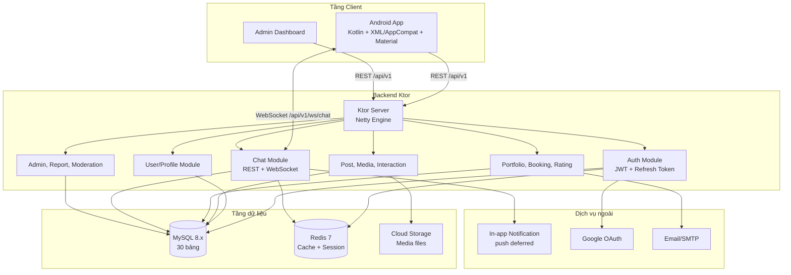

# 2.4. TỔNG QUAN KIẾN TRÚC HỆ THỐNG VÀ API

Phần này cập nhật theo bộ backend mới nhất trong `docs_backend`. Backend hiện dùng Kotlin Ktor, MySQL, Redis và WebSocket để phục vụ ứng dụng Android InstaGallery.

## 2.4.1. Sơ đồ kiến trúc tổng thể

Hệ thống được tổ chức theo mô hình client-server. Ứng dụng Android gọi REST API qua HTTPS, còn chat realtime dùng WebSocket.

## 2.4.2. Quy ước API

- REST API nghiệp vụ dùng prefix `/api/v1`.
- API trả về JSON.
- API cần đăng nhập dùng header `Authorization: Bearer <access_token>`.
- WebSocket chat dùng `/api/v1/ws/chat?token={jwt}`.
- Các route hệ thống như `/init-db`, `/reset-db`, `/migrate-db` chỉ dùng cho local/dev.

Nguồn endpoint đầy đủ nằm tại `docs_backend/Backend_APIs.md`.

## 2.4.3. Thống kê endpoint hiện tại

| Loại endpoint | Số lượng |
|---|---:|
| REST API dưới `/api/v1` | 107 |
| System/debug HTTP route ngoài `/api/v1` | 5 |
| Tổng HTTP endpoint | 112 |
| WebSocket endpoint | 1 |
| Tổng tính cả WebSocket | 113 |

## 2.4.4. REST API theo module

| Module | Số REST endpoint |
|---|---:|
| Auth | 11 |
| Users | 21 |
| Posts | 9 |
| Interactions | 10 |
| Media | 4 |
| Albums | 7 |
| Explore | 3 |
| Search | 4 |
| Chat REST | 5 |
| Notifications | 5 |
| Portfolios | 6 |
| Bookings | 5 |
| Ratings | 4 |
| Reports | 3 |
| Admin | 10 |
| **Tổng REST `/api/v1`** | **107** |

## 2.4.5. System/debug route

| Method | Endpoint | Mục đích |
|---|---|---|
| GET | `/health` | Health check |
| GET | `/init-db` | Tạo 30 bảng CSDL |
| GET | `/reset-db` | Xóa và tạo lại CSDL |
| GET | `/fix-user-id` | Sửa nhanh user id local |
| GET | `/migrate-db` | Tạo bảng/cột còn thiếu |

## 2.4.6. WebSocket

| Loại | Endpoint | Mục đích |
|---|---|---|
| WS | `/api/v1/ws/chat?token={jwt}` | Kết nối chat realtime |

## 2.4.7. Liên hệ với cơ sở dữ liệu

Backend hiện có `30` bảng dữ liệu, chia thành các nhóm chính: xác thực, bài đăng/media, tương tác xã hội, quan hệ người dùng, nhắn tin, album, booking photographer, thông báo, tìm kiếm và kiểm duyệt. Mô tả chi tiết từng bảng nằm tại `docs_backend/database_schema.md`.
