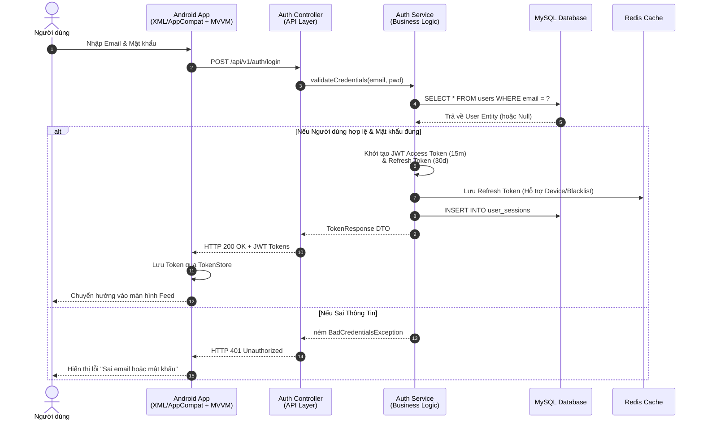
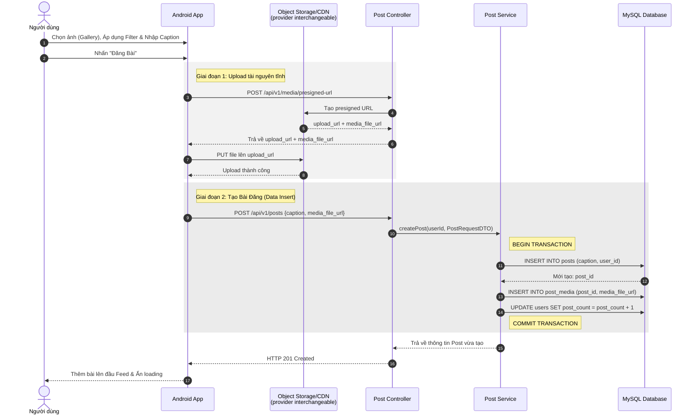
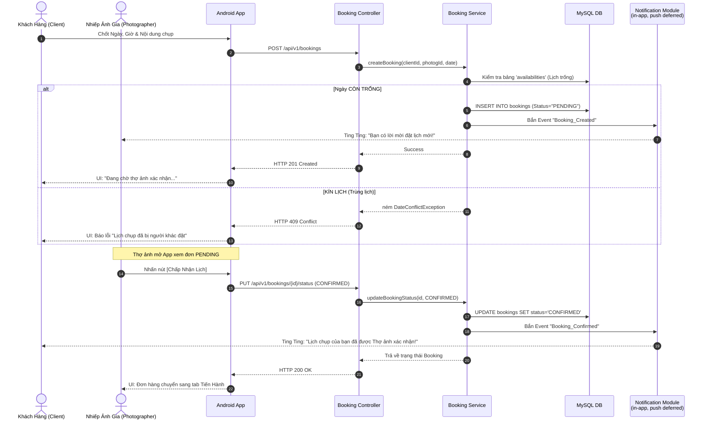

# 2.4.3. CÁC SƠ ĐỒ TUẦN TỰ (SEQUENCE DIAGRAMS)

Để bảo vệ Đồ án trước hội đồng xuất sắc nhất, bên cạnh UML Class/Use Case, **Sơ đồ Tuần tự (Sequence Diagram)** là minh chứng mạnh mẽ nhất thể hiện việc bạn nắm cực kỳ sâu mô hình Client-Server. Dưới đây là 3 sơ đồ "sát thủ" xử lý 3 luồng phức tạp nhất của InstaGallery: **Đăng nhập**, **Đăng bài (Xử lý Cloud Media)**, và **Máy trạng thái Đặt Lịch (Booking State Machine)**.

---

### 1. Luồng Xác Thực (Authentication & Login Flow)
Sơ đồ này mô tả cách JWT Access Token và Refresh Token được cấp phát và bảo mật qua Local Cache (Redis) cùng DB (MySQL).

---

### 2. Luồng Đăng Bài Tích Hợp Đa Phương Tiện (Upload Post & Media Flow)
Khác với ứng dụng thuần Text, InstaGallery phải xử lý file Ảnh/Video. Sơ đồ này chứng minh cơ chế Upload trực tiếp từ Client lên Storage Bucket thay vì dồn rác qua Server, giúp tối ưu băng thông (Performance).

---

### 3. Luồng Giao Dịch Đặt Lịch Chụp (Booking State Machine Flow)
Đây là nghiệp vụ độc đáo nhất (USP) của InstaGallery. Sơ đồ này biểu diễn tương tác chéo giữa 2 tác nhân thông qua notification module. Giai đoạn MVP chỉ cần thông báo trong app; push notification để sau.

