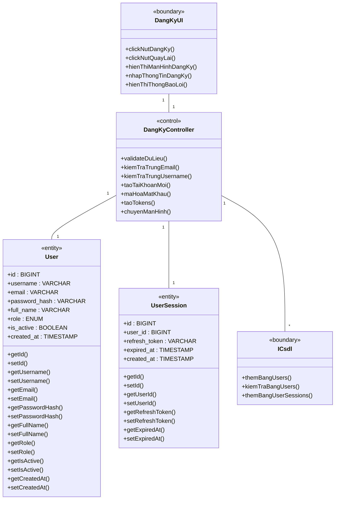
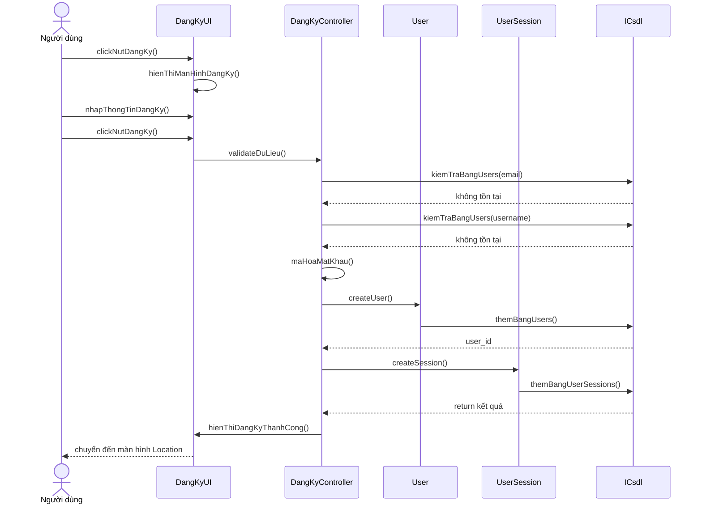
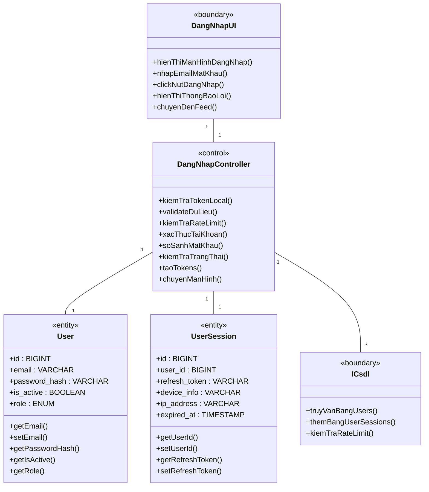
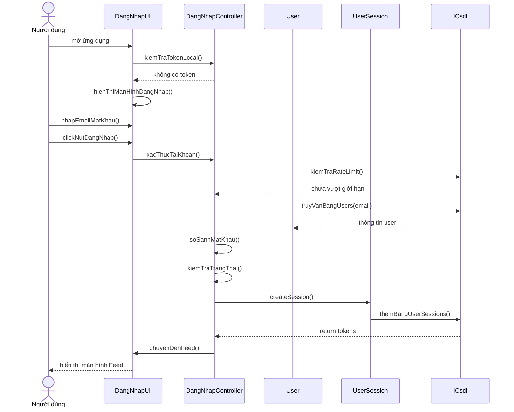
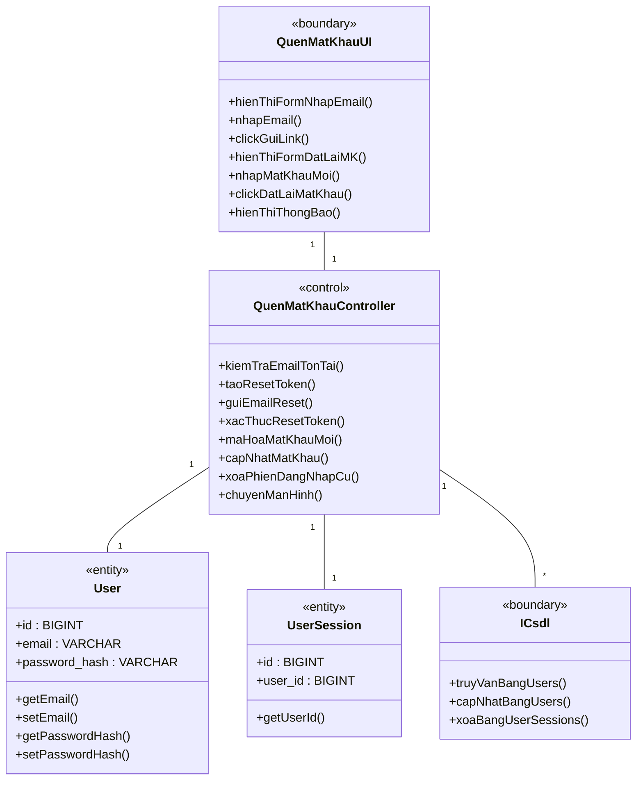
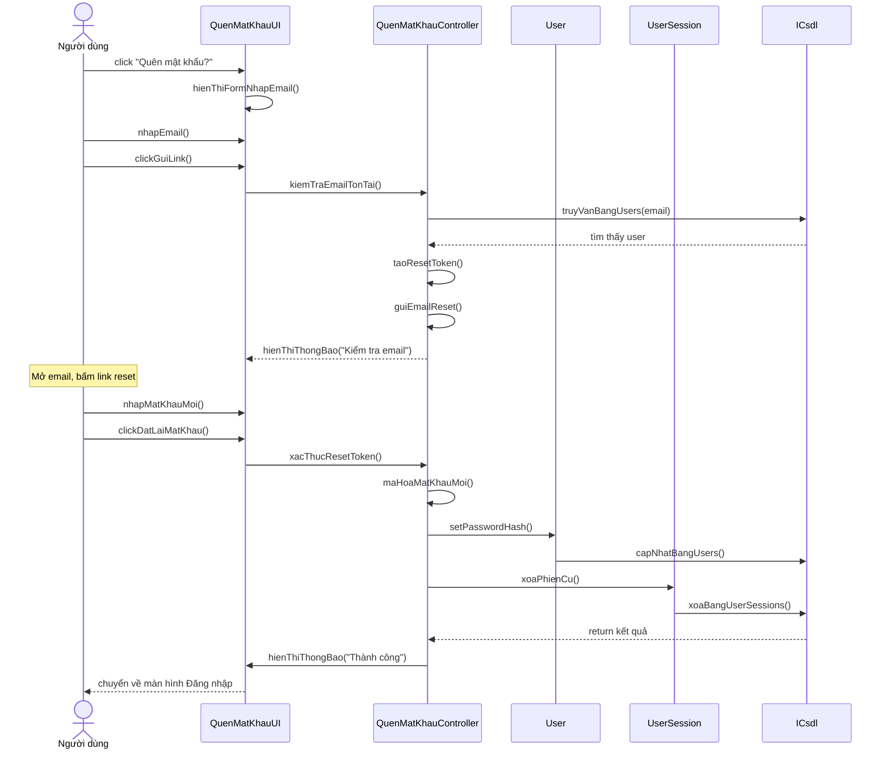
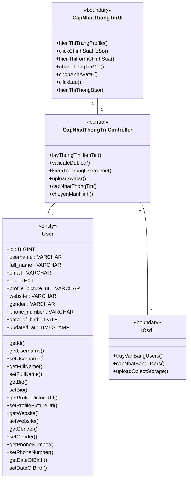
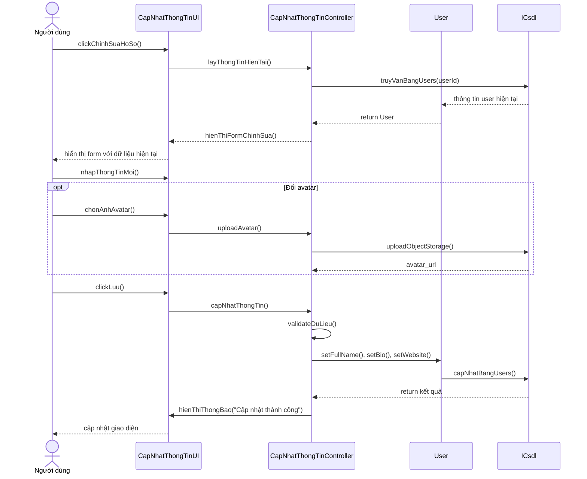
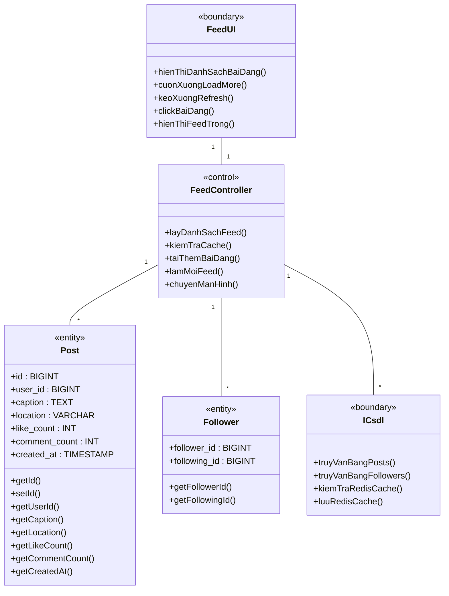
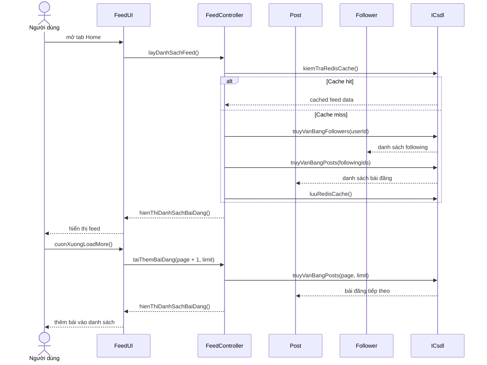

# 2.2.5. Phân tích các Use Case

## --- Nhóm: Xác thực & Quản lý tài khoản ---

### 2.2.5.1. Use Case Đăng ký

**- Biểu đồ lớp phân tích:**

**- Biểu đồ trình tự:**

---

### 2.2.5.2. Use Case Đăng nhập

**- Biểu đồ lớp phân tích:**

**- Biểu đồ trình tự:**

---

### 2.2.5.5. Use Case Quên mật khẩu

**- Biểu đồ lớp phân tích:**

**- Biểu đồ trình tự:**

---

### 2.2.5.8. Use Case Cập nhật hồ sơ cá nhân

**- Biểu đồ lớp phân tích:**

**- Biểu đồ trình tự:**

---

### 2.2.5.13. Use Case Duyệt Feed ảnh

**- Biểu đồ lớp phân tích:**

**- Biểu đồ trình tự:**

