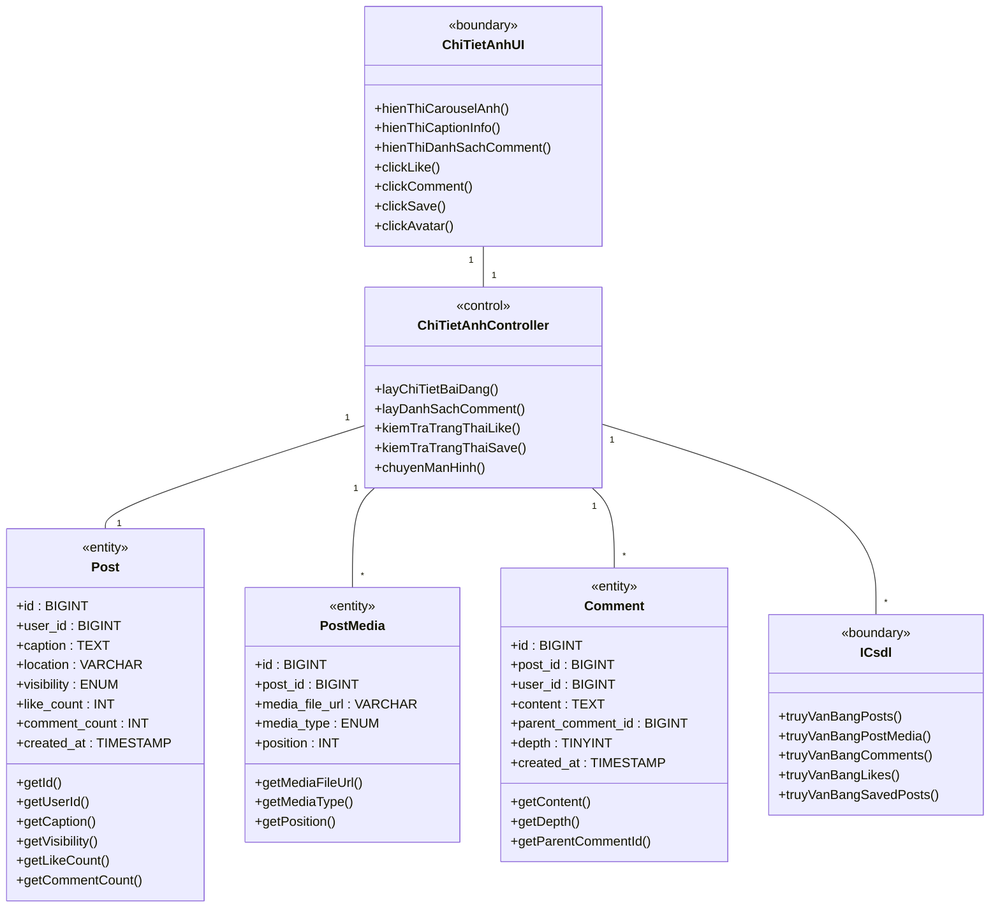
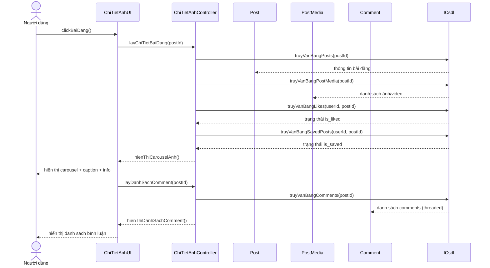
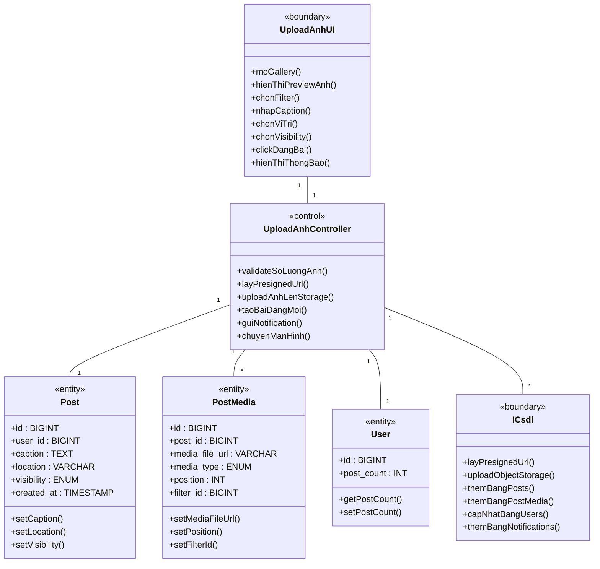
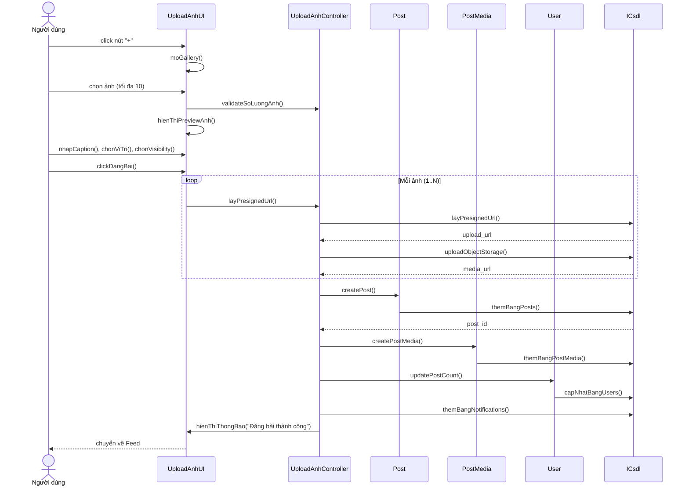
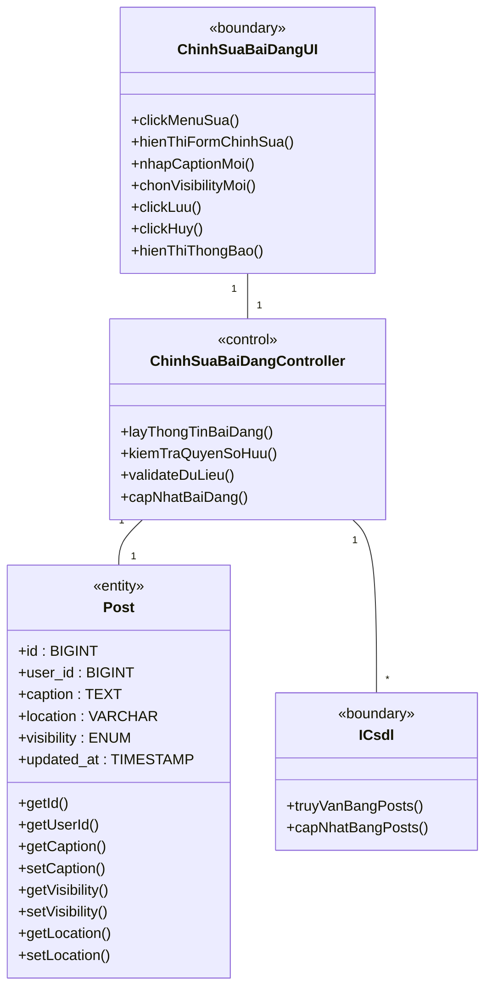
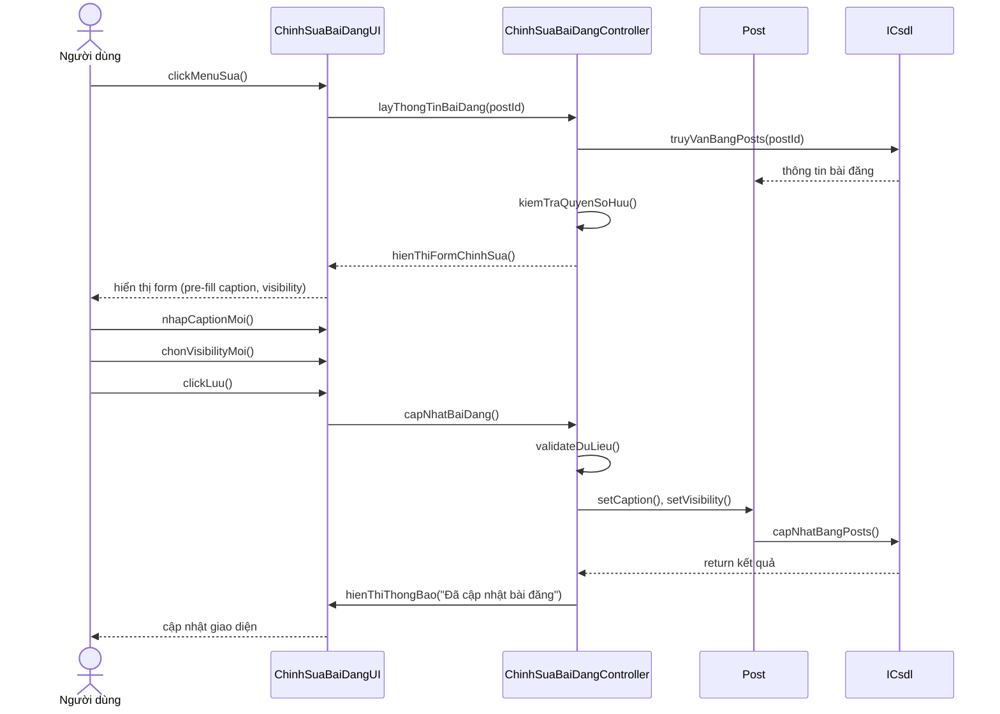
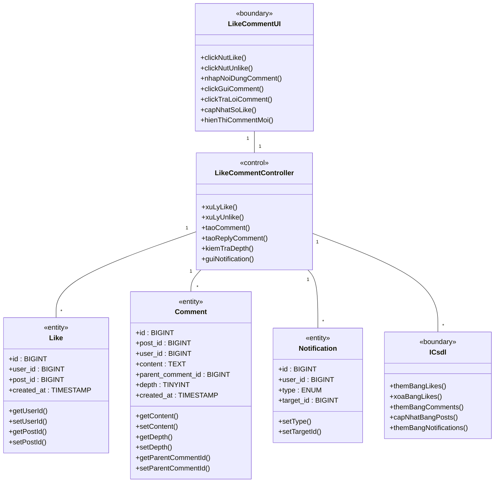
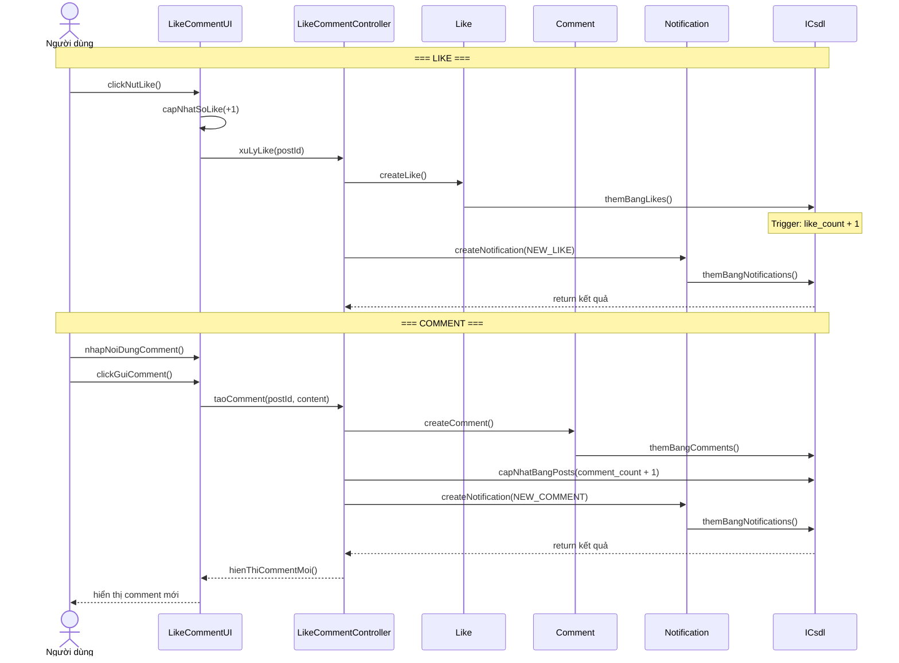
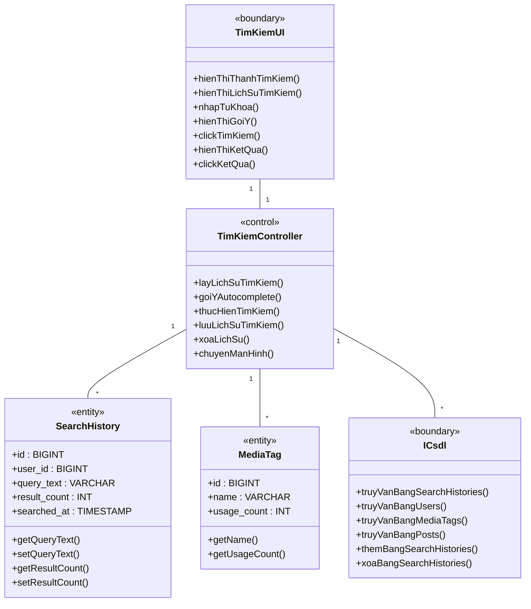
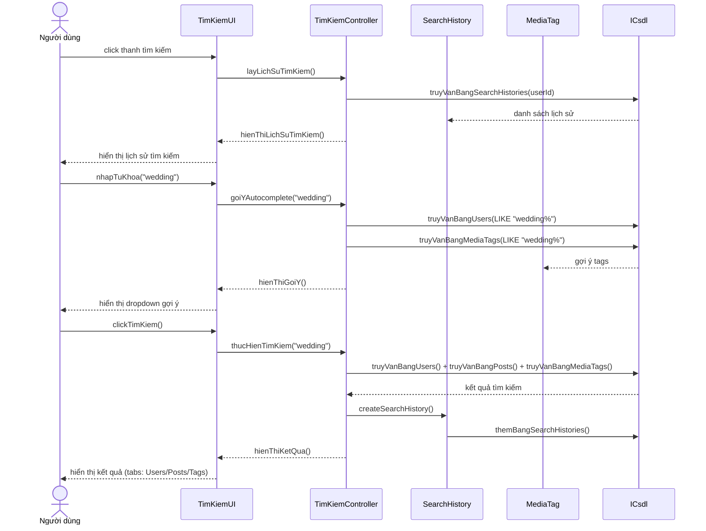

## --- Nhóm: Ảnh & Tương tác ---

### 2.2.5.15. Use Case Xem chi tiết bài đăng

**- Biểu đồ lớp phân tích:**

**- Biểu đồ trình tự:**

---

### 2.2.5.10. Use Case Upload ảnh / Đăng bài

**- Biểu đồ lớp phân tích:**

**- Biểu đồ trình tự:**

---

### 2.2.5.11. Use Case Chỉnh sửa bài đăng

**- Biểu đồ lớp phân tích:**

**- Biểu đồ trình tự:**

---

### 2.2.5.19 & 2.2.5.20. Use Case Like & Comment

**- Biểu đồ lớp phân tích:**

**- Biểu đồ trình tự:**

---

### 2.2.5.23. Use Case Tìm kiếm ảnh / Thợ ảnh / Hashtag

**- Biểu đồ lớp phân tích:**

**- Biểu đồ trình tự:**

