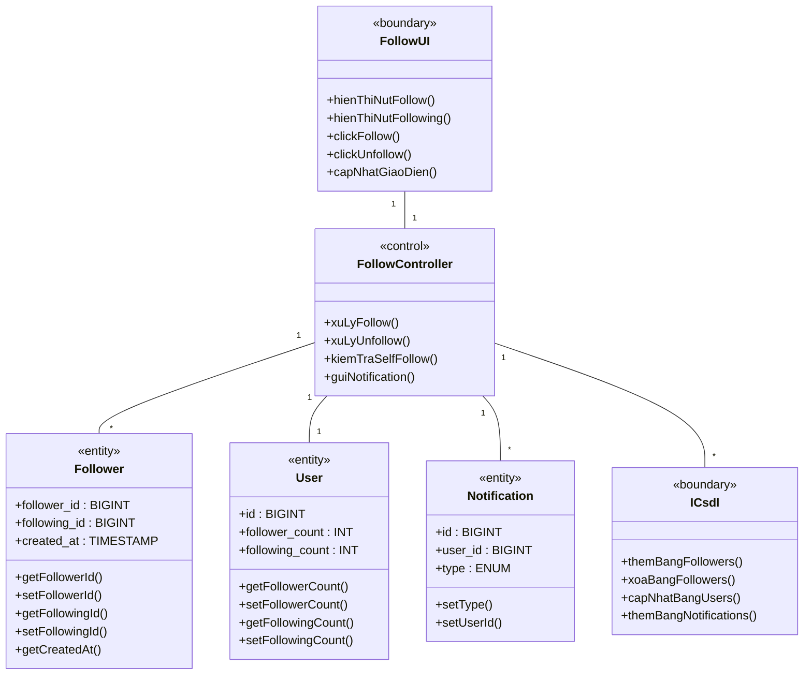
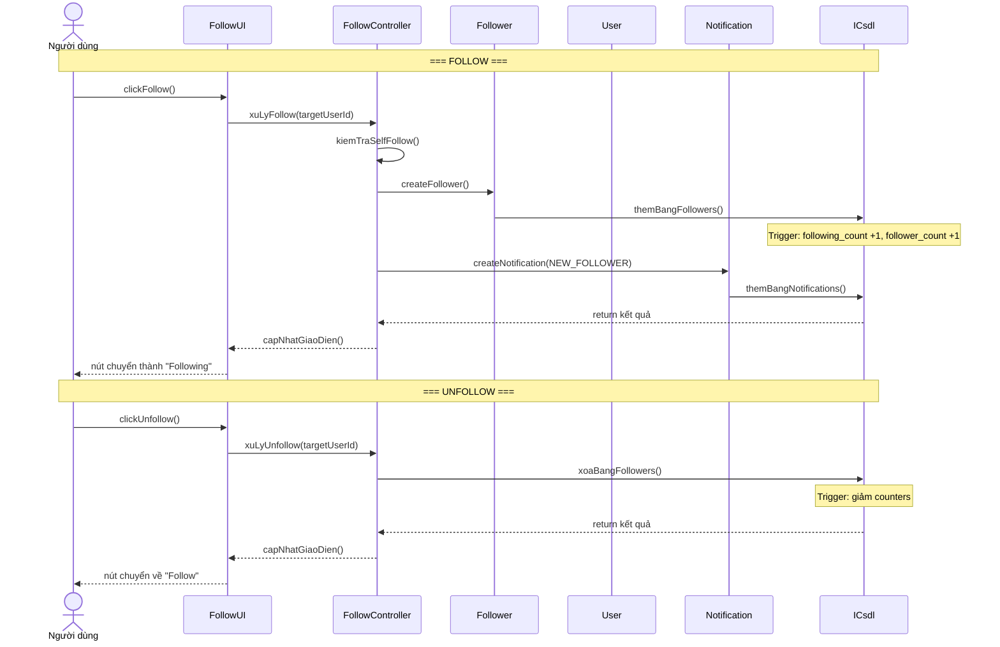
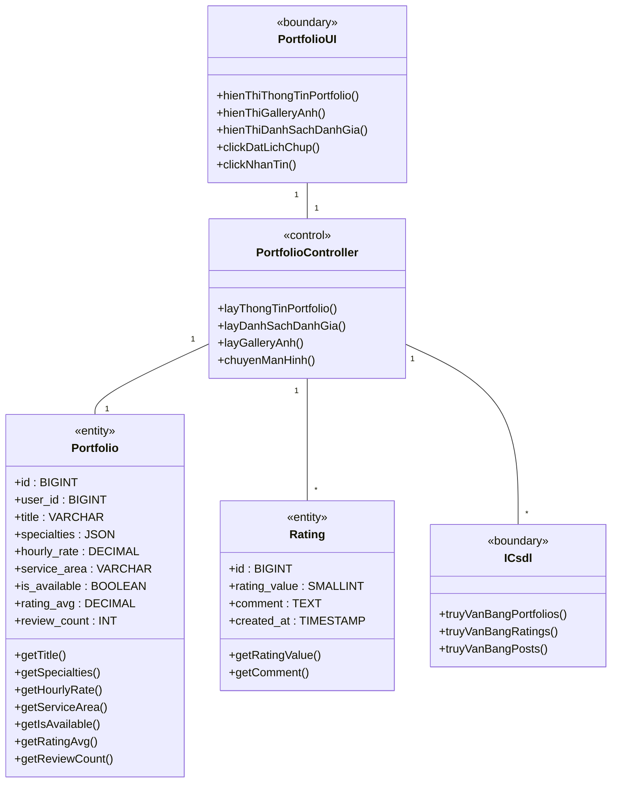
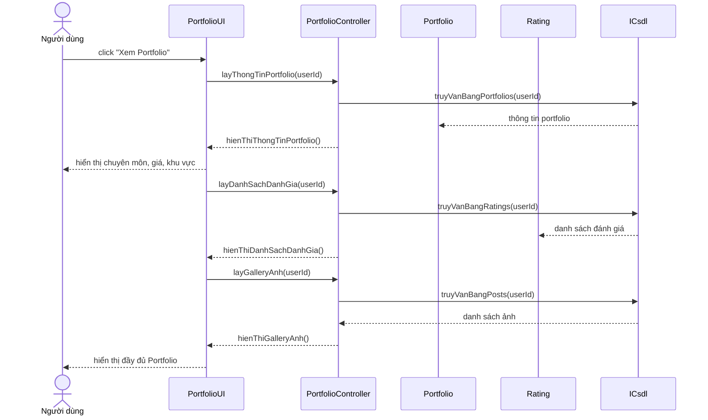
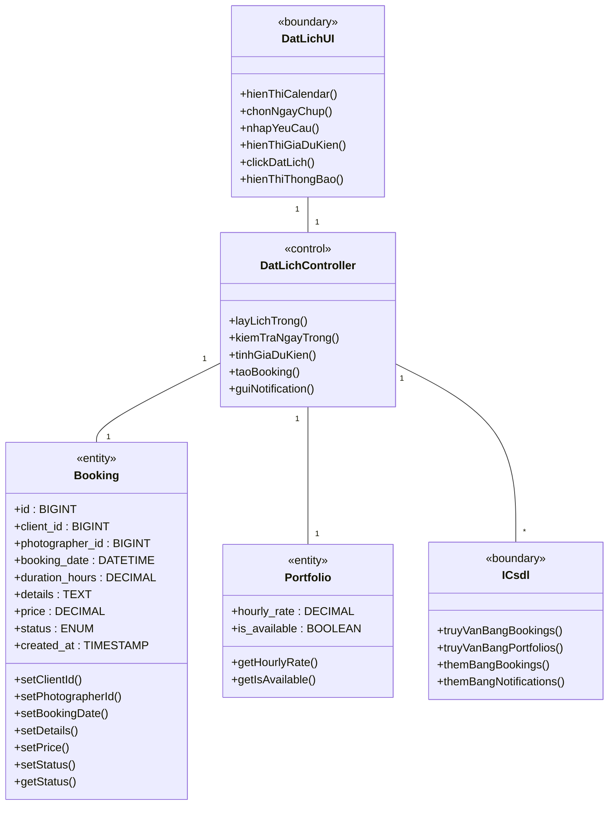
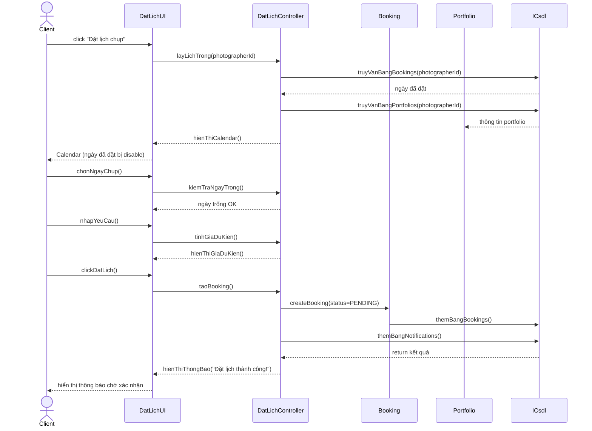
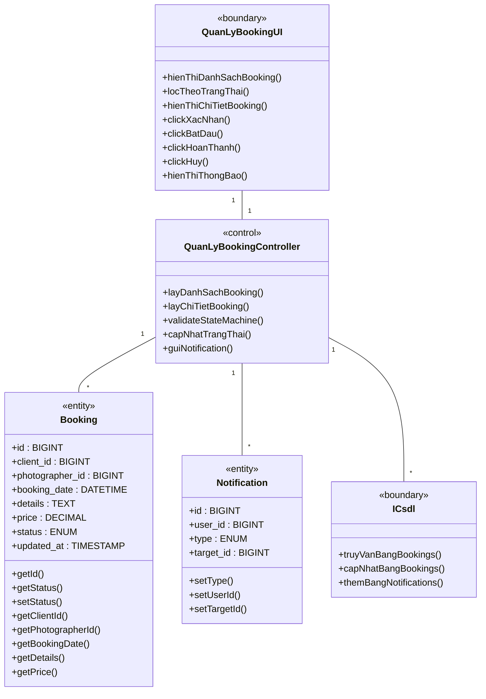
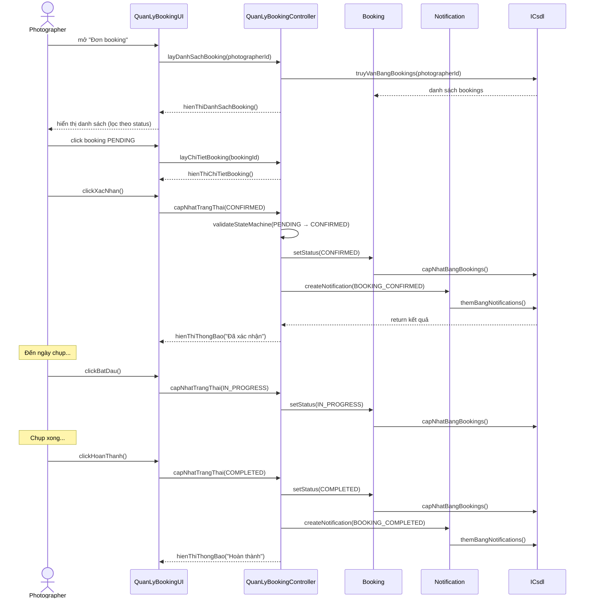
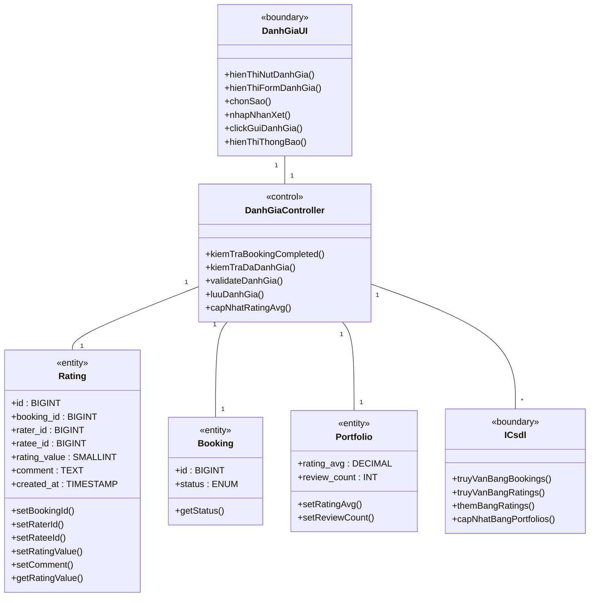
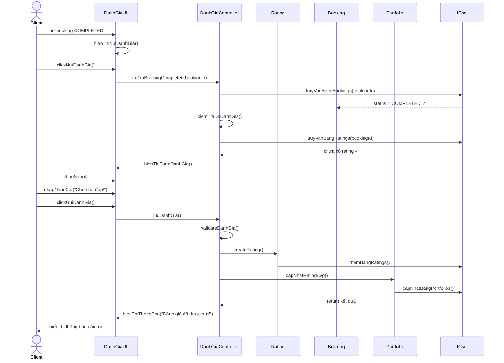

## --- Nhóm: Tương tác (tiếp) ---

### 2.2.5.22. Use Case Follow / Unfollow

**- Biểu đồ lớp phân tích:**

**- Biểu đồ trình tự:**

---

## --- Nhóm: Portfolio & Booking ---

### 2.2.5.34. Use Case Xem Portfolio nhiếp ảnh gia

**- Biểu đồ lớp phân tích:**

**- Biểu đồ trình tự:**

---

### 2.2.5.35. Use Case Đặt lịch chụp

**- Biểu đồ lớp phân tích:**

**- Biểu đồ trình tự:**

---

### 2.2.5.40. Use Case Quản lý Booking

**- Biểu đồ lớp phân tích:**

**- Biểu đồ trình tự:**

---

### 2.2.5.36. Use Case Đánh giá thợ ảnh

**- Biểu đồ lớp phân tích:**

**- Biểu đồ trình tự:**

