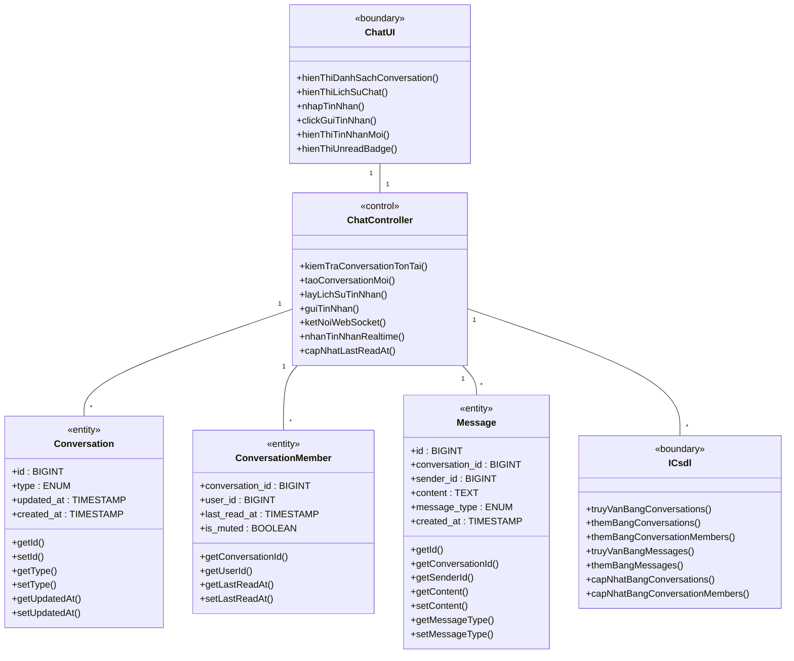
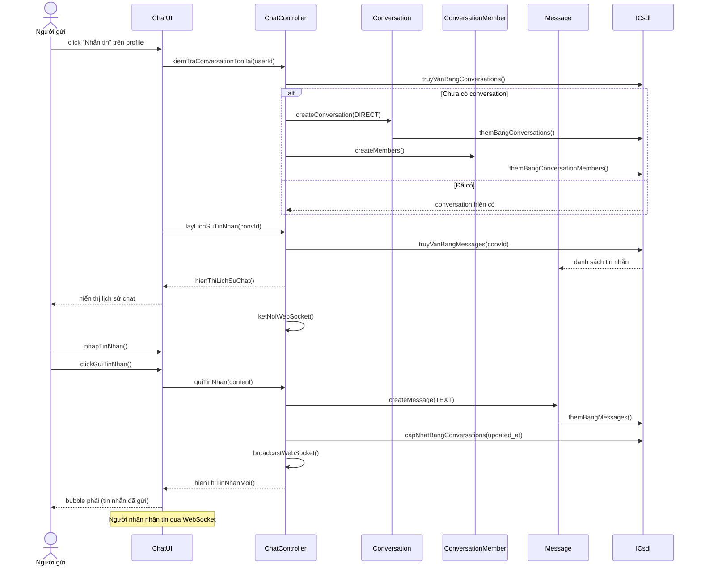
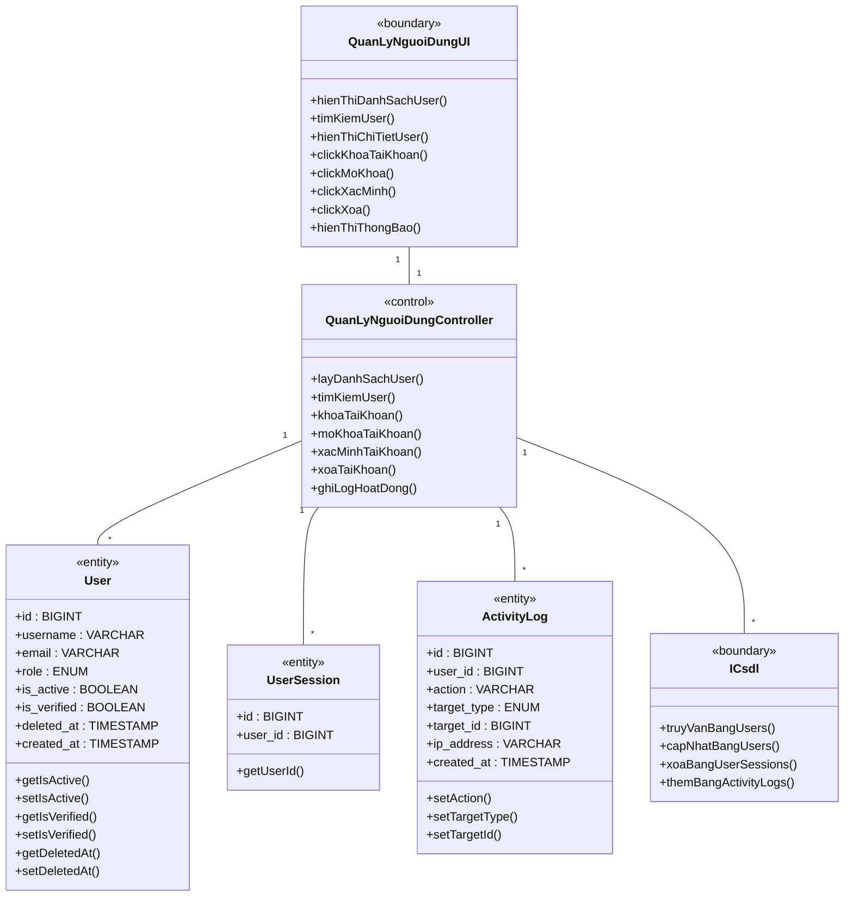
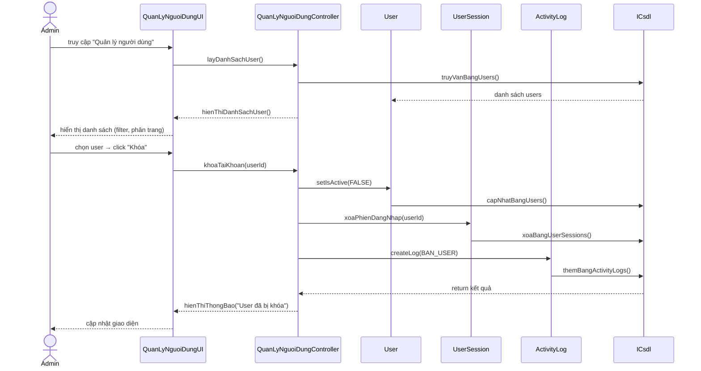
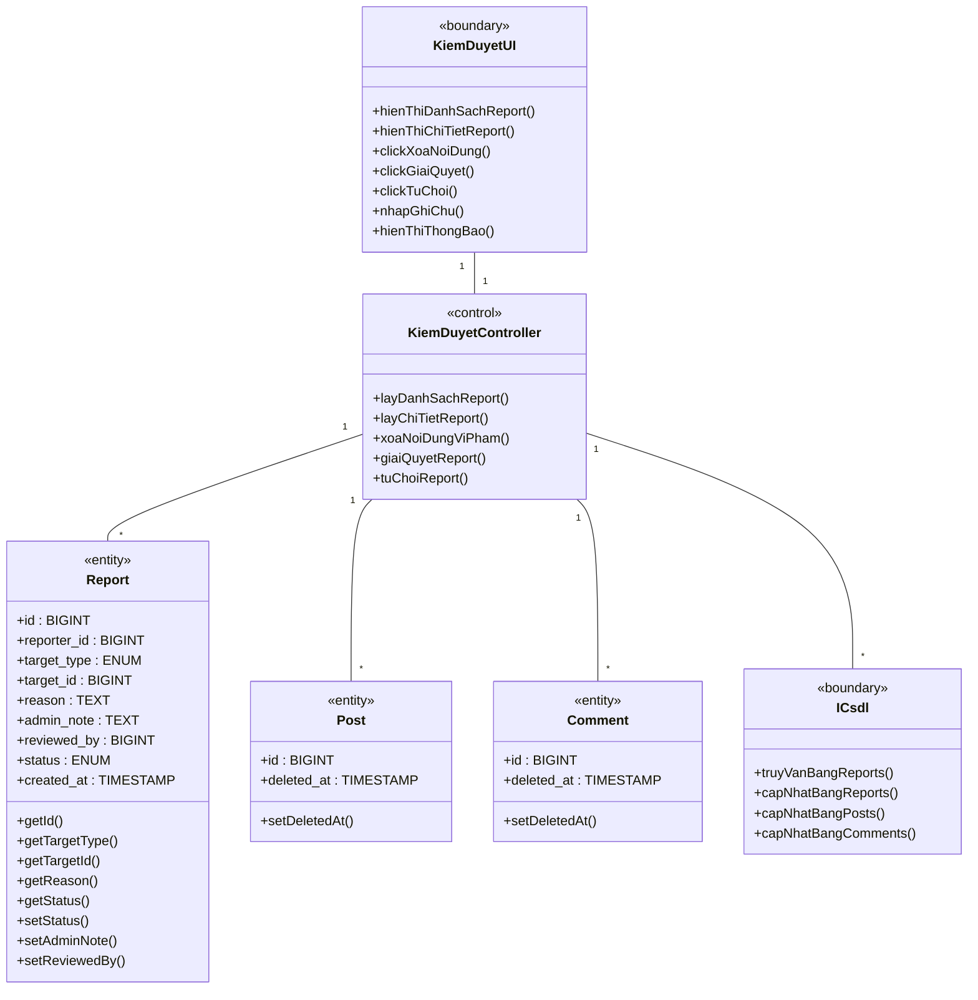
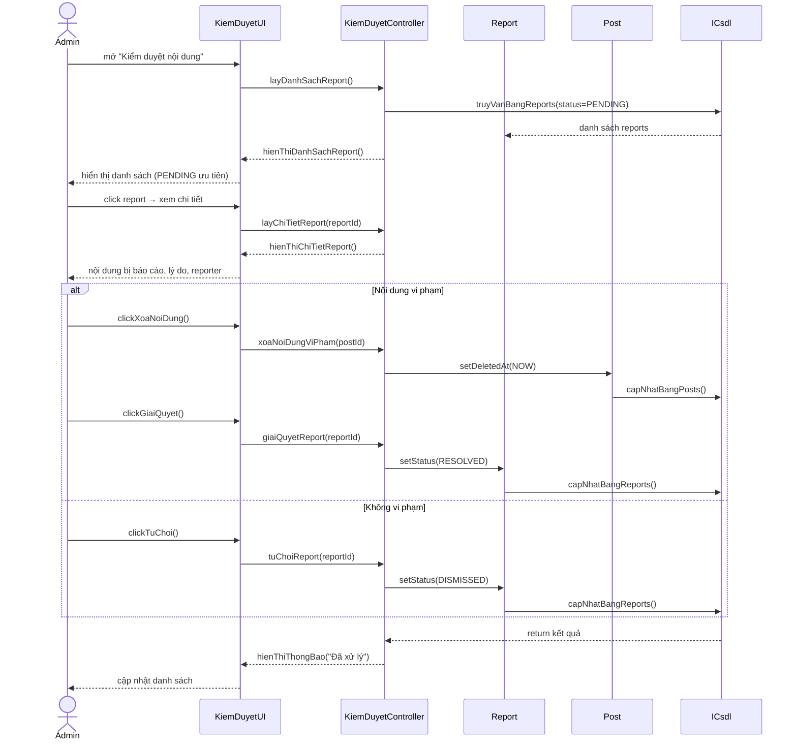
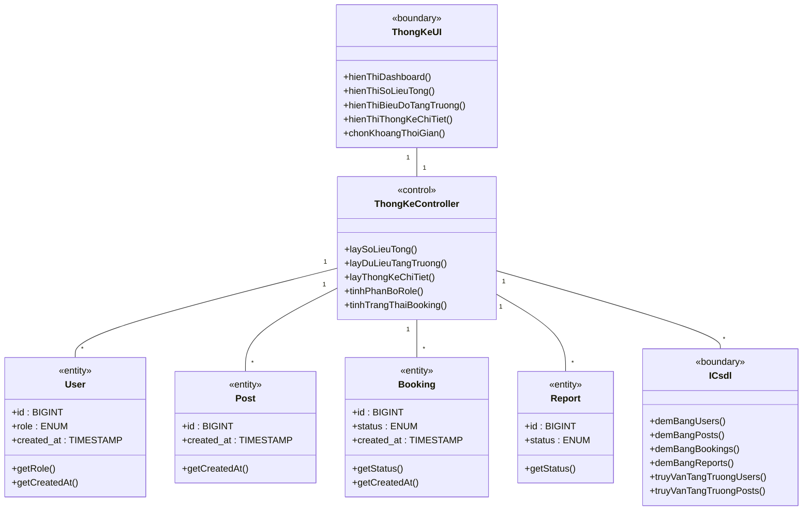
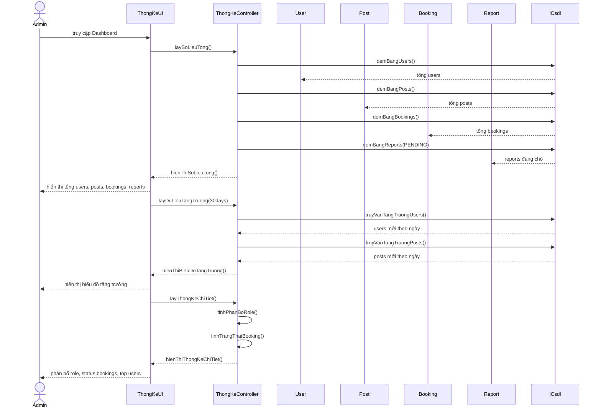

## --- Nhóm: Chat ---

### 2.2.5.37. Use Case Nhắn tin (Chat)

**- Biểu đồ lớp phân tích:**

**- Biểu đồ trình tự:**

---

## --- Nhóm: Quản trị ---

### 2.2.5.42. Use Case Quản lý người dùng

**- Biểu đồ lớp phân tích:**

**- Biểu đồ trình tự:**

---

### 2.2.5.43. Use Case Kiểm duyệt nội dung

**- Biểu đồ lớp phân tích:**

**- Biểu đồ trình tự:**

---

### 2.2.5.44. Use Case Thống kê hệ thống

**- Biểu đồ lớp phân tích:**

**- Biểu đồ trình tự:**

