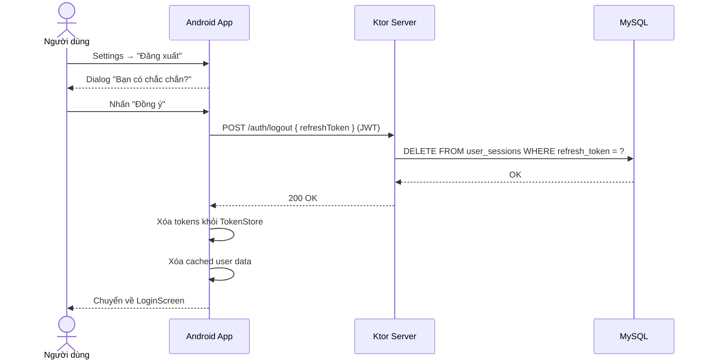
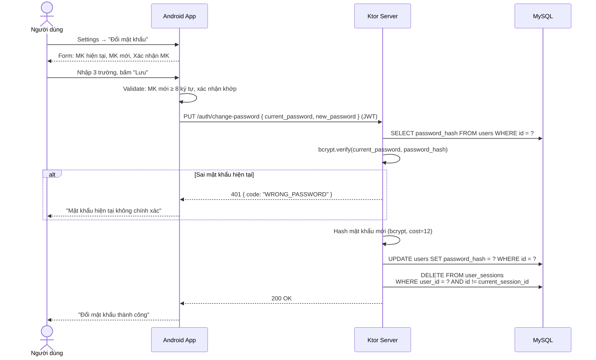
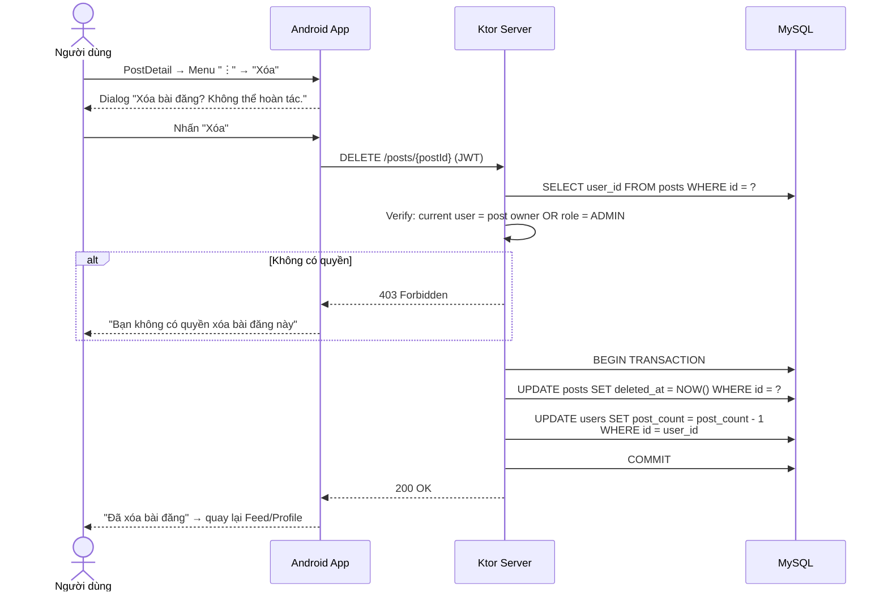
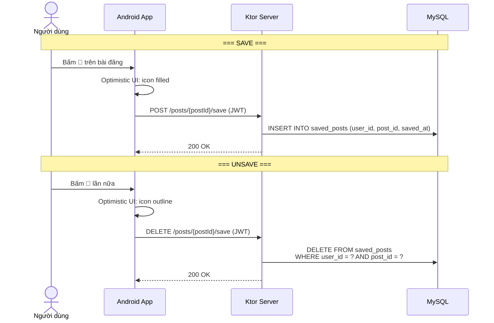
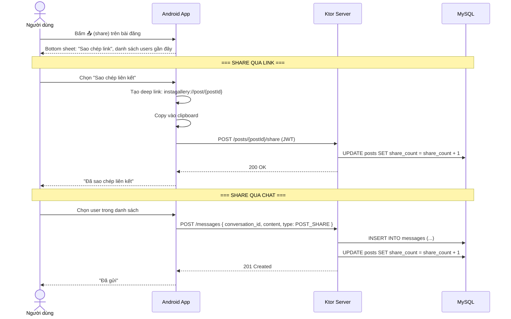
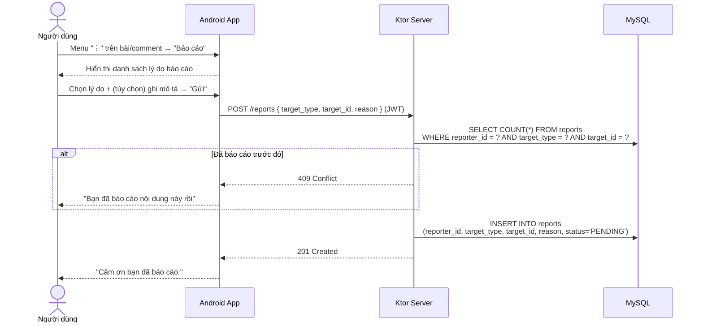
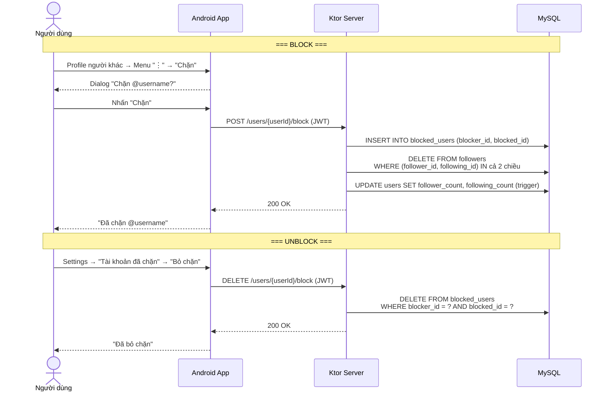
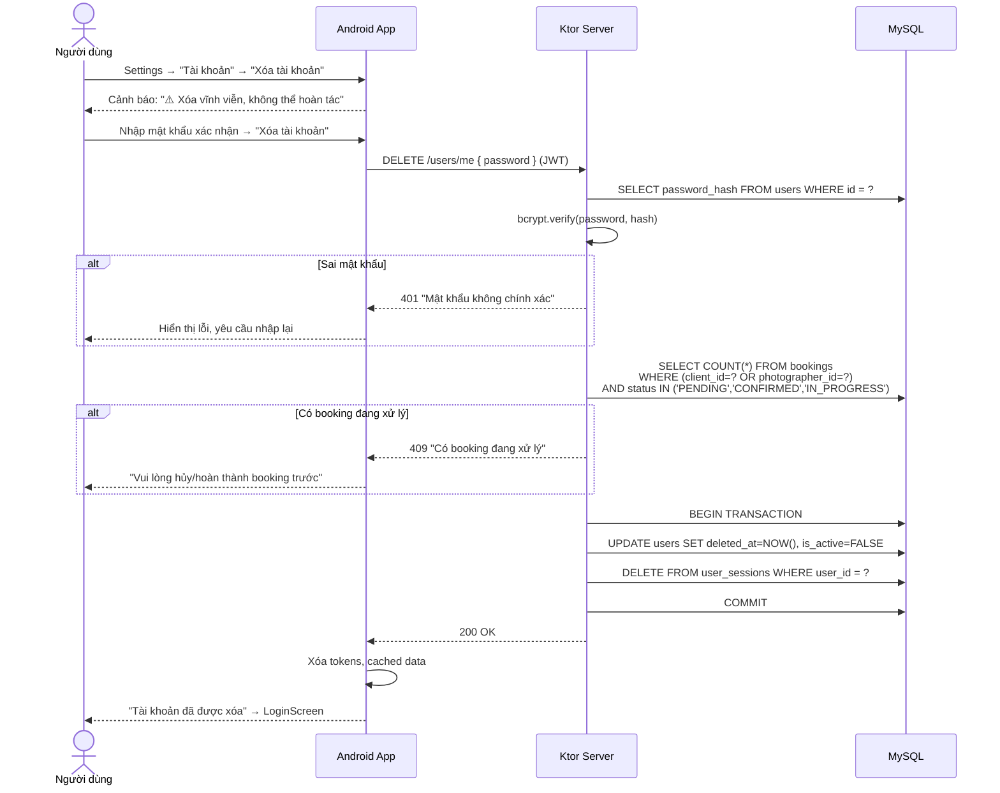
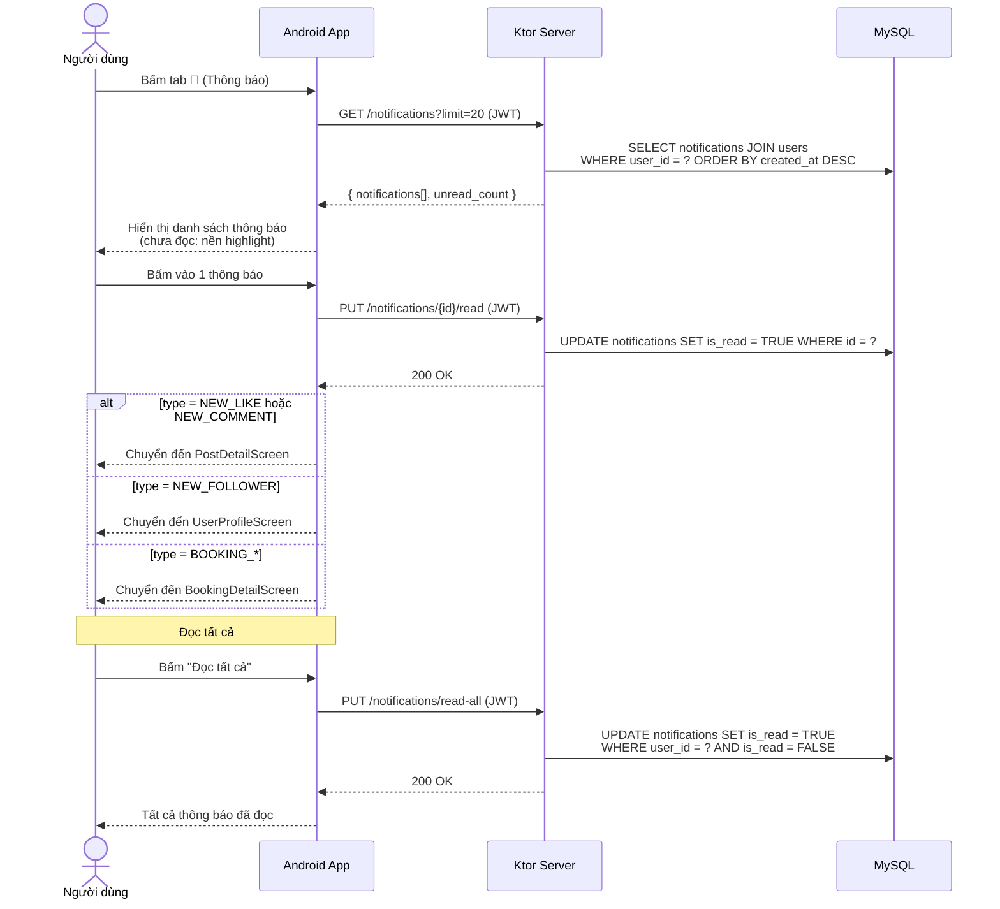
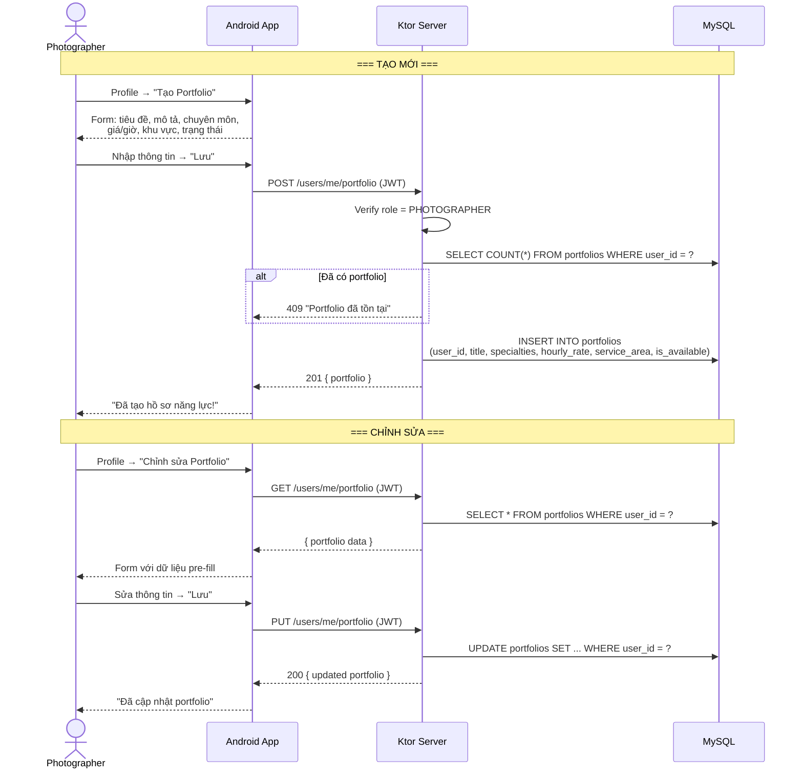

### 2.2.5. Phân tích các use case bổ sung (Sequence Diagram)

---

#### 2.2.5.4. Sequence Diagram — Đăng xuất

---

#### 2.2.5.6. Sequence Diagram — Đổi mật khẩu

---

#### 2.2.5.12. Sequence Diagram — Xóa bài đăng

---

#### 2.2.5.21. Sequence Diagram — Lưu bài đăng (Save / Unsave)

---

#### 2.2.5.26. Sequence Diagram — Chia sẻ bài đăng

---

#### 2.2.5.29. Sequence Diagram — Báo cáo vi phạm

---

#### 2.2.5.30. Sequence Diagram — Chặn người dùng (Block / Unblock)

---

#### 2.2.5.33. Sequence Diagram — Xóa tài khoản

---

#### 2.2.5.38. Sequence Diagram — Xem thông báo

---

#### 2.2.5.39. Sequence Diagram — Tạo / Chỉnh sửa Portfolio

