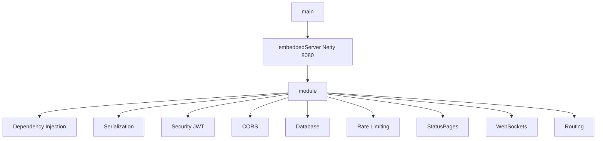

# 00. Tổng quan backend InstaGallery

## Mục đích hệ thống
`instagallery-backend` là backend REST API/WebSocket cho một ứng dụng mạng xã hội chia sẻ ảnh có mở rộng nghiệp vụ booking nhiếp ảnh gia. Nhìn từ code hiện tại, hệ thống đang phục vụ 4 nhóm chức năng chính:

- Xác thực người dùng: đăng ký, đăng nhập, refresh token, đổi mật khẩu, reset mật khẩu.
- Social feed: bài viết, like, save, comment, follow, explore, search, notification.
- Marketplace cho nhiếp ảnh gia: portfolio, booking, rating.
- Moderation và vận hành: report, admin stats, admin moderation.

## Công nghệ đang dùng
- Ngôn ngữ: Kotlin 2.0.0
- Framework: Ktor 3.0.2
- Database access: Exposed JDBC + HikariCP
- Database chính: MySQL
- Auth: JWT access token + refresh token lưu DB
- Password hashing: BCrypt
- DI: Koin
- Serialization: `kotlinx.serialization`
- Realtime: Ktor WebSocket
- Build tool: Gradle Kotlin DSL
- Test: Ktor test host, JUnit 5, MockK, H2

## Entry point khởi động
File [Application.kt](/d:/InstaGallery/instagallery-backend/src/main/kotlin/com/instagallery/Application.kt:1) là điểm vào chính:



## Kiến trúc tổng thể đang áp dụng
Project đang đi theo hướng:

```text
Route -> Service -> Repository -> Database/Table
```

Đây là kiến trúc backend khá phổ biến và dễ học. Tuy nhiên ở code hiện tại nó mới là layered architecture ở mức thực dụng, chưa phải Clean Architecture đầy đủ. Một số service vẫn truy cập trực tiếp `UsersTable` hoặc `DatabaseFactory.dbQuery`, và một số endpoint đang trả dữ liệu mock/TODO.

## Điểm mạnh hiện tại
- Cấu trúc package rõ ràng, dễ lần theo luồng xử lý.
- Nhiều domain đã được tách route/service/repository riêng.
- Có `StatusPages`, JWT auth, refresh token, BCrypt.
- Có test unit và integration cơ bản, `./gradlew.bat test` hiện chạy thành công trong môi trường này.

## Điểm yếu đáng chú ý
- Có fallback secret/password hardcode trong [application.conf](/d:/InstaGallery/instagallery-backend/src/main/resources/application.conf:10) và [DatabaseFactory.kt](/d:/InstaGallery/instagallery-backend/src/main/kotlin/com/instagallery/database/DatabaseFactory.kt:17).
- Có các route thao tác DB mở công khai trong [plugins/Routing.kt](/d:/InstaGallery/instagallery-backend/src/main/kotlin/com/instagallery/plugins/Routing.kt:29).
- `UserDto` đang chứa `passwordHash`, và repository map thẳng giá trị này ra DTO dùng cho API.
- WebSocket và optional auth ở search đang `JWT.decode(...)` thay vì verify chữ ký/hạn dùng.
- Nhiều API đã public nhưng logic phía dưới còn mock/TODO.

## Kết luận nhanh
Đây là một backend học tập và prototype khá đầy đủ tính năng. Nó tốt để học luồng Ktor + Exposed + JWT + repository pattern, nhưng chưa an toàn để coi là production-ready nếu chưa xử lý lại security, contract API, migration, validation và nhất quán kiến trúc.
