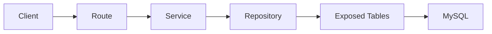

# 02. Kiến trúc hiện tại

## Mô hình đang dùng
Project hiện tại áp dụng mô hình phân tầng:



## Vai trò từng tầng

### Route
- Nằm trong `routes/`.
- Chịu trách nhiệm:
  - Định nghĩa endpoint.
  - Lấy `JWTPrincipal`.
  - Parse request body/path/query.
  - Trả `ApiResponse.success/error`.

Ví dụ:
- [AuthRoutes.kt](/d:/InstaGallery/instagallery-backend/src/main/kotlin/com/instagallery/routes/AuthRoutes.kt:14)
- [PostRoutes.kt](/d:/InstaGallery/instagallery-backend/src/main/kotlin/com/instagallery/routes/PostRoutes.kt:13)

### Service
- Nằm trong `services/`.
- Chịu trách nhiệm:
  - Validate nghiệp vụ.
  - Kiểm tra quyền.
  - Chuẩn hóa input.
  - Gọi nhiều repository nếu cần.

Ví dụ:
- `AuthService.register()` kiểm tra email, duplicate, hash password, tạo session.
- `BookingService.updateBookingStatus()` kiểm tra state transition và quyền client/photographer.

### Repository
- Nằm trong `repositories/`.
- Chứa query Exposed thực tế.
- Chịu trách nhiệm map `ResultRow` -> DTO hoặc trả primitive/query result.

Ví dụ:
- `PostRepository.getFeedPosts()`
- `InteractionRepository.toggleLike()`
- `NotificationRepository.getNotifications()`

### Database/Table
- `tables/` định nghĩa schema.
- `DatabaseFactory.dbQuery` bọc transaction coroutine.

## Kiến trúc hiện tại đúng ở đâu
- Đã tách route và business logic, không để route chứa toàn bộ query SQL.
- Domain chia theo module khá rõ.
- Có DI bằng Koin thay vì new object thủ công ở route.

## Kiến trúc hiện tại chưa sạch ở đâu

### 1. Service chưa luôn đi qua repository
Ví dụ:
- [UserService.kt](/d:/InstaGallery/instagallery-backend/src/main/kotlin/com/instagallery/services/UserService.kt:52) gọi trực tiếp `UsersTable.update`.
- [UserService.kt](/d:/InstaGallery/instagallery-backend/src/main/kotlin/com/instagallery/services/UserService.kt:74) tiếp tục chạm DB trực tiếp.

Hệ quả:
- Khó test hơn.
- Logic truy cập dữ liệu bị phân tán.
- Repository không còn là nơi tập trung data access.

### 2. DTO public và model nội bộ bị trộn
`UserDto` đang vừa là object nội bộ vừa là response object, nên lộ cả `passwordHash`.

### 3. Một số API contract chưa ổn định
Nhiều service/repository trả `Any`, `Map<String, Any>`, `List<Any>`.
Điều này làm:
- Mất type safety.
- Swagger/OpenAPI sau này khó viết.
- Frontend dễ bị lệ thuộc vào cấu trúc response không chuẩn hóa.

### 4. Route đang gánh quá nhiều parse tay
Nhiều endpoint dùng `call.receiveText()` rồi `decodeFromString<Map<...>>()`.
Điều này lặp code và dễ lỗi validate hơn so với dùng request DTO riêng.

## Kết luận kiến trúc
Đây là layered architecture hợp lý cho giai đoạn prototype. Nếu muốn nâng lên mức production:

```text
Route -> UseCase/Service -> Repository Interface -> Repository Impl -> DB
```

Nên bổ sung:
- DTO public riêng
- repository interface
- mapper
- request validation tập trung
- migration riêng thay vì schema init tự động
