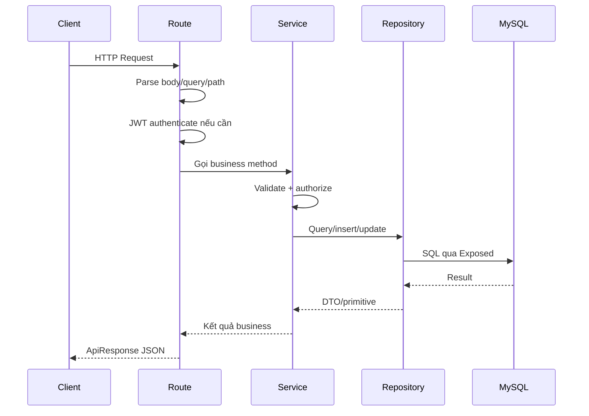

# 03. Luồng request

## Luồng tổng quát



## Ví dụ 1: Register
Luồng từ [AuthRoutes.kt](/d:/InstaGallery/instagallery-backend/src/main/kotlin/com/instagallery/routes/AuthRoutes.kt:18) và [AuthService.kt](/d:/InstaGallery/instagallery-backend/src/main/kotlin/com/instagallery/services/AuthService.kt:23):

1. Client gọi `POST /api/v1/auth/register`
2. Route nhận `RegisterRequest`
3. Service:
   - kiểm tra format email
   - kiểm tra độ dài password
   - kiểm tra email/username trùng
   - hash password bằng BCrypt
   - tạo user
   - tạo access token
   - tạo refresh token và lưu vào `user_sessions`
4. Route trả `201 Created`

## Ví dụ 2: Login
1. Client gọi `POST /api/v1/auth/login`
2. Route nhận `LoginRequest`
3. Service:
   - tìm user theo email
   - kiểm tra `isActive`
   - verify password với BCrypt
   - generate JWT
   - lưu refresh token mới
4. Trả `LoginResponse`

## Ví dụ 3: Tạo bài viết
Luồng từ [PostRoutes.kt](/d:/InstaGallery/instagallery-backend/src/main/kotlin/com/instagallery/routes/PostRoutes.kt:16) và [PostService.kt](/d:/InstaGallery/instagallery-backend/src/main/kotlin/com/instagallery/services/PostService.kt:18):

1. JWT auth chạy trước.
2. Route lấy `userId` từ claim `userId`.
3. Parse `CreatePostRequest`.
4. Service validate:
   - phải có media
   - tối đa 10 media
5. Repository:
   - insert `posts`
   - insert `post_media`
   - insert tag nếu có
6. Trả `PostDto`

## Ví dụ 4: Like bài viết
Luồng từ [InteractionRoutes.kt](/d:/InstaGallery/instagallery-backend/src/main/kotlin/com/instagallery/routes/InteractionRoutes.kt:22):

1. JWT auth
2. Route lấy `userId`, `postId`
3. Service kiểm tra post tồn tại
4. Repository:
   - nếu đã like thì delete dòng `likes`, giảm `like_count`
   - nếu chưa like thì insert `likes`, tăng `like_count`
5. Route trả trạng thái like mới

## Ví dụ 5: Booking
Luồng từ [BookingRoutes.kt](/d:/InstaGallery/instagallery-backend/src/main/kotlin/com/instagallery/routes/BookingRoutes.kt:18):

1. JWT auth
2. Parse `CreateBookingRequest`
3. `BookingService.createBooking()`:
   - cấm tự book chính mình
   - kiểm tra photographer tồn tại
   - parse `bookingDate`
   - cấm ngày quá khứ
4. Repository insert `bookings`
5. Trả `BookingDto`

## Auth được xử lý như thế nào
- Auth chuẩn HTTP dùng Ktor `authenticate("jwt")` trong [plugins/Security.kt](/d:/InstaGallery/instagallery-backend/src/main/kotlin/com/instagallery/plugins/Security.kt:11).
- Route protected lấy `JWTPrincipal` rồi đọc claim `userId`, `role`.
- Refresh token không nhúng vào JWT, mà lưu DB trong `user_sessions`.

## Validate đang nằm ở đâu
- Chủ yếu nằm trong service.
- Một phần nhỏ nằm ở route qua `toLongOrNull()`, `toIntOrNull()`.
- Chưa dùng `RequestValidation` dù dependency đã có trong `build.gradle.kts`.

## Response format
Toàn project đang cố thống nhất về:

```json
{
  "status": "SUCCESS",
  "data": {},
  "error": null,
  "message": "..."
}
```

hoặc

```json
{
  "status": "ERROR",
  "data": null,
  "error": {
    "code": "INVALID_ID",
    "message": "..."
  },
  "message": null
}
```

## Điểm cần cải thiện trong request flow
- Không nên parse JSON tay bằng `receiveText()` ở nhiều route.
- Không nên để route tự đọc role và so sánh string lặp lại quá nhiều.
- Nên có helper lấy `currentUserId`.
- Nên có validator tập trung cho body/query.
