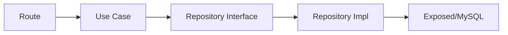

# 10. Kế hoạch cải tiến chuyên nghiệp

## Ưu tiên 1: vá các vấn đề nghiêm trọng

### 1. Bỏ lộ `passwordHash`
Vấn đề:
- `UserDto` đang chứa `passwordHash`

Giải pháp:
- tạo `UserResponse` riêng
- repository trả internal model
- route/service map ra response DTO

### 2. Sửa xác thực WebSocket và optional auth
Vấn đề:
- dùng `JWT.decode(...)`

Giải pháp:
- dùng `JwtManager.verifyTokenSync()`
- hoặc cấu hình riêng auth WS

### 3. Xóa hoặc khóa các route DB nguy hiểm
Vấn đề:
- `/reset-db`, `/init-db`, `/fix-user-id`, `/migrate-db`

Giải pháp:
- chỉ cho chạy qua script local hoặc admin CLI
- nếu buộc giữ, phải bảo vệ bằng env flag + admin auth

### 4. Bỏ secret/password hardcode
Giải pháp:
- bắt buộc dùng env
- fail fast nếu thiếu secret production

## Ưu tiên 2: làm sạch kiến trúc

### 1. Tách DTO public và model nội bộ
- `UserEntity/InternalUser`
- `UserResponse`
- `UserMapper`

### 2. Service không truy cập DB trực tiếp
- mọi `UsersTable.update(...)` nên đi về repository

### 3. Bỏ `Any` và `Map<String, Any>`
- thay bằng DTO cụ thể
- ví dụ `SavedPostsResponse`, `LikedPostsResponse`, `AdminUserListResponse`

### 4. Tách helper auth

Ví dụ:

```kotlin
fun ApplicationCall.currentUserId(): Long {
    return principal<JWTPrincipal>()?.payload?.getClaim("userId")?.asLong()
        ?: throw AuthException("UNAUTHORIZED", "Token không hợp lệ.")
}
```

## Ưu tiên 3: validation và contract

### 1. Dùng `RequestValidation`
- validate body tập trung
- giảm parse tay bằng `receiveText()`

### 2. Tạo request DTO riêng cho các body đang parse map
- chat conversation create request
- chat send message request
- privacy request
- comment setting request
- admin banned keyword request

### 3. Chuẩn hóa status code
- 401 cho chưa auth
- 403 cho thiếu quyền
- 404 cho không tồn tại
- 409 cho conflict

## Ưu tiên 4: database và hạ tầng

### 1. Thêm Flyway/Liquibase
- migration có version
- dễ deploy, rollback

### 2. Review index
- feed query
- search
- notifications
- followers/following

### 3. Sửa logic ban user
- thêm `isBanned`, `bannedAt`, `banReason`
- auth phải check cột này

## Ưu tiên 5: logging và observability

### 1. Thêm request logging
- method
- path
- status
- latency
- request id

### 2. Không log dữ liệu nhạy cảm
- password
- refresh token
- JWT

## Ưu tiên 6: testing

### Cần bổ sung test cho
- security failure cases
- refresh token rotation
- WebSocket auth
- admin ban user
- TODO endpoint sau khi hoàn thiện
- edge cases pagination/ownership/state transition

## Ưu tiên 7: deployment

### Nên bổ sung
- Dockerfile cho backend
- profile dev/staging/prod
- `.env.example`
- health check chuẩn
- OpenAPI/Swagger

## Định hướng clean architecture đề xuất



## Kết luận
Nếu phải chọn thứ tự triển khai thực tế:

1. Vá bảo mật
2. Tách DTO/model
3. Chuẩn hóa repository/service
4. Bổ sung migration
5. Viết thêm test
6. Tài liệu hóa API
