# 🗄️ InstaGallery — Tổng Hợp Cấu Trúc Database

> **Công nghệ**: MySQL · **ORM**: Jetbrains Exposed · **Tổng số bảng**: 33
>
> Cập nhật lần cuối: 2026-07-18

---

## 📑 Mục Lục

| # | Nhóm | Các bảng |
|---|------|----------|
| 1 | [🔐 Auth & Identity](#-auth--identity) | `users`, `user_sessions`, `password_reset_tokens` |
| 2 | [📸 Nội dung & Media](#-nội-dung--media) | `posts`, `post_media`, `filters`, `media_tags`, `post_media_tags` |
| 3 | [💬 Tương tác xã hội](#-tương-tác-xã-hội) | `likes`, `comment_likes`, `comment_dislikes`, `comments`, `saved_posts` |
| 4 | [👥 Quan hệ người dùng](#-quan-hệ-người-dùng) | `followers`, `follow_requests`, `blocked_users`, `muted_users` |
| 5 | [💌 Nhắn tin](#-nhắn-tin) | `conversations`, `conversation_members`, `messages` |
| 6 | [📁 Album](#-album) | `albums`, `album_media` |
| 7 | [📷 Dịch vụ nhiếp ảnh & Đặt lịch](#-dịch-vụ-nhiếp-ảnh--đặt-lịch) | `portfolios`, `photographer_services`, `availability_schedules`, `bookings`, `ratings` |
| 8 | [🔔 Thông báo & Thiết bị](#-thông-báo--thiết-bị) | `notifications`, `device_tokens` |
| 9 | [🔍 Tìm kiếm](#-tìm-kiếm) | `search_histories` |
| 10 | [🛡️ Kiểm duyệt & Audit](#️-kiểm-duyệt--audit) | `reports`, `banned_words`, `activity_logs` |

---

## 📊 ERD Tổng Quan

```mermaid
erDiagram
    USERS ||--o{ POSTS : "đăng"
    USERS ||--o{ LIKES : "thích"
    USERS ||--o{ COMMENT_LIKES : "thích bình luận"
    USERS ||--o{ COMMENT_DISLIKES : "không thích bình luận"
    USERS ||--o{ COMMENTS : "bình luận"
    USERS ||--o{ FOLLOWERS : "follow/following"
    USERS ||--o{ FOLLOW_REQUESTS : "yêu cầu follow"
    USERS ||--o{ BLOCKED_USERS : "chặn"
    USERS ||--o{ MUTED_USERS : "tắt tiếng"
    USERS ||--o| PORTFOLIOS : "sở hữu portfolio"
    USERS ||--o{ PHOTOGRAPHER_SERVICES : "cung cấp dịch vụ"
    USERS ||--o{ BOOKINGS : "đặt lịch (client)"
    USERS ||--o{ BOOKINGS : "nhận đặt (photographer)"
    USERS ||--o{ NOTIFICATIONS : "nhận thông báo"
    USERS ||--o{ DEVICE_TOKENS : "đăng ký thiết bị"
    USERS ||--o{ USER_SESSIONS : "phiên đăng nhập"
    USERS ||--o{ ALBUMS : "tạo album"
    USERS ||--o{ SAVED_POSTS : "lưu bài"
    USERS ||--o{ SEARCH_HISTORIES : "lịch sử tìm kiếm"
    USERS ||--o{ MESSAGES : "gửi tin nhắn"

    POSTS ||--o{ POST_MEDIA : "chứa media"
    POSTS ||--o{ LIKES : "được thích"
    POSTS ||--o{ COMMENTS : "có bình luận"
    POSTS ||--o{ SAVED_POSTS : "được lưu"
    POSTS ||--o{ ALBUM_MEDIA : "trong album"

    POST_MEDIA ||--o{ POST_MEDIA_TAGS : "được gắn tag"
    MEDIA_TAGS ||--o{ POST_MEDIA_TAGS : "dùng cho media"
    FILTERS ||--o{ POST_MEDIA : "áp dụng filter"

    COMMENTS ||--o{ COMMENT_LIKES : "được thích"
    COMMENTS ||--o{ COMMENT_DISLIKES : "bị không thích"
    COMMENTS ||--o{ COMMENTS : "trả lời (self-ref)"

    CONVERSATIONS ||--o{ CONVERSATION_MEMBERS : "có thành viên"
    CONVERSATIONS ||--o{ MESSAGES : "chứa tin nhắn"
    MESSAGES ||--o{ MESSAGES : "trả lời (self-ref)"

    PORTFOLIOS ||--o{ PHOTOGRAPHER_SERVICES : "có gói dịch vụ"
    PORTFOLIOS ||--o{ AVAILABILITY_SCHEDULES : "lịch rảnh"
    BOOKINGS ||--o| RATINGS : "được đánh giá"

    ALBUMS ||--o{ ALBUM_MEDIA : "chứa bài viết"
```



---

## 🔐 Auth & Identity

### `users`
> Bảng trung tâm của toàn hệ thống. Lưu thông tin người dùng, xác thực, và cấu hình quyền riêng tư.

| Cột | Kiểu dữ liệu | Ràng buộc | Mô tả |
|-----|-------------|-----------|-------|
| `id` | BIGINT | PK, AUTO_INCREMENT | ID người dùng |
| `username` | VARCHAR(50) | UNIQUE INDEX | Tên đăng nhập |
| `email` | VARCHAR(100) | UNIQUE INDEX | Email |
| `password_hash` | VARCHAR(255) | NOT NULL | Mật khẩu đã hash |
| `full_name` | VARCHAR(100) | NOT NULL | Họ và tên |
| `profile_picture_url` | VARCHAR(255) | NULLABLE | URL ảnh đại diện |
| `bio` | TEXT | NULLABLE | Tiểu sử |
| `website` | VARCHAR(255) | NULLABLE | Website cá nhân |
| `gender` | VARCHAR(20) | NULLABLE | Giới tính |
| `phone_number` | VARCHAR(20) | NULLABLE | Số điện thoại |
| `date_of_birth` | DATE | NULLABLE | Ngày sinh |
| `location` | VARCHAR(255) | NULLABLE | Địa chỉ |
| `user_type` | ENUM | DEFAULT `CLIENT` | `CLIENT` / `PHOTOGRAPHER` |
| `role` | ENUM | DEFAULT `USER` | `USER` / `ADMIN` |
| `provider` | ENUM | DEFAULT `LOCAL` | `LOCAL` / `GOOGLE` / `FACEBOOK` |
| `provider_id` | VARCHAR(255) | NULLABLE, UNIQUE | ID từ OAuth provider |
| `is_two_factor_enabled` | BOOLEAN | DEFAULT `false` | Bật 2FA |
| `two_factor_secret` | VARCHAR(255) | NULLABLE | Secret key 2FA |
| `is_private` | BOOLEAN | DEFAULT `false` | Tài khoản riêng tư |
| `is_verified` | BOOLEAN | DEFAULT `false` | Tài khoản xác minh |
| `is_active` | BOOLEAN | DEFAULT `true` | Tài khoản đang hoạt động |
| `follower_count` | INT | DEFAULT `0` | Cache số người theo dõi |
| `following_count` | INT | DEFAULT `0` | Cache số đang theo dõi |
| `post_count` | INT | DEFAULT `0` | Cache số bài đăng |
| `created_at` | TIMESTAMP | DEFAULT NOW | Thời điểm tạo |
| `updated_at` | TIMESTAMP | DEFAULT NOW | Thời điểm cập nhật |
| `deleted_at` | TIMESTAMP | NULLABLE | Soft delete |

**Indexes:** `username`, `email`

---

### `user_sessions`
> Quản lý refresh token theo thiết bị (hỗ trợ đăng xuất theo thiết bị cụ thể).

| Cột | Kiểu dữ liệu | Ràng buộc | Mô tả |
|-----|-------------|-----------|-------|
| `id` | BIGINT | PK | ID phiên |
| `user_id` | BIGINT | FK → `users`, INDEX | Chủ phiên |
| `device_info` | VARCHAR(255) | NULLABLE | Thông tin thiết bị |
| `ip_address` | VARCHAR(45) | NULLABLE | IP đăng nhập |
| `refresh_token` | VARCHAR(255) | UNIQUE INDEX | Refresh JWT token |
| `created_at` | TIMESTAMP | DEFAULT NOW | Thời điểm tạo |
| `expired_at` | TIMESTAMP | INDEX | Thời điểm hết hạn |

---

### `password_reset_tokens`
> Token một lần dùng để đặt lại mật khẩu qua email.

| Cột | Kiểu dữ liệu | Ràng buộc | Mô tả |
|-----|-------------|-----------|-------|
| `id` | BIGINT | PK | ID token |
| `user_id` | BIGINT | FK → `users` | Chủ sở hữu |
| `token` | VARCHAR(255) | UNIQUE INDEX | UUID / chuỗi hashed |
| `expired_at` | DATETIME | NOT NULL | Thời gian hết hạn |
| `created_at` | TIMESTAMP | DEFAULT NOW | Thời điểm tạo |

---

## 📸 Nội dung & Media

### `posts`
> Bài đăng của người dùng. Hỗ trợ nhiều media, kiểm soát hiển thị và comment visibility.

| Cột | Kiểu dữ liệu | Ràng buộc | Mô tả |
|-----|-------------|-----------|-------|
| `id` | BIGINT | PK | ID bài đăng |
| `user_id` | BIGINT | FK → `users` CASCADE, INDEX | Tác giả |
| `caption` | TEXT | NULLABLE | Chú thích bài đăng |
| `location` | VARCHAR(255) | NULLABLE | Địa điểm |
| `visibility` | ENUM | DEFAULT `PUBLIC`, INDEX | `PUBLIC` / `FOLLOWERS` / `PRIVATE` |
| `comment_visibility` | ENUM | DEFAULT `ALLOW_ALL` | `ALLOW_ALL` / `FOLLOWERS` / `DISABLED` |
| `like_count` | INT | DEFAULT `0` | Cache số lượt thích |
| `comment_count` | INT | DEFAULT `0` | Cache số bình luận |
| `share_count` | INT | DEFAULT `0` | Cache số chia sẻ |
| `created_at` | TIMESTAMP | DEFAULT NOW, INDEX | Thời điểm đăng |
| `updated_at` | TIMESTAMP | DEFAULT NOW | Thời điểm sửa |
| `deleted_at` | TIMESTAMP | NULLABLE, INDEX | Soft delete |

**Composite Index:** `idx_user_created(user_id, created_at)`

---

### `post_media`
> Các file media (ảnh/video) đính kèm trong một bài đăng, hỗ trợ carousel.

| Cột | Kiểu dữ liệu | Ràng buộc | Mô tả |
|-----|-------------|-----------|-------|
| `id` | BIGINT | PK | ID media |
| `post_id` | BIGINT | FK → `posts` CASCADE, INDEX | Bài đăng chứa |
| `media_file_url` | VARCHAR(500) | NOT NULL | URL file gốc |
| `thumbnail_url` | VARCHAR(500) | NULLABLE | URL thumbnail |
| `media_type` | ENUM | DEFAULT `IMAGE` | `IMAGE` / `VIDEO` |
| `position` | INT | DEFAULT `0` | Thứ tự trong carousel |
| `filter_id` | BIGINT | FK → `filters` SET_NULL, NULLABLE | Filter áp dụng |
| `width` | INT | NULLABLE | Chiều rộng (px) |
| `height` | INT | NULLABLE | Chiều cao (px) |
| `file_size` | BIGINT | NULLABLE | Kích thước file (bytes) |
| `duration` | INT | NULLABLE | Thời lượng video (giây) |
| `metadata` | TEXT | NULLABLE | JSON: EXIF data |
| `created_at` | TIMESTAMP | DEFAULT NOW | Thời điểm tạo |

**Composite Index:** `idx_post_position(post_id, position)`

---

### `filters`
> Danh sách các bộ lọc ảnh có thể áp dụng khi đăng media.

| Cột | Kiểu dữ liệu | Ràng buộc | Mô tả |
|-----|-------------|-----------|-------|
| `id` | BIGINT | PK | ID filter |
| `name` | VARCHAR(50) | UNIQUE INDEX | Tên filter |
| `description` | TEXT | NULLABLE | Mô tả |
| `config_json` | TEXT | NULLABLE | JSON: cấu hình filter |
| `preview_url` | VARCHAR(255) | NULLABLE | URL ảnh preview |
| `is_active` | BOOLEAN | DEFAULT `true` | Filter đang hoạt động |

---

### `media_tags`
> Bộ từ khóa/hashtag dùng để gắn nhãn cho media.

| Cột | Kiểu dữ liệu | Ràng buộc | Mô tả |
|-----|-------------|-----------|-------|
| `id` | BIGINT | PK | ID tag |
| `name` | VARCHAR(50) | UNIQUE INDEX | Tên hashtag |
| `description` | TEXT | NULLABLE | Mô tả |
| `usage_count` | INT | DEFAULT `0`, INDEX | Số lần sử dụng |
| `created_at` | TIMESTAMP | DEFAULT NOW | Thời điểm tạo |

---

### `post_media_tags`
> Bảng trung gian: gắn nhiều tag vào một media cụ thể.

| Cột | Kiểu dữ liệu | Ràng buộc | Mô tả |
|-----|-------------|-----------|-------|
| `media_id` | BIGINT | PK (composite), FK → `post_media` CASCADE | ID media |
| `tag_id` | BIGINT | PK (composite), FK → `media_tags` CASCADE, INDEX | ID tag |
| `created_at` | TIMESTAMP | DEFAULT NOW | Thời điểm gắn tag |

---

## 💬 Tương tác xã hội

### `likes`
> Người dùng thích một bài đăng (mỗi cặp user-post là duy nhất).

| Cột | Kiểu dữ liệu | Ràng buộc | Mô tả |
|-----|-------------|-----------|-------|
| `id` | BIGINT | PK | ID like |
| `user_id` | BIGINT | FK → `users` CASCADE | Người thích |
| `post_id` | BIGINT | FK → `posts` CASCADE, INDEX | Bài được thích |
| `created_at` | TIMESTAMP | DEFAULT NOW, INDEX | Thời điểm thích |

**Unique Index:** `uk_user_post_likes(user_id, post_id)`

---

### `comments`
> Bình luận có hỗ trợ nested (trả lời bình luận) với giới hạn độ sâu.

| Cột | Kiểu dữ liệu | Ràng buộc | Mô tả |
|-----|-------------|-----------|-------|
| `id` | BIGINT | PK | ID bình luận |
| `post_id` | BIGINT | FK → `posts` CASCADE, INDEX | Bài đăng |
| `user_id` | BIGINT | FK → `users` CASCADE, INDEX | Tác giả |
| `content` | TEXT | NOT NULL | Nội dung |
| `parent_comment_id` | BIGINT | FK → `comments` CASCADE, NULLABLE, INDEX | Trả lời bình luận nào |
| `like_count` | INT | DEFAULT `0` | Cache số lượt thích |
| `reply_count` | INT | DEFAULT `0` | Cache số trả lời |
| `depth` | TINYINT | DEFAULT `0` | Độ sâu lồng nhau |
| `created_at` | TIMESTAMP | DEFAULT NOW | Thời điểm tạo |
| `updated_at` | TIMESTAMP | DEFAULT NOW | Thời điểm sửa |
| `deleted_at` | TIMESTAMP | NULLABLE | Soft delete |

**Composite Index:** `idx_post_created(post_id, created_at)`

---

### `comment_likes`
> Người dùng thích một bình luận cụ thể.

| Cột | Kiểu dữ liệu | Ràng buộc | Mô tả |
|-----|-------------|-----------|-------|
| `id` | BIGINT | PK | ID |
| `user_id` | BIGINT | FK → `users` CASCADE | Người thích |
| `comment_id` | BIGINT | FK → `comments` CASCADE, INDEX | Bình luận được thích |
| `created_at` | TIMESTAMP | DEFAULT NOW, INDEX | Thời điểm thích |

**Unique Index:** `uk_user_comment_likes(user_id, comment_id)`

---

### `comment_dislikes`
> Người dùng không thích một bình luận cụ thể.

| Cột | Kiểu dữ liệu | Ràng buộc | Mô tả |
|-----|-------------|-----------|-------|
| `id` | BIGINT | PK | ID bản ghi |
| `user_id` | BIGINT | FK → `users` CASCADE | Người không thích |
| `comment_id` | BIGINT | FK → `comments` CASCADE, INDEX | Bình luận bị không thích |
| `created_at` | TIMESTAMP | DEFAULT NOW, INDEX | Thời điểm không thích |

**Unique Index:** `uk_user_comment_dislikes(user_id, comment_id)`

---

### `saved_posts`
> Người dùng lưu bài viết vào bộ sưu tập cá nhân.

| Cột | Kiểu dữ liệu | Ràng buộc | Mô tả |
|-----|-------------|-----------|-------|
| `id` | BIGINT | PK | ID |
| `user_id` | BIGINT | FK → `users` CASCADE | Người lưu |
| `post_id` | BIGINT | FK → `posts` CASCADE, INDEX | Bài được lưu |
| `saved_at` | TIMESTAMP | DEFAULT NOW | Thời điểm lưu |

**Unique Index:** `uk_user_post_saved(user_id, post_id)`

---

## 👥 Quan hệ người dùng

### `followers`
> Theo dõi trực tiếp (không cần phê duyệt — dành cho tài khoản công khai).

| Cột | Kiểu dữ liệu | Ràng buộc | Mô tả |
|-----|-------------|-----------|-------|
| `follower_id` | BIGINT | PK (composite), FK → `users` CASCADE | Người theo dõi |
| `following_id` | BIGINT | PK (composite), FK → `users` CASCADE, INDEX | Người được theo dõi |
| `created_at` | TIMESTAMP | DEFAULT NOW, INDEX | Thời điểm follow |

> ⚠️ Constraint `follower_id ≠ following_id` được kiểm soát tại tầng application.

---

### `follow_requests`
> Yêu cầu theo dõi (dùng khi tài khoản `is_private = true`).

| Cột | Kiểu dữ liệu | Ràng buộc | Mô tả |
|-----|-------------|-----------|-------|
| `id` | BIGINT | PK | ID yêu cầu |
| `follower_id` | BIGINT | FK → `users` CASCADE, INDEX | Người gửi yêu cầu |
| `following_id` | BIGINT | FK → `users` CASCADE, INDEX | Người nhận yêu cầu |
| `status` | ENUM | DEFAULT `PENDING`, INDEX | `PENDING` / `ACCEPTED` / `REJECTED` |
| `created_at` | TIMESTAMP | DEFAULT NOW | Thời điểm gửi |
| `updated_at` | TIMESTAMP | DEFAULT NOW | Thời điểm xử lý |

**Unique Index:** `idx_follower_following_req(follower_id, following_id)`

---

### `blocked_users`
> Người dùng chặn người dùng khác.

| Cột | Kiểu dữ liệu | Ràng buộc | Mô tả |
|-----|-------------|-----------|-------|
| `id` | BIGINT | PK | ID bản ghi |
| `blocker_id` | BIGINT | FK → `users` CASCADE, INDEX | Người chặn |
| `blocked_id` | BIGINT | FK → `users` CASCADE, INDEX | Người bị chặn |
| `reason` | VARCHAR(255) | NULLABLE | Lý do chặn |
| `created_at` | TIMESTAMP | DEFAULT NOW | Thời điểm chặn |

**Unique Index:** `idx_blocker_blocked(blocker_id, blocked_id)`

---

### `muted_users`
> Tắt tiếng người dùng khác (vẫn follow nhưng không thấy bài đăng).

| Cột | Kiểu dữ liệu | Ràng buộc | Mô tả |
|-----|-------------|-----------|-------|
| `id` | BIGINT | PK | ID bản ghi |
| `muter_id` | BIGINT | FK → `users` CASCADE, INDEX | Người tắt tiếng |
| `muted_id` | BIGINT | FK → `users` CASCADE, INDEX | Người bị tắt tiếng |
| `created_at` | TIMESTAMP | DEFAULT NOW | Thời điểm tắt tiếng |

**Unique Index:** `idx_muter_muted(muter_id, muted_id)`

---

## 💌 Nhắn tin

### `conversations`
> Cuộc hội thoại (có thể là 1-1 hoặc nhóm).

| Cột | Kiểu dữ liệu | Ràng buộc | Mô tả |
|-----|-------------|-----------|-------|
| `id` | BIGINT | PK | ID cuộc hội thoại |
| `title` | VARCHAR(255) | NULLABLE | Tên nhóm chat (nếu có) |
| `type` | ENUM | DEFAULT `DIRECT` | `DIRECT` / `GROUP` |
| `created_at` | TIMESTAMP | DEFAULT NOW | Thời điểm tạo |
| `updated_at` | TIMESTAMP | DEFAULT NOW, INDEX | Thời điểm tin nhắn cuối |

**Index:** `idx_updated_at`

---

### `conversation_members`
> Thành viên tham gia cuộc hội thoại với vai trò và trạng thái đọc.

| Cột | Kiểu dữ liệu | Ràng buộc | Mô tả |
|-----|-------------|-----------|-------|
| `conversation_id` | BIGINT | PK (composite), FK → `conversations` CASCADE | Cuộc hội thoại |
| `user_id` | BIGINT | PK (composite), FK → `users` CASCADE, INDEX | Thành viên |
| `role` | ENUM | DEFAULT `MEMBER` | `MEMBER` / `ADMIN` |
| `nickname` | VARCHAR(50) | NULLABLE | Biệt danh trong nhóm |
| `is_muted` | BOOLEAN | DEFAULT `false` | Tắt thông báo |
| `joined_at` | TIMESTAMP | DEFAULT NOW | Thời điểm tham gia |
| `last_read_at` | TIMESTAMP | NULLABLE | Đã đọc đến lúc nào |

---

### `messages`
> Tin nhắn trong cuộc hội thoại, hỗ trợ trả lời và nhiều loại nội dung.

| Cột | Kiểu dữ liệu | Ràng buộc | Mô tả |
|-----|-------------|-----------|-------|
| `id` | BIGINT | PK | ID tin nhắn |
| `conversation_id` | BIGINT | FK → `conversations` CASCADE, INDEX | Cuộc hội thoại |
| `sender_id` | BIGINT | FK → `users` CASCADE, INDEX | Người gửi |
| `content` | TEXT | NULLABLE | Nội dung văn bản |
| `message_type` | ENUM | DEFAULT `TEXT` | `TEXT` / `IMAGE` / `VIDEO` / `FILE` |
| `media_url` | VARCHAR(500) | NULLABLE | URL file đính kèm |
| `reply_to_id` | BIGINT | FK → `messages` SET_NULL, NULLABLE | Trả lời tin nhắn nào |
| `is_deleted` | BOOLEAN | DEFAULT `false` | Soft delete |
| `created_at` | TIMESTAMP | DEFAULT NOW | Thời điểm gửi |

**Composite Index:** `idx_conv_created(conversation_id, created_at)`

---

## 📁 Album

### `albums`
> Album ảnh do người dùng tạo để tổ chức bài đăng.

| Cột | Kiểu dữ liệu | Ràng buộc | Mô tả |
|-----|-------------|-----------|-------|
| `id` | BIGINT | PK | ID album |
| `user_id` | BIGINT | FK → `users` CASCADE, INDEX | Chủ album |
| `title` | VARCHAR(100) | NOT NULL | Tên album |
| `description` | TEXT | NULLABLE | Mô tả |
| `cover_image_url` | VARCHAR(255) | NULLABLE | Ảnh bìa |
| `is_private` | BOOLEAN | DEFAULT `false` | Riêng tư |
| `created_at` | TIMESTAMP | DEFAULT NOW | Thời điểm tạo |
| `updated_at` | TIMESTAMP | DEFAULT NOW | Thời điểm cập nhật |
| `deleted_at` | TIMESTAMP | NULLABLE | Soft delete |

**Composite Index:** `idx_user_albums(user_id, created_at)`

---

### `album_media`
> Bảng trung gian: liên kết bài đăng vào album.

| Cột | Kiểu dữ liệu | Ràng buộc | Mô tả |
|-----|-------------|-----------|-------|
| `id` | BIGINT | PK | ID |
| `album_id` | BIGINT | FK → `albums` CASCADE, INDEX | Album |
| `post_id` | BIGINT | FK → `posts` CASCADE | Bài đăng |
| `added_at` | TIMESTAMP | DEFAULT NOW | Thời điểm thêm vào album |

**Unique Index:** `idx_album_post_unique(album_id, post_id)`

---

## 📷 Dịch vụ nhiếp ảnh & Đặt lịch

### `portfolios`
> Hồ sơ chuyên nghiệp của nhiếp ảnh gia (1-1 với user).

| Cột | Kiểu dữ liệu | Ràng buộc | Mô tả |
|-----|-------------|-----------|-------|
| `id` | BIGINT | PK | ID portfolio |
| `user_id` | BIGINT | FK → `users` CASCADE, UNIQUE INDEX | Nhiếp ảnh gia |
| `title` | VARCHAR(255) | NULLABLE | Tiêu đề dịch vụ |
| `description` | TEXT | NULLABLE | Mô tả dịch vụ |
| `specialties` | TEXT | NULLABLE | JSON Array: `["wedding", "portrait"]` |
| `hourly_rate` | DECIMAL(12,2) | NULLABLE | Giá theo giờ |
| `currency` | VARCHAR(3) | DEFAULT `VND` | Đơn vị tiền tệ |
| `service_area` | VARCHAR(255) | NULLABLE | Khu vực phục vụ |
| `is_available` | BOOLEAN | DEFAULT `true`, INDEX | Đang nhận việc |
| `rating_avg` | DECIMAL(3,2) | DEFAULT `0.00`, INDEX | Điểm đánh giá trung bình |
| `review_count` | INT | DEFAULT `0` | Tổng số đánh giá |
| `created_at` | TIMESTAMP | DEFAULT NOW | Thời điểm tạo |
| `updated_at` | TIMESTAMP | DEFAULT NOW | Thời điểm cập nhật |

---

### `photographer_services`
> Gói dịch vụ nhiếp ảnh cụ thể của nhiếp ảnh gia.

| Cột | Kiểu dữ liệu | Ràng buộc | Mô tả |
|-----|-------------|-----------|-------|
| `id` | BIGINT | PK | ID dịch vụ |
| `photographer_id` | BIGINT | FK → `users` CASCADE, INDEX | ID nhiếp ảnh gia |
| `name` | VARCHAR(120) | NOT NULL | Tên gói dịch vụ |
| `category` | VARCHAR(40) | INDEX | Phân loại (đại sảnh, chân dung, lễ hội...) |
| `price` | DECIMAL(12,2) | NOT NULL | Giá gói dịch vụ |
| `currency` | VARCHAR(3) | DEFAULT `VND` | Đơn vị tiền tệ |
| `duration_minutes` | INT | NOT NULL | Thời lượng chụp (phút) |
| `photo_count` | INT | NULLABLE | Số ảnh tối thiểu nhận được |
| `edited_photo_count` | INT | NULLABLE | Số ảnh được photoshop chỉnh sửa |
| `makeup_included` | BOOLEAN | DEFAULT `false` | Bao gồm gói trang điểm makeup |
| `outfit_included` | BOOLEAN | DEFAULT `false` | Bao gồm trang phục chụp |
| `location_support` | BOOLEAN | DEFAULT `true` | Hỗ trợ tìm và tư vấn địa điểm |
| `description` | TEXT | NULLABLE | Mô tả chi tiết gói |
| `includes` | TEXT | NULLABLE | Chi tiết vật tư kèm theo |
| `cover_url` | VARCHAR(1024) | NULLABLE | Ảnh đại diện gói dịch vụ |
| `is_active` | BOOLEAN | DEFAULT `true`, INDEX | Gói dịch vụ còn hoạt động không |
| `created_at` | TIMESTAMP | DEFAULT NOW | Thời điểm tạo |
| `updated_at` | TIMESTAMP | DEFAULT NOW | Thời điểm cập nhật |

**Composite Index:** `idx_photographer_services_category(photographer_id, category)`

---

### `availability_schedules`
> Lịch rảnh của nhiếp ảnh gia (theo tuần hoặc ngày cụ thể).

| Cột | Kiểu dữ liệu | Ràng buộc | Mô tả |
|-----|-------------|-----------|-------|
| `id` | BIGINT | PK | ID lịch |
| `portfolio_id` | BIGINT | FK → `portfolios` CASCADE, INDEX | Portfolio sở hữu |
| `type` | ENUM | NOT NULL | `RECURRING` / `SPECIFIC_DATE` |
| `day_of_week` | ENUM | NULLABLE | ISO day: `MONDAY`…`SUNDAY` |
| `specific_date` | DATE | NULLABLE | Ngày cụ thể nếu type = `SPECIFIC_DATE` |
| `start_time` | VARCHAR(5) | NOT NULL | Giờ bắt đầu (HH:mm) |
| `end_time` | VARCHAR(5) | NOT NULL | Giờ kết thúc (HH:mm) |
| `is_booked` | BOOLEAN | DEFAULT `false` | Đã được đặt |
| `created_at` | TIMESTAMP | DEFAULT NOW | Thời điểm tạo |
| `updated_at` | TIMESTAMP | DEFAULT NOW | Thời điểm cập nhật |

---

### `bookings`
> Lịch đặt chụp ảnh giữa khách hàng và nhiếp ảnh gia.

| Cột | Kiểu dữ liệu | Ràng buộc | Mô tả |
|-----|-------------|-----------|-------|
| `id` | BIGINT | PK | ID booking |
| `client_id` | BIGINT | FK → `users` CASCADE, INDEX | Khách hàng |
| `photographer_id` | BIGINT | FK → `users` CASCADE, INDEX | Nhiếp ảnh gia |
| `booking_date` | DATETIME | NOT NULL, INDEX | Ngày giờ chụp |
| `duration_hours` | DECIMAL(4,1) | NULLABLE | Số giờ chụp |
| `location_booking` | VARCHAR(255) | NULLABLE | Địa điểm chụp |
| `details` | TEXT | NULLABLE | Yêu cầu chi tiết |
| `price` | DECIMAL(12,2) | NULLABLE | Giá thỏa thuận |
| `currency` | VARCHAR(3) | DEFAULT `VND` | Đơn vị tiền tệ |
| `status` | ENUM | DEFAULT `PENDING`, INDEX | `PENDING` / `CONFIRMED` / `COMPLETED` / `CANCELLED` |
| `cancellation_reason` | TEXT | NULLABLE | Lý do hủy |
| `created_at` | TIMESTAMP | DEFAULT NOW | Thời điểm tạo |
| `updated_at` | TIMESTAMP | DEFAULT NOW | Thời điểm cập nhật |

**Composite Index:** `idx_photographer_date(photographer_id, booking_date)`
> ⚠️ Constraint `client_id ≠ photographer_id` được kiểm soát tại tầng application.

---

### `ratings`
> Đánh giá sau khi hoàn thành booking (1-1 với booking).

| Cột | Kiểu dữ liệu | Ràng buộc | Mô tả |
|-----|-------------|-----------|-------|
| `id` | BIGINT | PK | ID đánh giá |
| `booking_id` | BIGINT | FK → `bookings` CASCADE, UNIQUE INDEX | Booking được đánh giá |
| `rater_id` | BIGINT | FK → `users` CASCADE, INDEX | Người đánh giá |
| `ratee_id` | BIGINT | FK → `users` CASCADE, INDEX | Người được đánh giá |
| `rating_value` | SMALLINT | NOT NULL, INDEX | Điểm: 1–5 |
| `comment` | TEXT | NULLABLE | Nhận xét |
| `created_at` | TIMESTAMP | DEFAULT NOW | Thời điểm đánh giá |

---

## 🔔 Thông báo & Thiết bị

### `notifications`
> Thông báo đẩy cho người dùng về các sự kiện liên quan.

| Cột | Kiểu dữ liệu | Ràng buộc | Mô tả |
|-----|-------------|-----------|-------|
| `id` | BIGINT | PK | ID thông báo |
| `user_id` | BIGINT | FK → `users` CASCADE, INDEX | Người nhận |
| `sender_id` | BIGINT | FK → `users` SET_NULL, NULLABLE | Người kích hoạt |
| `type` | ENUM | NOT NULL | `LIKE` / `COMMENT` / `FOLLOW` / `BOOKING` / `MESSAGE`… |
| `target_type` | ENUM | NULLABLE | `POST` / `COMMENT` / `USER` / `BOOKING` |
| `target_id` | BIGINT | NULLABLE | ID của đối tượng liên quan |
| `title` | VARCHAR(255) | NULLABLE | Tiêu đề thông báo |
| `body` | TEXT | NULLABLE | Nội dung thông báo |
| `is_read` | BOOLEAN | DEFAULT `false` | Đã đọc chưa |
| `created_at` | TIMESTAMP | DEFAULT NOW, INDEX | Thời điểm tạo |

**Composite Index:** `idx_user_read(user_id, is_read)`

---

### `device_tokens`
> Lưu FCM Token phục vụ cho việc gửi thông báo đẩy.

| Cột | Kiểu dữ liệu | Ràng buộc | Mô tả |
|-----|-------------|-----------|-------|
| `id` | BIGINT | PK | ID bản ghi |
| `user_id` | BIGINT | FK → `users` CASCADE, INDEX | Người dùng sở hữu thiết bị |
| `token` | VARCHAR(512) | UNIQUE INDEX | FCM token phục vụ push notification |
| `platform` | VARCHAR(20) | DEFAULT `ANDROID` | Nền tảng hệ điều hành thiết bị |
| `device_id` | VARCHAR(128) | NULLABLE | Chuỗi định danh ID thiết bị vật lý |
| `app_version` | VARCHAR(64) | NULLABLE | Phiên bản ứng dụng di động đang cài |
| `created_at` | TIMESTAMP | DEFAULT NOW | Thời điểm tạo |
| `updated_at` | TIMESTAMP | DEFAULT NOW | Thời điểm cập nhật |
| `last_seen_at` | TIMESTAMP | DEFAULT NOW | Thời điểm hoạt động cuối |

---

## 🔍 Tìm kiếm

### `search_histories`
> Lịch sử tìm kiếm của người dùng.

| Cột | Kiểu dữ liệu | Ràng buộc | Mô tả |
|-----|-------------|-----------|-------|
| `id` | BIGINT | PK | ID bản ghi |
| `user_id` | BIGINT | FK → `users` CASCADE, INDEX | Người tìm kiếm |
| `query_text` | VARCHAR(255) | NOT NULL | Từ khóa tìm kiếm |
| `result_count` | INT | NULLABLE | Số kết quả trả về |
| `searched_at` | TIMESTAMP | DEFAULT NOW, INDEX | Thời điểm tìm kiếm |

---

## 🛡️ Kiểm duyệt & Audit

### `reports`
> Báo cáo vi phạm nhắm đến bài đăng, bình luận, hoặc người dùng.

| Cột | Kiểu dữ liệu | Ràng buộc | Mô tả |
|-----|-------------|-----------|-------|
| `id` | BIGINT | PK | ID báo cáo |
| `reporter_id` | BIGINT | FK → `users` CASCADE, INDEX | Người báo cáo |
| `target_type` | ENUM | NOT NULL | `POST` / `USER` / `COMMENT` |
| `target_id` | BIGINT | NOT NULL | ID đối tượng bị báo cáo |
| `reason` | TEXT | NOT NULL | Lý do báo cáo |
| `admin_note` | TEXT | NULLABLE | Ghi chú của admin |
| `reviewed_by` | BIGINT | FK → `users` SET_NULL, NULLABLE | Admin xử lý |
| `status` | ENUM | DEFAULT `PENDING`, INDEX | `PENDING` / `REVIEWED` / `RESOLVED` |
| `created_at` | TIMESTAMP | DEFAULT NOW | Thời điểm tạo |
| `updated_at` | TIMESTAMP | DEFAULT NOW | Thời điểm cập nhật |

**Composite Index:** `idx_report_target(target_type, target_id)`

---

### `banned_words`
> Danh sách từ/pattern bị cấm trong nội dung (hỗ trợ regex).

| Cột | Kiểu dữ liệu | Ràng buộc | Mô tả |
|-----|-------------|-----------|-------|
| `id` | BIGINT | PK | ID |
| `word_or_regex` | VARCHAR(255) | UNIQUE INDEX | Từ hoặc pattern regex |
| `is_regex` | BOOLEAN | DEFAULT `false` | Có phải regex không |
| `added_by_admin_id` | BIGINT | FK → `users` SET_NULL, NULLABLE | Admin thêm vào |
| `created_at` | TIMESTAMP | DEFAULT NOW | Thời điểm thêm |

---

### `activity_logs`
> Audit log toàn diện mọi hành động quan trọng trong hệ thống.

| Cột | Kiểu dữ liệu | Ràng buộc | Mô tả |
|-----|-------------|-----------|-------|
| `id` | BIGINT | PK | ID log |
| `user_id` | BIGINT | FK → `users` SET_NULL, NULLABLE, INDEX | Người thực hiện |
| `action` | VARCHAR(100) | NOT NULL, INDEX | Hành động: `LOGIN`, `UPLOAD`, `DELETE`… |
| `target_type` | ENUM | NOT NULL | `POST` / `USER` / `COMMENT` / `BOOKING`… |
| `target_id` | BIGINT | NULLABLE | ID đối tượng bị tác động |
| `ip_address` | VARCHAR(45) | NULLABLE | IP thực hiện hành động |
| `user_agent` | VARCHAR(500) | NULLABLE | Thông tin trình duyệt/app |
| `metadata` | TEXT | NULLABLE | JSON: thông tin bổ sung |
| `created_at` | TIMESTAMP | DEFAULT NOW, INDEX | Thời điểm xảy ra |

**Composite Index:** `idx_activity_target(target_type, target_id)`

---

## 🔗 Tóm Tắt Quan Hệ

```
users (1) ──────────────────── (N) posts
users (1) ──────────────────── (N) likes
users (1) ──────────────────── (N) comments
users (N) ──────────────────── (N) followers [via followers table]
users (1) ──────────────────── (N) follow_requests
users (N) ──────────────────── (N) blocked_users [via blocked_users table]
users (N) ──────────────────── (N) muted_users [via muted_users table]
users (1) ──────────────────── (1) portfolios
users (1) ──────────────────── (N) photographer_services
users (1) ──────────────────── (N) bookings (as client)
users (1) ──────────────────── (N) bookings (as photographer)
users (1) ──────────────────── (N) notifications
users (1) ──────────────────── (N) device_tokens
users (1) ──────────────────── (N) user_sessions
users (1) ──────────────────── (N) albums
users (N) ──────────────────── (N) conversations [via conversation_members]

posts (1) ──────────────────── (N) post_media
posts (1) ──────────────────── (N) comments
posts (N) ──────────────────── (N) albums [via album_media]

post_media (N) ─────────────── (N) media_tags [via post_media_tags]

comments (1) ───────────────── (N) comment_dislikes

conversations (1) ───────────── (N) messages
messages (1) ────────────────── (N) messages [reply_to_id self-ref]

bookings (1) ────────────────── (1) ratings
portfolios (1) ──────────────── (N) availability_schedules
```

## 🧩 Phân Tích Chi Tiết Quan Hệ Nghiệp Vụ

Hệ thống database của InstaGallery xoay quanh 5 vùng trục chính với các ràng buộc dữ liệu chặt chẽ hỗ trợ business flows:

### 1. Phân hệ Xác thực & Quản lý thiết bị (Security Subsystem)
* **`users` (1) ── (N) `user_sessions`**: Cho phép một tài khoản đăng nhập trên nhiều thiết bị khác nhau. Khóa ngoại `user_id` liên kết dạng `ON DELETE CASCADE`. Khi người dùng xóa tài khoản, tất cả phiên đăng nhập sẽ tự động bị hủy để bảo mật.
* **`users` (1) ── (N) `device_tokens`**: Phục vụ Push Notification. Mỗi người dùng có thể dùng nhiều thiết bị (điện thoại Android, tablet...). Hệ thống ánh xạ token của từng thiết bị để gửi tin nhắn/thông báo chính xác. Có ràng buộc duy nhất `UNIQUE` trên `token` để tránh gửi lặp thông báo.

### 2. Trục Tương tác Xã hội & Quyền riêng tư (Social Graph & Engagement)
* **`users` (N) ── (N) `users` qua `followers`**: Quan hệ tự thân M:N (Self-referencing). Ràng buộc ở tầng nghiệp vụ yêu cầu `follower_id ≠ following_id` để ngăn chặn việc người dùng tự theo dõi chính mình.
* **`users` (1) ── (N) `follow_requests`**: Được sử dụng khi đích đến follow cấu hình tài khoản ở chế độ riêng tư (`is_private = true`). Sử dụng trạng thái `status` (`PENDING`, `ACCEPTED`, `REJECTED`) để xác định luồng dữ liệu. Khi được duyệt (`ACCEPTED`), một bản ghi sẽ tự động được ghi nhận vào bảng `followers`.
* **`posts` (1) ── (N) `comments`**: Mỗi bài viết có nhiều bình luận. Bình luận lại có liên kết đè tự thân `comments` (1) ── (N) `comments` qua `parent_comment_id` để tạo luồng cây bình luận (Nested Comment). Ràng buộc check ở tầng nghiệp vụ giới hạn độ sâu tối đa là 3 cấp (`depth <= 3`) để tránh phình dữ liệu và tối ưu hiệu năng hiển thị.
* **`comments` (1) ── (N) `comment_likes` / `comment_dislikes`**: Biểu cảm tương tác bình luận. Hai quan hệ này độc lập nhưng ràng buộc ở tầng logic không cho phép một user vừa Like vừa Dislike đồng thời trên cùng một bình luận.

### 3. Phân hệ Nội dung Carousel & Từ khóa (Carousel & Tagging System)
* **`posts` (1) ── (N) `post_media`**: Hỗ trợ bài đăng đa phương tiện (carousel slide). Quan hệ được sắp xếp tuyến tính thông qua cột `position` (0, 1, 2...). Nếu post bị xóa, cascade xóa sạch media đi kèm để giải phóng không gian ổ đĩa.
* **`post_media` (N) ── (N) `media_tags` qua `post_media_tags`**: Quan hệ M:N cho phép gắn thẻ tìm kiếm cụ thể lên từng bức ảnh hoặc video riêng biệt trong slide bài đăng (chứ không chỉ gắn lên toàn bộ bài đăng).

### 4. Nghiệp vụ Photographer & Đặt lịch (Domain Booking Core)
* **`users` (1) ── (1) `portfolios`**: Ràng buộc duy nhất `UNIQUE KEY` đối với `user_id` đảm bảo mỗi tài khoản Nhiếp ảnh gia chỉ có thể kích hoạt hiển thị 1 trang Portfolio giới thiệu năng lực.
* **`portfolios` (1) ── (N) `photographer_services`**: Mỗi Portfolio có nhiều gói dịch vụ tương ứng với các danh mục chụp (`category`) khác nhau kèm mô tả và chi phí cụ thể.
* **`portfolios` (1) ── (N) `availability_schedules`**: Cung cấp khung thời gian rảnh rỗi phục vụ cho thuật toán tự động kiểm tra xung đột thời gian đặt lịch.
* **`bookings` (Quan hệ 3 bên)**:
  - Liên kết khách hàng (`client_id`) ── Nhiếp ảnh gia (`photographer_id`) ── Dịch vụ.
  - Có ràng buộc validation bắt buộc `client_id ≠ photographer_id` (Nhiếp ảnh gia không thể tự đặt lịch chụp đối với chính bản thân).
* **`bookings` (1) ── (1) `ratings`**: Đánh giá chất lượng sau buổi chụp. Khóa ngoại `booking_id` cấu hình `UNIQUE INDEX` ngăn cấm việc đánh giá trùng lặp nhiều lần cho cùng một buổi chụp đã hoàn thành.

### 5. Quản trị, Kiểm duyệt & Log vết (Control & Audit Trail)
* **`users` (1) ── (N) `reports`**: Người dùng báo cáo nội dung vi phạm. Bảng `reports` liên kết linh động thông qua cặp trường `target_type` (`POST`, `USER`, `COMMENT`) và `target_id`. Việc kiểm duyệt dùng cơ chế `ON DELETE SET NULL` ở trường `reviewed_by` (giúp giữ lại lịch sử xử lý báo cáo của Admin ngay cả khi tài khoản Admin đó bị xóa khỏi hệ thống).
* **`users` (1) ── (N) `activity_logs`**: Thu thập chuỗi hành động kiểm tra bảo mật (Audit Trail). Trường `user_id` dùng `SET NULL` để lưu lại nhật ký sự kiện lịch sử hệ thống ngay cả khi tài khoản tương tác ban đầu đã thực hiện xóa tài khoản hoàn toàn.

---

## ⚙️ Chiến lược kỹ thuật

| Chiến lược | Chi tiết |
|------------|----------|
| **Soft Delete** | Các bảng `users`, `posts`, `comments`, `albums` có cột `deleted_at` |
| **Counter Cache** | `users` cache `follower_count`, `following_count`, `post_count`; `posts` cache `like_count`, `comment_count` |
| **Composite Index** | Tối ưu query feed (`user_id + created_at`), chat (`conversation_id + created_at`) |
| **Enum by Name** | Tất cả ENUM lưu dạng chuỗi (`enumerationByName`) để dễ migrate |
| **Cascading** | Xóa user → cascade xóa posts, sessions, albums (dữ liệu phụ thuộc) |
| **SET_NULL** | Xóa user admin → set null ở `reviewed_by`, `sender_id` (giữ lịch sử) |
| **Unique Constraints** | Tránh duplicate: like, follow, save, block, mute đều có unique index |
