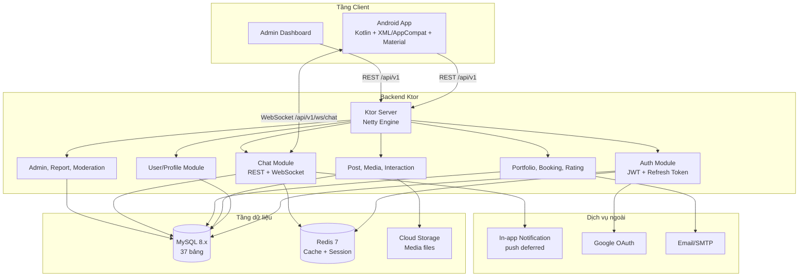

# 2.4. TỔNG QUAN KIẾN TRÚC HỆ THỐNG VÀ API

Phần này cập nhật theo bộ backend mới nhất trong `docs_backend`. Backend hiện dùng Kotlin Ktor, MySQL, Redis và WebSocket để phục vụ ứng dụng Android InstaGallery.

## 2.4.1. Sơ đồ kiến trúc tổng thể

Hệ thống được tổ chức theo mô hình client-server. Ứng dụng Android gọi REST API qua HTTPS, còn chat realtime dùng WebSocket.

## 2.4.2. Quy ước API

- REST API nghiệp vụ dùng prefix `/api/v1`.
- API trả về JSON.
- API cần đăng nhập dùng header `Authorization: Bearer <access_token>`.
- WebSocket chat dùng `/api/v1/ws/chat?token={jwt}`. Token phải được ký và còn hạn.
- Không còn route `/init-db`, `/reset-db`, `/fix-user-id`, `/migrate-db`. Schema tự tạo lúc khởi động ngoài production.

Nguồn endpoint đầy đủ nằm tại `docs/api-specs/Backend_APIs.md`.

## 2.4.3. Thống kê endpoint hiện tại

| Loại endpoint | Số lượng |
|---|---:|
| REST API dưới `/api/v1` | 139 |
| Route hệ thống ngoài `/api/v1` | 2 |
| Tổng HTTP endpoint | 141 |
| WebSocket endpoint | 1 |
| **Tổng tính cả WebSocket** | **142** |

## 2.4.4. REST API theo module

| Module | Số REST endpoint |
|---|---:|
| Auth | 11 |
| Users | 22 |
| Posts | 9 |
| Interactions | 11 |
| Media | 6 |
| Albums | 7 |
| Explore | 3 |
| Search | 4 |
| Chat REST | 6 |
| Notifications | 5 |
| Portfolios | 7 |
| Photographer services | 7 |
| Bookings | 6 |
| Ratings | 4 |
| Reports | 3 |
| Devices | 2 |
| Admin | 26 |
| **Tổng REST `/api/v1`** | **139** |

## 2.4.5. System/debug route

| Method | Endpoint | Mục đích |
|---|---|---|
| GET | `/` | Server đang chạy |
| GET | `/health` | Server đang chạy, không hỏi database |

## 2.4.6. WebSocket

| Loại | Endpoint | Mục đích |
|---|---|---|
| WS | `/api/v1/ws/chat?token={jwt}` | Chat realtime. JWT được verify trước khi nhận kết nối |

## 2.4.7. Liên hệ với cơ sở dữ liệu

Backend hiện có `36` bảng dữ liệu, chia thành các nhóm chính: xác thực, bài đăng/media, tương tác xã hội, quan hệ người dùng, nhắn tin, album, booking photographer, thông báo, tìm kiếm và kiểm duyệt. Mô tả chi tiết từng bảng nằm tại `docs/database/database_schema.md`.

